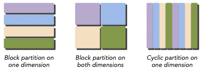

# 1 Heterogeneous Parallel Computing with CUDA

**high-performance computing**(HPC)를 실현하기 위해서는 computer architecture뿐만 아니라, hardware systems, software tool, programming platforms, 그리고 parallel programming paradigms를 고려해야 한다.

> 들어가기 앞서 이 책(2014 출시)은 CUDA 6.0(현재 12.0.x까지 나왔다.)와, Kepler architecture(현재 RTX 4090이 나왔다.)를 사용하므로 현재 실정과는 거리가 있다.

---

## 1.1 Parallel Computing

**parallel computing**은 여러 연산을 simultaneous하게 수행하고, 큰 problem을 작은 problem들로 나눠서 **concurrent**하게 수행하는 것을 의미한다. 이때 이렇게 작게 나뉜 연산 piece를 **task**라고 한다.

여기서 concurrency(동시성)이란 정확히는 동시에 실행되는 것'처럼' 보이는 개념이다. 예를 들어 한 개의 core에서도 작업 간에 context switch를 하여 여러 작업을 concurrent하게 수행할 수 있다.

> 이 경우 concurrent하게 실행되는 task들은 OS의 scheduling 정책에 의해 서로 복잡하게 얽힌다.

좀 더 프로그래머 관점에서 보면 concurrent한 연산을 어떻게 구현할지가 목표가 된다. 그리고 이런 구현은 크게 두 가지 영역과 관련이 있다.

- Computer architecture(하드웨어 관점)

- Parellel programming(소프트웨어 관점)

computer architecture 관점에서는 problem을 multiple processes 또는 multiple thread을 이용해서 concurrent하게 해결하고자 한다. 여기서 제일 중요한 component가 주로 **core**라고 지칭하는 **CPU**(Central Processing Unit)이다.

현재는 architecture 수준에서 parallelism을 지원하는 multicore가 존재한다. 여기서 programming은 problem 연산을 가능한 core들에게 mapping하여 실행하게 만드는 역할을 한다.

> 특히 multicore에서의 algorithm 구현이라면, 프로그래머들은 computer architecture의 구조를 상세하게 이해해야 한다.

---

## 1.2 Sequential and Parallel Programming

sequential programming의 경우 다음과 같이 연산이 수행된다.

여기서 program의 task가 concurrent하게 수행된다면 parallel programming이다. 

program은 기본적으로 **instruction**와 **data** 두 개의 ingredients를 갖는다. task에서 각 instruction은 input을 받아서 function에 적용하고, output을 생성한다. 이때 주의할 점은 instruction 처리 중에 **data dependency**가 발생할 수 있다.

> 따라서 여러 task를 수행한다면 각자가 dependency를 가지고 있는지 여부를 꼭 파악해야 한다. dependency를 파악하는 것이 바로 parallel algorithm을 구현하는 제일 기본적인 기술이다.

> 참고로 대부분의 경우 dependent tasks에서 multiple independent chains를 구현하는 것이 가장 좋은 방법일 때가 많다.

---

## 1.3 Parallelism

현재 **parallelism**(병렬성)은 architecture design에서 필수적인 요소가 되었다. parallelism은 크게 두 가지 type으로 나눌 수 있다.

- Task parallelism

**Task parallelism**은 많은 task나 function들을 independent하게 수행할 수 있을 때 수행한다. task parallelism은 multiple cores에 function들이 분배되게 만든다.

- Data parallelism

CUDA programming이 바로 data parallel computation을 구현하는 데 특화된 방법이다.

data parallel processing은 data element들을 parallel threads로 mapping한다. 따라서 굉장히 큰 data set을 처리하는 여러 application을 data parallel model을 사용해서 speedup할 수 있다. 

data parallel program을 design하기 위해서는 우선 여러 thread에 data를 **partition**(분할)해야 한다. partition은 두 가지 접근 방식으로 구현이 가능하다.

- block partitioning

**block partitioning**에서는 연속해 있는 여러 element들이 **chunk**로 묶인다. (대체로) 한 번에 오직 하나의 chunk를 single thread가 처리한다.

아래 그림은 1차원 data를 partition한 block partition이다.

- cyclic partitioning

**cyclic partitioning**에서는 좀 더 적은 양의 data element들을 chunk로 묶는다. 그리고 이웃하는 thread가 이웃하는 여러 chunk를 받고, 각 thread는 하나 이상의 chunk를 처리한다.

아래 그림은 1차원 data를 partition한 cyclic partition이다.

 

2차원 이상의 data라면 x축, y축과 같은 기준을 정해 partition을 적용할 수 있다. 

- 첫 번째는 y축을 기준으로 block partition을 진행했다.

- 두 번째는 x,y축 두 기준으로 block partition을 진행했다.

- 세 번째는 x축을 기준으로 cyclic partition을 진행했다.

> 사실 대체로 data는 1차원으로 저장되고, 여러 차원의 data를 사용하더라도 physical storage에는 결국 1차원으로 mapping된다. 

어떻게 thread에 data를 분배할지 결정하는 것은, data를 어떻게 저장할지 정하는 문제와 밀접하게 연관되어 있다. 다시 말해 프로그래머가 어떻게 thread가 동작하도록 구현하는가는 program의 performance에 큰 영향을 미치게 된다.

---

## 1.4 Computer Architecture

computer architecture를 분류하는 방법은 다양하게 있지만, **Flynn's Taxonomy** 분류가 대표적으로 쓰인다. 이 분류는 computer architecture를 4가지 type으로 나눈다.

- **SISD**(Single Instruction Single Data)

- **SIMD**(Single Instruction Multiple Data)

- **MISD**(Multiple Instruction Single Data)

- **MIMD**(Multiple Instruction Multiple Data)

SISD는 traditional computer에 해당한다. 오직 core가 한 개 존재하며, 한 번에 오직 한 instruction stream만 실행된다. 

SIMD는 parallel architecture에 속한다. multiple core를 가지며 모든 core가 한 번에 '같은 instruction을 execute'한다. (대부분의 modern computer가 SIMD에 속한다.) SIMD의 가장 큰 장점은 compiler 덕분에 프로그래머들은 sequential하게 program을 구성해도 parallel speedup을 달성할 수 있다는 점이다.

MISD는 비교적 드문 architecture로, multiple core가 seperate instruction stream을 통해 같은 data stream을 처리한다.

MIMD는 multiple core를 사용한 parallel architecture다. multiple data stream으로 구성되며 각각은 independent instruction을 처리한다. 참고로 대부분의 MIMD architecture는 sub-component로 SIMD를 포함한다.

architecture level에서는 다음 조건을 만족시킬 수 있도록 고려해야 한다.

- **latency**(레이턴시. operation이 시작해서 끝날 때까지 걸리는 시간. 주로 microsecond 단위 사용) 감소

- **bandwidth**(대역폭. 단위 시간당 처리하는 data의 양. 주로 megabytes/sec 혹은 gigabytes/sec 단위 사용) 증가

  - gflops: billion floating-point operations per second를 의미한다.

- **throughput**(처리율. 단위 시간당 처리하는 operation의 양. 주로 gflops 단위 사용) 증가

computer architecture는 memory organization 관점에서도 크게 두 가지로 분류할 수 있다.

- Multi-node with **distributed** memory

multi-node system에서는 network를 통해 다량의 processor가 연결되어서 연산을 수행한다. 각 processor는 자신만의 local memory를 가지며, network를 이용해서 content를 communicate한다. 이런 systems를 주로 **clusters**라고 지칭한다.

- Multiprocessor with **shared** memory

multiprocessor는 dual-processor부터 수백 개가 넘는 processor까지 다양한 size를 지칭한다. 이 processor들은 보통 물리적으로 같은 memory와 연결되어 있거나, PCIe와 같은 low-latency link를 통해 data를 share한다.

따라서 shared address space를 사용하지만, 이는 memory sharing을 위해서 꼭 물리적으로 연결된 단일 memory가 필요하다는 말은 아니다. 예를 들면 multiprocessor는 한 chip 안에 여러 개의 core를 가진 **multicore**가 있다.

multicore architecture 중에서도 수십, 수백 개의 core를 가진 것을 **many-core**라고 지칭한다. GPU가 many-core architecture에 해당된다.

> GPU는 모든 종류의 parallelism을 가지고 있다. multithreading, MIMD, SIMD, instruction-level parallelism.

---