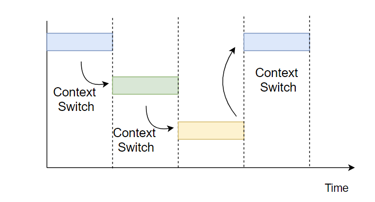
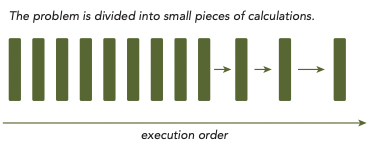
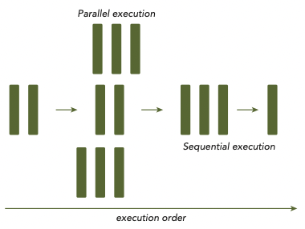
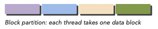
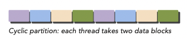
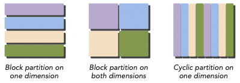
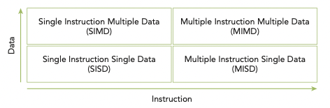
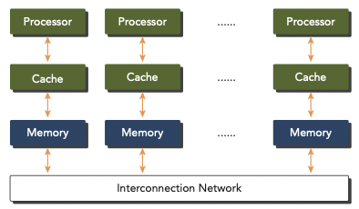
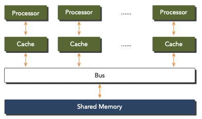

# 1 Heterogeneous Parallel Computing with CUDA

**high-performance computing**(HPC)를 실현하기 위해서는 computer architecture뿐만 아니라, hardware systems, software tool, programming platforms, 그리고 parallel programming paradigms를 고려해야 한다.

> 들어가기 앞서 2014년 출된 교재는 CUDA 6.0와 Kepler architecture를 사용하므로, 현재 실정(CUDA 12.0.x, Ada Lovelace architecture인 RTX 4090)과는 거리가 있다.

---

## 1.1 Parallel Computing

parallel computing이란 여러 연산을 simultaneous하게 수행하고, 큰 problem을 작은 problem들로 나눠서 **concurrent**하게 수행하는 것을 의미한다. 이때 이렇게 작게 나뉜 연산 piece를 **task**라고 한다.

여기서 **concurrency**(동시성)이란 정확히는 동시에 실행되는 것'처럼' 보이는 개념이다. 예를 들어 한 개의 core에서도 작업들을 **context switch**하는 방법으로 여러 작업을 concurrent하게 수행할 수 있다.

> 이 경우 concurrent하게 실행되는 task들은 OS의 scheduling 정책에 의해 서로 복잡하게 얽힌다.

좀 더 프로그래머 관점에서 보면 concurrent한 연산을 어떻게 구현할지가 목표가 된다. 크게 두 가지 관점으로 구현할 수 있다.

- Computer architecture(하드웨어 관점)

- Parellel programming(소프트웨어 관점)

computer architecture 관점에서는 problem을 multiple processes 또는 multiple thread을 이용해서 concurrent하게 해결하고자 한다. 여기서 제일 중요한 component가 주로 **core**라고 지칭하는 **CPU**(Central Processing Unit)이다.

현재는 hardware architecture 수준에서 parallelism을 지원하는 multicore가 존재한다. 여기서 programming은 연산이 가능한 core들에게 효율적으로 mapping이 되도록 하는 역할을 맡는 것이다.

> 특히 multicore에서의 algorithm 구현을 위해서는, computer architecture의 구조를 상세하게 이해할 필요가 있다.

---

## 1.2 Sequential and Parallel Programming

- sequential programming

  

- parallel programming

  

program은 기본적으로 **instruction**와 **data** 두 개의 ingredients를 갖는다. 

- instruction은 input을 받아서 function을 수행(ALU 등이 연산)하고 output을 도출한다. 

- 이때 instruction 처리 중에 발생할 수 있는 **data dependency**를 주의해야 한다.

---

## 1.3 Parallelism

현재 **parallelism**(병렬성)은 크게 두 가지 type으로 분류할 수 있다.

- Task parallelism

  **Task parallelism**은 많은 task나 function들을 independent하게 수행할 수 있을 때 수행한다. task parallelism은 multiple cores에 function들이 분배되게 만든다.

- Data parallelism

  data element들을 parallel threads로 mapping한다. 따라서 굉장히 큰 data set을 처리하는 여러 application에서 speedup을 얻는 데 유용하다. 
  
  > CUDA programming이 바로 data parallelism에 특화된 방법이다.

---

### 1.3.1 data parallelism

data parallel program을 design하기 위해서는, 우선 data를 여러 thread로 **partition**(분할)해야 한다.

- block partitioning

  **block partitioning**은 여러 element를 **chunk**로 묶인다. 
  
  - (대체로) single thread가 한 번에 한 chunk를 처리한다.

  아래 그림이 1차원 data를 partition한 block partition이다.

  

- cyclic partitioning

  **cyclic partitioning**에서는 좀 더 적은 양의 data element를 chunk로 묶는다. 
  
  - 각 thread가 하나 이상의 chunk를 처리한다.

  아래 그림이 1차원 data를 partition한 cyclic partition이다.

  

 

2차원 이상의 data일 때는 어떨까? 2차원의 경우 다음과 같이 x,y축을 기준으로 partitioning할 수 있다. 

> 사실 hardware적인 관점에서는 data가 physical storage에 결국 1차원으로 mapping된다. 

---

## 1.4 Computer Architecture

대체로 아래 **Flynn's Taxonomy**를 이용해 computer architecture를 분류하는 경우가 많다. 이 분류에서는 computer architecture를 4가지 type으로 나눈다.

- **SISD**(Single Instruction Single Data)

  (traditional computer) 오직 core가 한 개 존재하며, 한 번에 오직 한 instruction stream만 실행된다. 

- **SIMD**(Single Instruction Multiple Data)

  (대부분의 modern computer) parallel architecture에 속한다. multiple core를 가지며 '모든 core가 한 번에 같은 instruction을 execute'한다. 
  
  - SIMD의 가장 큰 장점: 프로그래머들이 sequential하게 program을 구성해도, compiler 덕분에 parallel speedup을 얻을 수 있다.

- **MISD**(Multiple Instruction Single Data)

  비교적 드문 architecture로, multiple core가 seperate instruction stream로 같은 data stream을 처리한다.

- **MIMD**(Multiple Instruction Multiple Data)

  multiple core를 사용한 parallel architecture다. multiple data stream으로 구성되며 각각 independent instruction을 처리한다. 
  
  > 참고로 대부분의 MIMD architecture는 sub-component로 SIMD를 포함한다.

---

### 1.4.1 performance

architecture level에서 다음 지표를 주로 performance로 사용한다. 따라서 다음 지표들을 높일 수 있는 방법을 고려해야 한다.

- **latency**: operation이 시작해서 끝날 때까지의 시간(주로 ms 단위 사용)

  > response time, 혹은 execution time으로도 부른다.

- **bandwidth**: 대역폭. 단위 시간당 처리하는 data의 양.(주로 megabytes/sec 혹은 gigabytes/sec 단위 사용)

  - gflops: billion floating-point operations per second를 의미한다.

- **throughput**: 처리율. 단위 시간당 처리하는 operation의 양.(주로 gflops 단위 사용)

개개인의 컴퓨터 사용자 입장에서는 주로 하루에 얼마나 더 많은 일을 할 수 있는지가 중요하기 때문에, latency를 더 중요하게 볼 가능성이 높다. 하지만 여러 사용자가 사용하는 데이터센터 입장에서는, 얼마나 더 많은 일을 처리할 수 있는가가 더 중요하므로 throughput을 더 중요하게 볼 가능성이 높다.

---

### 1.4.2 memory organization

computer architecture는 memory organization 관점에서도 크게 두 가지로 분류할 수 있다.

- Multi-node with **distributed** memory

  multi-node system에서는 networking을 통해, 여러 processor가 통신하며 연산을 수행한다.

  

  각 processor는 자신만의 local memory를 가지며, networking으로 content를 communicate한다. 이런 systems를 주로 **clusters**라고 지칭한다.

- Multiprocessor with **shared** memory

  processor들이 보통 물리적으로 같은 memory와 연결되어 있거나, PCIe(PCI-Express)와 같은 low-latency link를 통해 data를 share한다.

  > multiprocessor는 dual-processor부터 수백 개가 넘는 processor까지 다양한 size를 지칭한다.

  

  shared address space를 사용하지만, memory sharing을 위해서 꼭 물리적으로 연결된 단일 memory가 필요하지는 않다. 

    
> multicore architecture 중에서도 수십, 수백 개의 core를 가진 것을 **many-core**라고 지칭한다. GPU가 many-core architecture에 해당된다.

> GPU는 모든 종류의 parallelism을 가지고 있다. multithreading, MIMD, SIMD, instruction-level parallelism.

---
