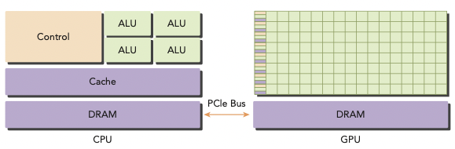
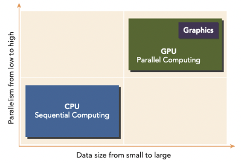
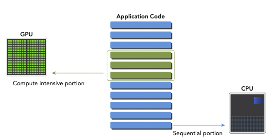
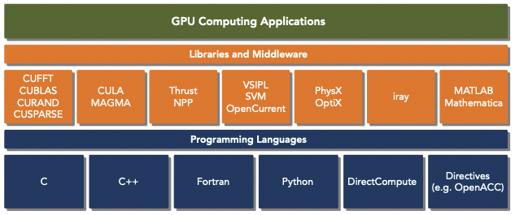
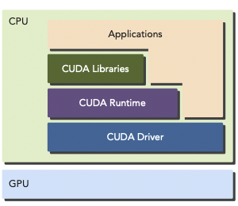
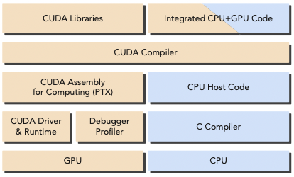
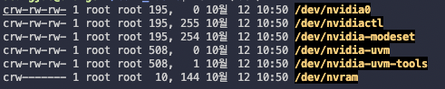
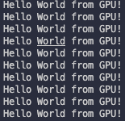

# 1 Heterogeneous Parallel Computing with CUDA

---

## 1.5 Heterogeneous Computing

> homogeneous system에서 heterogeneous system으로의 전환을 HPC로 가는 기념비적인 사건으로 보는 시점도 있다.

보통 CPU와 GPU는 single computer node에서 PCIe bus로 연결되는 discrete한 방식으로 구성된다. 이런 system이 바로 **heterogeneous system**이며 각자가 well-suited task를 맡아 수행한다. 

하지만 이런 heterogeneous system도 design complexity에 의해 여러 limit를 가지게 된다.

---

### 1.5.1 heterogeneous architecture

2014년 기준으로 heterogeneous computer node는 대체로 두 개의 multicore CPU sockets와 many-core GPU로 구성되었다. 이때 GPU는 standalone하지 않고 CPU의 co-processor 역할을 한다. 따라서 CPU를 **host**, GPU를 **device**라고 지칭한다.



heterogeneous application은 두 가지 종류의 code로 구성된다.(application 자체는 보통 CPU에서 initialize한다.)

- CPU에서 구동되는 host code

  host code는 compute-intensive(많은 계산이 필요한) task를 load하기 전에 environment, code, data를 관리한다.

  > CPU는 control-intensive task에 적합하다.

- GPU에서 구동되는 device code

  computational intensive application의 경우, program은 보통 많은 양의 data parallelism을 가진다. GPU를 이 data parallelism 처리를 accelerate하기 위해 사용한다.

이처럼 CPU와 물리적으로 떨어져서 application의 computationally intensive section을 accelerate하기 위해 사용하는 hardware component를 **hardware accelerator**라고 한다. GPU가 대표적이다.

> 대표적인 GPU 라인업으로 Tegra(mobile, embedded device), GeForce(consumer graphics), Quadro(professional visualization), Tesla(datacenter parallel computing)이 있다.

> GPU capability에 영향을 미치는 가장 큰 요소로 <U>CUDA core의 개수, memory size</U>를 꼽을 수 있다. 또한 GPU performance를 나타내는 방법으로는 주로 <U>Peak computational performance, memory bandwidth</U>를 사용한다.

---

### 1.5.2 paradigm of heterogeneous computing

CPU와 GPU가 어떤 task에서 유용한지 알기 위해 parallelism level과 data size를 기준으로 비교해 보자.





- CPU: 작은 data size, 정교한 control logic, low-level parallelism에 유용하다. 또한 복잡한 logic과 instruction-level parallelism 처리에 적합하다.

- GPU: 많은 양의 data이며 굉장히 많은 data parallelism을 가진 경우에 유용하다. 게다가 CPU보다 큰 bandwidth를 가진다.

---

## 1.6 CUDA



**CUDA**(Compute Unified Device Architecture)는 NVIDIA GPU에서 복잡한 계산 문제를 더 효율적이게 수행하기 위해 만들어진 parallel computing platform이자 programming model이다.

CUDA platform은 CUDA-accelerated library, compiler directives, application programming interfaces, 그리고 다른 프로그래밍 언어(C, C++, Fortran, Python)의 extension 등으로 사용할 수 있다.

CUDA C 역시 표준 ANSI C의 extension이다. CUDA를 사용하면 core의 수를 조절하는 방식으로 GPU의 parallelism을 조절할 수 있다.

CUDA는 GPU device와 thread를 관리하기 위해 두 API level을 제공한다.



- CUDA Driver API: low-level API로 program과 관련이 깊다. 그러나 GPU 동작 원리에 특화되어 있다. 

- CUDA Runtime API: driver API상에서 구현된 high-level API로, runtime API의 각 function들이 basic operation으로 분해되서 driver API로 넘겨진다.

CUDA program도 host code(CPU에서 동작), device code(GPU에서 동작)으로 나뉜다. host code를 compile하는 과정에서 CUDA nvcc compiler가 device code를 분리해 준다.



- host code: 표준 C code이며, C compiler가 compile한다.

- device code: GPU에서 실행되는 **kernel**(data-parallel function)을 가진 CUDA C code이다. nvcc가 compile한다.

> nvcc는 LLVM compiler 기반으로 만들어졌다.

---

## 1.6.1 hello world from GPU

GPU에서 kernel code를 작성하여 "Hello World." 문자열을 출력할 것이다.

우선 CUDA compiler가 설치되어 있는지 확인한다.(경로는 보통 /usr/local/cuda/bin/nvcc)

```bash
$ which nvcc
```


확인이 끝났다면 장치에 GPU accelerator card가 장착되었는지 확인한다.

```bash
$ ls -l /dev/nv*
```



> nvidia0이 등록된 GPU card이다.(card가 더 있다면 nvidia1, nvidia2식으로 더 있을 것이다.)

확인이 되었다면 CUDA C code를 작성한다. 확장자는 .cu로 하며 CUDA nvcc compiler를 이용해서 program을 compile하도록 설정한다. kernel code를 포함하여 작성하고 compile한 뒤, 명령을 입력해서 executable file을 실행하면 된다.

우선 비교를 위해 C 언어로만 작성한 hello world 출력 코드를 보자. 파일은 'hello.cu'란 이름으로 저장한다.

```c
#include <stdio.h>
int main(void){
  printf("Hello World from CPU!\n");
}
```

다음 명령을 통해 nvcc로 compile한다.

```bash
nvcc hello.cu -o hello
```

그 다음으로는 kernel function을 이용해 본다. 파일명은 'helloFromGPU.cu'이다.

```c
#include <stdio.h>

__global__ void helloFromGPU(void){
  printf("Hello World from GPU!\n");
}
 
int main(void){
  // hello from cpu
  // printf("Hello World from CPU!\n");

  helloFromGPU <<<1, 10>>>();
  cudaDeviceReset();
  return 0;
}
```

- \_\_global\_\_: compiler에게 function이 CPU에서 call되어, GPU에서 execute됨을 알린다.

- helloFromGPU <<<1,10>>>();: kernel function을 실행한다.(host thread에서 call되어 device side에서 실행된다.) 다수의 thread array에서 같은 code를 실행한다. 

  - parameter는 10개의 GPU thread로 구성된 block 한 개를 만든다는 뜻이다. 모든 thread는 같은 code를 실행한다.

- cudaDeviceReset(): 현재 process와 관련된 모든 resource들을 device에서 clean up(destroy)한다.

만들어진 파일을 ./helloFromGPU로 실행한 결과는 다음과 같다.



CUDA program 구성을 간단히 요약하면 다음과 같은 과정으로 전개된다.

1. GPU memory들을 allocate.

2. CPU memory에서 GPU memory로 data를 copy.

3. CUDA kernel을 invoke.

4. GPU memory에서 CPU memory로 data를 copy back한다.

5. GPU memory를 destroy.

> 간단한 helloFromGPU.cu 예제에서는 오직 3가지 과정만 있었다.

---

### 1.6.2 Locality

parallel하며 효과적인 code를 작성하기 위해서는 CPU architecture를 알아야 한다. 예를 들면 **locality**(지역성)와 같은 매우 중요한 개념을 모르면 불가능하다. locality란 data를 reuse(재사용)하여 memory access latency를 줄이는 방법을 의미한다.

locality는 두 가지 종류로 나눌 수 있다.

- **Temporal locality**: 짧은 기간동안 존재하는 data나 resource를 재사용.

- **Spatial locality**: storage location에서 가깝게 위치한 data elements의 재사용.

현재 CPU architecture는 이 두 locality를 활용하기 위해 큰 cache들을 사용한다. 또한 이런 CPU cache를 효율적으로 사용하려면 프로그래머가 algorithm을 제대로 디자인하는 것이 중요하다.

> 예를 들어 main memory의 speedup을 위해 사용되는 software-managed cache인 **shared memory**가 있다. shard memory로 code의 locality를 control할 수 있다.

다시 말해 프로그래머는 low-level cache optimization이 가능해야 한다. 하지만 CPU가 어떻게 schedule되는지 프로그래머가 알기는 어렵다.

이때 CUDA를 memory hierarchy와 thread hierarchy를 확인할 수 있는 유용한 수단으로 사용할 수 있다.

---