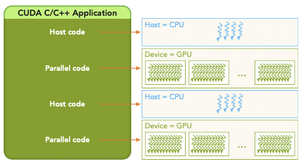
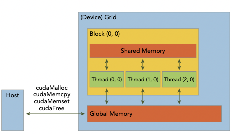
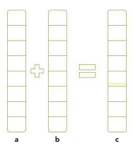
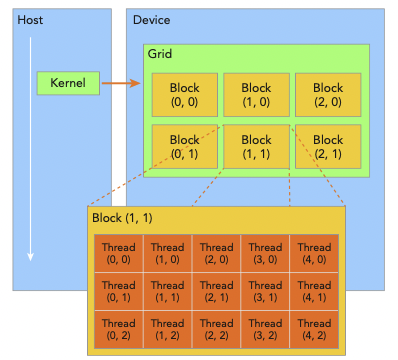
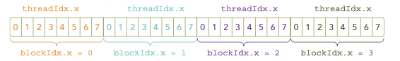
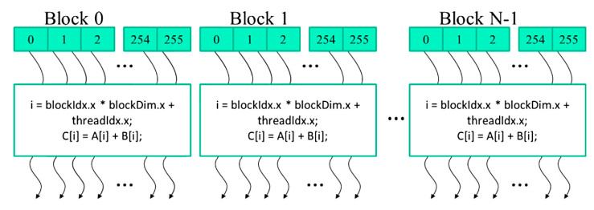
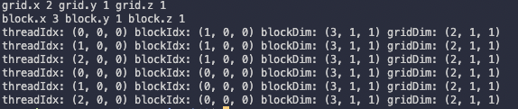
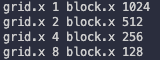

# 2 CUDA Programming Model

이번 장은 vector addition, matrix addition 예제를 CUDA program으로 작성하며 살펴볼 것이다.

---

## 2.1 CUDA programming model이란?

programming model은 application이 hardware에서 구현이 가능하도록 하는 computer architecture을 abstraction한 형태에 해당된다.

> programming language나 programming environment로 나타난다.

아래 그림은 program과 programming model 구현에 있어서의 abstraction을 계층 형식으로 나타낸 것이다.

> CUDA programming model은 GPU architecture의 memory hierarchy의 abstraction을 드러낸다.


또한 다른 parallel programming model에서 abstraction들을 share하기 위해서, CUDA programming model은 다음과 같이 GPU를 제어하는 특징들을 갖는다.

- organize threads on the GPU through a hierarchy structure

- access memory on the GPU through a hierarchy structure

프로그래머 관점에서는 parallel computation을 다른 level에서 본다. 

- domain level

program과 algorithm을 디자인할 때 해당하는 level이다. 어떻게 data와 function을 **decompose**(분해)해야 올바르고 효율적으로 program을 parallel할 수 있을지 고민한다.

- logic level

program과 algorithm 디자인이 끝나면 programming 단계로 넘어간다. 어떻게 구성해야 logic을 concurrent thread들로 구성할 수 있는지 고민한다. 

- hardware level

thread들을 효율 좋게 core로 mapping하는 여부 등을 고려한다.

---

## 2.2 CUDA Programming Structure

> [CUDA 기초](https://velog.io/@lunarainproject/CUDA-%EA%B8%B0%EC%B4%88)

- 책(2014 발간)에서는 CUDA 6으로 실습을 진행한다.

- host(CPU) memory는 variable 이름 앞에 h_를 붙여서 구분할 것이다.

- device(GPU) memory는 variable 이름 앞에 d_를 붙여서 구분할 것이다.

여기서 CPU와 GPU 사이에 공유되는 managed memory pool을 형성하는 **unified memory**를 알아야 한다. 덕분에 CPU와 GPU memory 모두 단일 pointer를 사용해서 접근할 수 있다. unified memory에 allocate된 data를 host와 device 사이에 자동으로 **migrate**한다.

CUDA의 핵심은 kernel이다. CUDA는 GPU thread에서 동작하는 kernel들을 scheduling한다. 



host는 대부분의 operation에서 device와 independent하게 동작할 수 있다. kernel이 **launch**(구동)을 시작하면, host는 data parallel code를 GPU에서 작동하게 만드는 additional task에서 벗어나 즉시 control 작업으로 돌아간다.

다시 말해 kernel은 **asynchronous**(비동기적)으로 launch된다. host는 kernel launch가 완료되는 것을 기다리지 않고 다음 작업을 수행한다.

> CUDA runtime에서 제공하는 cudaDeviceSynchronize를 이용해서 CPU가 device code의 완료를 기다리게 만들 수도 있다.

---

## 2.3 managing memory

CUDA runtime은 device memory를 allocate하는 function들을 제공한다.

| 표준 C function | CUDA C function |
| --- | --- |
| malloc | cudaMalloc |
| memcpy | cudaMemcpy |
| memset | cudaMemset |
| free | cudaFree |

우선 GPU memory allocation을 위한 cudaMalloc은 다음과 같이 사용한다. 두 가지 parameter가 필요하다.

```c
cudaError_t cudaMalloc ( void** devPtr, size_t size )
```

- cudaError_t를 입력하면 error 발생 시 이유를 출력해 준다.

- allocate한 memory는 해당 device memory address를 가리키는 pointer인 devPtr을 통해 return된다.

host와 device 사이에 data를 transfer하기 위한 function으로는 cudaMemcpy를 사용한다. unified memory에 존재하는 data가 아니라면, data를 사전에 device memory로 transfer해야 한다.

```c
cudaError_t cudaMemcpy ( void* dst, const void* src, size_t count, cudaMemcpyKind kind )
```

- dst: destination memory address pointer

- src: source memory address pointer

- count: copy할 byte size

- kind: data transfer type

  - cudaMemcpyHostToHost

  - cudaMemcpyHostToDevice

  - cudaMemcpyDeviceToHost

  - cudaMemcpyDeviceToDevice

<U>cudaMemcpy는 synchronous behavior</U>이다. host application은 cudaMemcpy의 return/transfer가 완료될 때까지 멈춘다.

참고로 kernel launch를 제외한 모든 CUDA call은, enumerated type cudaError_t으로 error code를 return한다. 

- 만약 GPU memory에 성공적으로 allocate했다면, 'cudaSuccess'를 return한다.

- 그렇지 않다면 cudaErrorMemoryAllocation을 return한다.

다음 function을 사용하면 이를 error message로 변환할 수 있다.(C의 strerror function과 비슷하다.)

```c
char* cudaGetErrorString(cudaError_t error)
```



이제 예제를 보며 host와 device간의 data movement 관리를 살펴보자. 



우선 위 그림과 같은 array 연산(host-based array summation)을 C를 사용해서 구현한다. 파일명은 sumArraysOnHost.c이다.

```c
#include <stdlib.h>
#include <string.h>
#include <time.h>

// Host에서 array sum 수행
void sumArraysOnHost(float *A, float *B, float *C, const int N) {
    for (int idx=0; idx<N; idx++) {
        C[idx] = A[idx] + B[idx];
    }
}

// array에 random number로 초기값을 설정
void initialData(float *ip, int size) {
    // random number 생성
    time_t t;
    srand((unsigned int) time(&t));

    for (int i=0; i<size; i++) {
        ip[i] = (float) ( rand() & 0xFF )/10.0f;
    }
}

int main(int argc, char **argv) {
    int nElem = 1024;
    size_t nBytes = nElem * sizeof(float);

    float *h_A, *h_B, *h_C;
    h_A = (float *)malloc(nBytes);
    h_B = (float *)malloc(nBytes);
    h_C = (float *)malloc(nBytes);

    initialData(h_A, nElem);
    initialData(h_B, nElem);

    sumArraysOnHost(h_A, h_B, h_C, nElem);

    free(h_A);
    free(h_B);
    free(h_C);

    return(0);
}
```

pure C program이므로 C compiler를 사용하거나 nvcc compiler로 다음과 같이 실행하면 된다.

```bash
$ nvcc -Xcompiler -std=c99 sumArraysOnHost.c -o sum
$ ./sum
```

참고로 위 compile 명령의 **flag**(옵션)은 다음 의미를 가진다.(자세히는 CUDA compiler document를 살피면 알 수 있다.)

- -Xcompiler: 바로 C compiler 또는 preprocessor로 처리한다.

- -std=c99: code style이 c99 standard임을 알린다.

이 연산을 GPU에서 구동하게끔 바꾸는 것은 쉽다. 

1. GPU memory allocation

```c
float *d_A, *d_B, *d_C;
cudaMalloc((float**) &d_A, nBytes);
cudaMalloc((float**) &d_B, nBytes);
cudaMalloc((float**) &d_B, nBytes);
```

2. host memory에서 GPU global memory로 data를 transfer한다.

```c
cudaMemcpy(d_A, h_A, nBytes, cudaMemcpyHostToDevice);
cudaMemcpy(d_B, h_B, nBytes, cudaMemcpyHostToDevice);
```

3. kernel 수행.

GPU global memory로 transfer하는 과정이 끝나면, 이제부터는 host side에서 GPU에서 array summation을 수행하기 위해 kernel function을 invoke될 수 있다. 만약 kernel이 call되면 control은 즉시 host로 return back되며, GPU가 kernel을 수행하는 사이에 다른 function을 수행한다.(asynchronous 동작)

4. result를 host memory로 copy한다.

kernel 작업이 모두 끝나면, result(array d_C)는 GPU global memory에 저장된다. 이제 이 result를 host array(gpuRef)로 copy해야 한다.

```c
cudaMemcpy(gpuRef, d_C, nBytes, cudaMemcpyDeviceToHost);
```

> 만약 이렇게 copy를 진행하지 않고 'gpuRef = d_C'와 같은 잘못된 assignment문으로 작성하게 되면 application은 runtime에 crash된다.

> 이런 실수를 방지하기 위해 unified memory가 CUDA 6부터 제공됐다. CPU와 GPU memory 모두 single pointer를 사용한다.

cudaMemcpy에 의해 host는 copy 작업이 끝날 때까지 멈추게 된다. 

5. memory를 release한다.

```c
cudaFree(d_A);
cudaFree(d_B);
cudaFree(d_C);
```

---

## 2.4 organizing threads

> [thread block architecture](https://tododiary.tistory.com/57)

host side에서 kernel function이 launch되면, device로 execution이 넘어가며 kernel function에서 정의한 thread들에서 명령을 수행하게 되었다. 이때 'thread들을 어떻게 구성하는가'라는 문제가 CUDA programming에 있어서 핵심적인 부분이다.

thread는 2-level hierarcy로 구성된다. 하나의 grid는 여러 block으로 구성되고, 각 block은 하나 이상의 thread로 구성된다.



- 하나의 kernel launch로 생성된 모든 thread를 **grid**라고 통칭한다.

  - grid 내 모든 thread는 같은 global memory space를 share한다.

  - 이 thread들이 모두 동일한 kernel code를 실행한다.

- 하나의 grid는 여러 thread **block**들로 구성된다. 각 thread block는 다음 특징을 가지고 cooperate할 수 있다.

  - block-local synchronization

  - block-local shared memory

  > <U>다른 block의 thread끼리는 cooperate할 수 없다.</U>

> block은 thread를 최대 512개 가질 수 있다. 또한 block이 가지는 thread 개수는 32(또는 NVIDIA는 64를 권장) 배수로 지정하는 편이 좋다.(SM이 32배수 단위로 동작)

thread들은 다음 index를 통해 구분할 수 있다. 이런 index(coordinate variables)는 CUDA runtime에 의해 각 thread별로 할당된다.



- blockIdx: grid 내부에서의 block index

- threadIdx: block 내부에서의 thread index

> coordinate variable은 uint3 type을 갖는다. 이 structure은 3개의 unsigned integer로 구성되며, 첫 번째, 두 번째, 세 번째 component는 x, y, z를 붙여서 접근할 수 있다.

```c
blockIdx.x
blockIdx.y
blockIdx.z

// block 내 모든 thread는 동일한 blockIdx를 공유한다.
threadIdx.x
threadIdx.y
threadIdx.z
```

kernel launch 구문에서 execution configutation parameters(<<<...>>>)로 grid와 각 block의 dimension을 지정했다. grid는 주로 block의 2D array, block은 주로 thread의 3D array로 구성된다. 이런 grid와 block의 dimention은 다음 built-in variable로 확인할 수 있다.

- blockDim

- gridDim

> 이 variable들은 dim3 type이며, uint3에 기반한 dimension에 특화된 integer vector type이다. 마찬가지로 blockDim.x, blockDim.y, blockDim.z로 접근할 수 있다.

> 사용하지 않은 차원의 크기는 1로 지정한다.(값을 지정하지 않는다면 default로 1이 되어 사용하지 않게 된다.)



이런 variable을 사용하면 하나의 grid에서 유일한 global index를 만들 수 있다.

위 그림에서는 다음이 해당된다. 

- i = blockIdx.x * blockDim.x + threadIdx.x

> block이 1D이며, thread가 256개라고 하자. 그러면 block 0의 thread에서 i의 범위는 0~255 / block 1의 thread에서는 i의 범위가 256~511 / block 2의 thread에서는 i의 범위가 512~767... 식으로 배정된다.

> 이런 방법으로 index i를 이용하여 vector A, B, C 값에 접근할 수 있다.

이런 방식 덕분에 kernel function은 loop가 없다. 대신 loop를 grid로 대체하고, 각 thread가 iteration 하나에 대응되며 연산한다. 이런 종류의 data parallelism을 **loop parallelism**이라고 지칭한다.

주의할 점은 element 개수(vector size)가 block size의 배수가 아니라는 점이다. 예를 들어 element가 총 100개라면, 효율성을 고려한 가장 작은 thread 차원은 32이다. 그렇다면 block은 총 4개가 생기고, 총 128개의 thread를 가지게 된다.

따라서 이렇게 구성할 경우 28개의 thread는 비활성화해야(연산을 수행하지 않아야) 한다. 

> block 개수를 구하는 식이 있다. 예를 들어 vector size가 1000이고 각 block이 256개의 thread를 가진다면, (1000 + 256 - 1) / 256 = 4로 4개의 block을 생성하게 된다. 이 경우 결과적으로는 256*4 = 1024 thread가 실행되고, 나머지 24개는 연산을 수행하지 않도록 해야 한다.

> 비슷하게(1D block) grid는 (nElem + block.x - 1)/block.x) 개가 된다.

<br/>

### <span style='background-color: #393E46; color: #F7F7F7'>&nbsp;&nbsp;&nbsp;📝 예제: grid와 block dimension 구하기&nbsp;&nbsp;&nbsp;</span>

host와 device 양쪽에서 grid와 block의 dimension을 체크할 것이다.

device에서는 kernel function을 만들어서, 각자의 thread index, block index, grid dimension을 출력한다.

```c
#include <cuda_runtime.h>
#include <stdio.h>

__global__ void checkIndex(void) {
    printf("threadIdx: (%d, %d, %d) blockIdx: (%d, %d, %d) blockDim: (%d, %d, %d) "
        "gridDim: (%d, %d, %d)\n", threadIdx.x, threadIdx.y, threadIdx.z,
        blockIdx.x, blockIdx.y, blockIdx.z, blockDim.x, blockDim.y, blockDim.z,
        gridDim.x, gridDim.y, gridDim.z);
}

int main(int argc, char **argv) {
    // number of elements
    int nElem = 6;

    // grid, block structure 정의
    // 지정하지 않은 차원은 사용하지 않는 것(1)으로 처리

    // 3개의 thread를 포함하는 1D block
    dim3 block (3);
    // grid 개수
    dim3 grid  ((nElem + block.x - 1)/block.x);

    // check grid and block dimension from host side
    printf("grid.x %d grid.y %d grid.z %d\n", grid.x, grid.y, grid.z);
    printf("block.x %d block.y %d block.z %d\n", block.x, block.y, block.z);

    // check grid and block dimension from device side
    checkIndex <<<grid, block>>> ();

    // reset device
    cudaDeviceReset();

    return(0);
}
```

CUDA에서 printf function을 사용하기 위해서는 compile되는 환경의 GPU architecture를 명시해야 한다.

```bash
nvcc -arch=sm_80 checkDimension.cu -o check
./check
```

> 책은 Fermi GPU이므로 -arch=sm_20을 옵션으로 사용했다.([CUDA -arch 확인](https://arnon.dk/matching-sm-architectures-arch-and-gencode-for-various-nvidia-cards/))(Fermi는 CUDA 상위 버전에서 deprecated됐다.) 

> 현재 실습 중인 환경은 RTX 3080 Ti로 Ampere architecture이다.(sm_86)($ nvidia-smi -q 명령으로 확인)([GPU 확인](https://kyumdoctor.tistory.com/72))

결과는 다음과 같다.



이 예제에서 명심할 점은 grid와 block variable의 접근에서, host와 device가 구분된다는 사실이다.

- host: host에서 'block'으로 declaration한 뒤, block.x, block.y, block.z을 사용.

- device: built-in block size variable인 blockDim.x, blockDim.y, blockDim.z를 사용.

이는 kernel launch보다 앞서 host에서 grid와 block variable을 정의하기 때문이다.

정리하자면 data size가 주어졌을 때, grid와 block dimension은 다음 과정을 통해 정한다.

1. block size를 결정

2. grid dimension을 data size와 block size를 이용한 계산을 통해 결정

> block dimension을 정할 때는 kernel의 performance적인 특징과, GPU resource의 limitation을 알아야 한다.

<br/>

### <span style='background-color: #393E46; color: #F7F7F7'>&nbsp;&nbsp;&nbsp;📝 예제: host에서 grid, block dimension 정의하기&nbsp;&nbsp;&nbsp;</span>

아래 예제를 통해 1D grid와 1D block을 host에서 정의할 것이다. 파일명은 defineGridBlock.cu이다.

```c
#include <cuda_runtime.h>
#include <stdio.h>

int main(int argc, char **argv) {
    // define total data elements
    int nElem = 1024;

    // define grid and block structure
    dim3 block (1024);
    dim3 grid  ((nElem + block.x - 1)/block.x);
    printf("grid.x %d block.x %d \n", grid.x, block.x);

    // reset block
    block.x = 512;
    grid.x = (nElem + block.x - 1)/block.x;
    printf("grid.x %d block.x %d \n", grid.x, block.x);

    // reset block
    block.x = 256;
    grid.x = (nElem + block.x - 1)/block.x;
    printf("grid.x %d block.x %d \n", grid.x, block.x);
    
    // reset block
    block.x = 128;
    grid.x = (nElem + block.x - 1)/block.x;
    printf("grid.x %d block.x %d \n", grid.x, block.x);

    // reset device
    cudaDeviceReset();
    return(0);
}
```

다음과 같이 compile한다.

```bash
nvcc defineGridBlock.cu -o block
./block 
```

결과는 다음과 같다.



---

## 2.5 launching a CUDA kernel

앞서 CUDA kernel call은 다음과 같이 명령했다.

```c
kernel_name <<<grid, block>>>(argument list);
```

다음 두 예시를 보자.

- kernel_name<<<1, 32>>>(argument list): 32개의 element를 한 block에 담는다.

- kernel_name<<<32, 1>>>(argument list): 32개의 block은 모두 element 하나만을 갖는다.

또한 kernel은 type qualifier로 \_\_global\_\_을 붙여서 declaration했다.

```c
__global__ void kernel_name(argument list);
```

이때 <U>kernel function은 꼭 void return type</U>이어야 한다. 

아래는 CUDA C programming에서의 type qualifier를 정리한 표이다.

| qualifer | execution | callable | 설명 |
| :---: | :---: | :---: | :---: |
| \_\_global\_\_ | device | host에서 callable<br/>NVIDIA가 제시하는 compute capability가 3 이상인 device | void return type이어야 한다. |
| \_\_device\_\_ | device | device only | |
| \_\_host\_\_ | host | host only | 생략해도 무방하다. |

> 참고로 function이 host와 device 양쪽에서 compile된다면, \_\_device\_\_와 \_\_host\_\_ qualifier를 같이 써도 된다.

또한 CUDA kernel의 제약을 정리하면 다음과 같다.

- device memory만 접근 가능하다.

- void return type만 가능하다.

- 유동적인 숫자의 variable을 argument로 사용할 수 없다.

- static variable을 지원하지 않는다.

- function pointer를 지원하지 않는다.

- asynchronous한 특성을 보인다.(따라서 error를 알기 힘들다.)

무엇보다도 두 벡터를 더하는 연산(A+B = C) function을 C와 CUDA로 구현했을 때의 차이를 보면 제일 극명하게 알 수 있다.

아래는 C code이다.

```c
void sumArraysOnHost(float *A, float *B, float *C, const int N) {
  for (int i = 0; i < N; i++) {
    C[i] = A[i] + B[i];
  }
}
```

다음은 CUDA code이다. loop가 사라지고 built-in thread coordinate variable이 array index를 대신했다. 또한 N개의 thread를 launch하면서, N을 reference할 필요가 없어졌다.

```c
__global__ void sumArraysOnGPU(float *A, float *B, float *C) {
  int i = threadIdx.x;
  C[i] = A[i] + B[i];
}
```

---

