# 2 CUDA Programming Model

이번 장은 vector addition, matrix addition 예제를 CUDA program으로 작성하며 살펴볼 것이다.

---

## 2.1 CUDA programming model이란?

programming model은 application이 hardware에서 구현이 가능하도록 하는 computer architecture을 abstraction한 형태에 해당된다.

> programming language나 programming environment로 나타난다.

아래 그림은 program과 programming model 구현에 있어서의 abstraction을 계층 형식으로 나타낸 것이다.

> CUDA programming model은 GPU architecture의 memory hierarchy의 abstraction을 드러낸다.


또한 다른 parallel programming model에서 abstraction들을 share하기 위해서, CUDA programming model은 다음과 같이 GPU를 제어하는 특징들을 갖는다.

- organize threads on the GPU through a hierarchy structure

- access memory on the GPU through a hierarchy structure

<br/>

프로그래머 관점에서는 parallel computation을 다음과 같은 level로 본다. 

- domain level

    program과 algorithm을 디자인할 때 해당하는 level이다. 어떻게 data와 function을 **decompose**(분해)해야 효율적으로 program이 parallel하게 수행될지 고민한다.

- logic level

    program과 algorithm 디자인이 끝나면 programming 단계로 넘어간다. 어떻게 구성해야 logic을 concurrent thread들로 구성할 수 있는지 고민한다. 

- hardware level

    thread를 효율 좋게 core에 mapping하는 방법 등을 고려한다.

---

## 2.2 CUDA Programming Structure

> [CUDA 기초](https://velog.io/@lunarainproject/CUDA-%EA%B8%B0%EC%B4%88)

- 책(2014 발간)에서는 CUDA 6으로 실습을 진행한다.

- host(CPU) memory는 variable 이름 앞에 h_를 붙여서 구분할 것이다.

- device(GPU) memory는 variable 이름 앞에 d_를 붙여서 구분할 것이다.

여기서 CPU와 GPU 사이에 공유되는 managed memory pool을 형성하는 **unified memory**를 알아야 한다. 덕분에 CPU와 GPU memory 모두 단일 pointer를 사용해서 접근할 수 있다. unified memory에 allocate된 data를 host와 device 사이에 자동으로 **migrate**한다.

CUDA의 핵심은 kernel이다. CUDA는 GPU thread에서 동작하는 kernel들을 scheduling한다. 


host는 대부분의 operation에서 device와 independent하게 동작할 수 있다. kernel이 **launch**(구동)을 시작하면, host는 data parallel code를 GPU에서 작동하게 만드는 additional task에서 벗어나 즉시 control 작업으로 돌아간다.

다시 말해 kernel은 **asynchronous**(비동기적)으로 launch된다. host는 kernel launch가 완료되는 것을 기다리지 않고 다음 작업을 수행한다.

> CUDA runtime에서 제공하는 cudaDeviceSynchronize를 이용해서 CPU가 device code의 완료를 기다리게 만들 수도 있다.

---

## 2.3 managing memory

CUDA runtime은 device memory를 allocate하는 function들을 제공한다.

| 표준 C function | CUDA C function |
| --- | --- |
| malloc | cudaMalloc |
| memcpy | cudaMemcpy |
| memset | cudaMemset |
| free | cudaFree |

우선 GPU memory allocation을 위한 cudaMalloc은 다음과 같이 사용한다. 두 가지 parameter가 필요하다.

```c
cudaError_t cudaMalloc ( void** devPtr, size_t size )
```

- cudaError_t를 입력하면 error 발생 시 이유를 출력해 준다.

- allocate한 memory는 해당 device memory address를 가리키는 pointer인 devPtr을 통해 return된다.

host와 device 사이에 data를 transfer하기 위한 function으로는 cudaMemcpy를 사용한다. unified memory에 존재하는 data가 아니라면, data를 사전에 device memory로 transfer해야 한다.

```c
cudaError_t cudaMemcpy ( void* dst, const void* src, size_t count, cudaMemcpyKind kind )
```

- dst: destination memory address pointer

- src: source memory address pointer

- count: copy할 byte size

- kind: data transfer type

  - cudaMemcpyHostToHost

  - cudaMemcpyHostToDevice

  - cudaMemcpyDeviceToHost

  - cudaMemcpyDeviceToDevice

<U>cudaMemcpy는 synchronous behavior</U>이다. host application은 cudaMemcpy의 return/transfer가 완료될 때까지 멈춘다.

참고로 kernel launch를 제외한 모든 CUDA call은, enumerated type cudaError_t으로 error code를 return한다. 

- 만약 GPU memory에 성공적으로 allocate했다면, 'cudaSuccess'를 return한다.

- 그렇지 않다면 cudaErrorMemoryAllocation을 return한다.

다음 function을 사용하면 이를 error message로 변환할 수 있다.(C의 strerror function과 비슷하다.)

```c
char* cudaGetErrorString(cudaError_t error)
```


이제 예제를 보며 host와 device간의 data movement 관리를 살펴보자. 


우선 위 그림과 같은 array 연산(host-based array summation)을 오직 C만 사용해서 구현한다. 파일명은 sumArraysOnHost.c이다.

> [int main(int argc, char **argv)란?](https://iamaman.tistory.com/364)

```c
#include <stdlib.h>
#include <string.h>
#include <time.h>

// Host에서 array sum 수행
void sumArraysOnHost(float *A, float *B, float *C, const int N) {
    for (int idx=0; idx<N; idx++) {
        C[idx] = A[idx] + B[idx];
    }
}

// array에 random number로 초기값을 설정
void initialData(float *ip, int size) {
    // random number 생성
    time_t t;
    srand((unsigned int) time(&t));

    for (int i=0; i<size; i++) {
        ip[i] = (float) ( rand() & 0xFF )/10.0f;
    }
}

int main(int argc, char **argv) {
    int nElem = 1024;
    size_t nBytes = nElem * sizeof(float);

    float *h_A, *h_B, *h_C;
    h_A = (float *)malloc(nBytes);
    h_B = (float *)malloc(nBytes);
    h_C = (float *)malloc(nBytes);

    initialData(h_A, nElem);
    initialData(h_B, nElem);

    sumArraysOnHost(h_A, h_B, h_C, nElem);

    free(h_A);
    free(h_B);
    free(h_C);

    return(0);
}
```

pure C program이므로 C compiler를 사용하거나 nvcc compiler로 다음과 같이 실행하면 된다.

```bash
$ nvcc -Xcompiler -std=c99 sumArraysOnHost.c -o sum
$ ./sum
```

참고로 위 compile 명령의 **flag**(옵션)은 다음 의미를 가진다.(자세히는 CUDA compiler document를 살피면 알 수 있다.)

- -Xcompiler: 바로 C compiler 또는 preprocessor로 처리한다.

- -std=c99: code style이 c99 standard임을 알린다.

이 연산을 GPU에서 구동하게끔 바꾸는 것은 쉽다. 

1. GPU memory allocation

```c
float *d_A, *d_B, *d_C;
cudaMalloc((float**) &d_A, nBytes);
cudaMalloc((float**) &d_B, nBytes);
cudaMalloc((float**) &d_B, nBytes);
```

2. host memory에서 GPU global memory로 data를 transfer한다.

```c
cudaMemcpy(d_A, h_A, nBytes, cudaMemcpyHostToDevice);
cudaMemcpy(d_B, h_B, nBytes, cudaMemcpyHostToDevice);
```

3. kernel 수행.

GPU global memory로 transfer하는 과정이 끝나면, 이제부터는 host side에서 GPU에서 array summation을 수행하기 위해 kernel function을 invoke될 수 있다. 만약 kernel이 call되면 control은 즉시 host로 return back되며, GPU가 kernel을 수행하는 사이에 다른 function을 수행한다.(asynchronous 동작)

4. result를 host memory로 copy한다.

kernel 작업이 모두 끝나면, result(array d_C)는 GPU global memory에 저장된다. 이제 이 result를 host array(gpuRef)로 copy해야 한다.

```c
cudaMemcpy(gpuRef, d_C, nBytes, cudaMemcpyDeviceToHost);
```

> 만약 이렇게 copy를 진행하지 않고 'gpuRef = d_C'와 같은 잘못된 assignment문으로 작성하게 되면 application은 runtime에 crash된다.

> 이런 실수를 방지하기 위해 unified memory가 CUDA 6부터 제공됐다. CPU와 GPU memory 모두 single pointer를 사용한다.

cudaMemcpy에 의해 host는 copy 작업이 끝날 때까지 멈추게 된다. 

5. memory를 release한다.

```c
cudaFree(d_A);
cudaFree(d_B);
cudaFree(d_C);
```

---

## 2.4 organizing threads

> [thread block architecture](https://tododiary.tistory.com/57)

host side에서 kernel function이 launch되면, device로 execution이 넘어가며 kernel function에서 정의한 thread들에서 명령을 수행하게 되었다. 이때 'thread들을 어떻게 구성하는가'라는 문제가 CUDA programming에 있어서 핵심적인 부분이다.

thread는 2-level hierarcy로 구성된다. 하나의 grid는 여러 block으로 구성되고, 각 block은 하나 이상의 thread로 구성된다.


- 하나의 kernel launch로 생성된 모든 thread를 **grid**라고 통칭한다.

  - grid 내 모든 thread는 같은 global memory space를 share한다.

  - 이 thread들이 모두 동일한 kernel code를 실행한다.

- 하나의 grid는 여러 thread **block**들로 구성된다. 각 thread block는 다음 특징을 가지고 cooperate할 수 있다.

  - block-local synchronization

  - block-local shared memory

  > <U>다른 block의 thread끼리는 cooperate할 수 없다.</U>

> block은 thread를 최대 512개 가질 수 있다. 또한 block이 가지는 thread 개수는 32(또는 NVIDIA는 64를 권장) 배수로 지정하는 편이 좋다.(SM이 32배수 단위로 동작)

thread들은 다음 index를 통해 구분할 수 있다. 이런 index(coordinate variables)는 CUDA runtime에 의해 각 thread별로 할당된다.


- blockIdx: grid 내부에서의 block index

- threadIdx: block 내부에서의 thread index

> coordinate variable은 uint3 type을 갖는다. 이 structure은 3개의 unsigned integer로 구성되며, 첫 번째, 두 번째, 세 번째 component는 x, y, z를 붙여서 접근할 수 있다.

```c
blockIdx.x
blockIdx.y
blockIdx.z

// block 내 모든 thread는 동일한 blockIdx를 공유한다.
threadIdx.x
threadIdx.y
threadIdx.z
```

kernel launch 구문에서 execution configutation parameters(<<<...>>>)로 grid와 각 block의 dimension을 지정했다. grid는 주로 block의 2D array, block은 주로 thread의 3D array로 구성된다. 이런 grid와 block의 dimention은 다음 built-in variable로 확인할 수 있다.

- blockDim

- gridDim

> 이 variable들은 dim3 type이며, uint3에 기반한 dimension에 특화된 integer vector type이다. 마찬가지로 blockDim.x, blockDim.y, blockDim.z로 접근할 수 있다.

> 사용하지 않은 차원의 크기는 1로 지정한다.(값을 지정하지 않는다면 default로 1이 되어 사용하지 않게 된다.)


이런 variable을 사용하면 하나의 grid에서 유일한 global index를 만들 수 있다.

위 그림에서는 다음이 해당된다. 

- i = blockIdx.x * blockDim.x + threadIdx.x

> block이 1D이며, thread가 256개라고 하자. 그러면 block 0의 thread에서 i의 범위는 0\~255 / block 1의 thread에서는 i의 범위가 256\~511 / block 2의 thread에서는 i의 범위가 512\~767... 식으로 배정된다.

> 이런 방법으로 index i를 이용하여 vector A, B, C 값에 접근할 수 있다.

이런 방식 덕분에 kernel function은 loop가 없다. 대신 loop를 grid로 대체하고, 각 thread가 iteration 하나에 대응되며 연산한다. 이런 종류의 data parallelism을 **loop parallelism**이라고 지칭한다.

주의할 점은 element 개수(vector size)가 block size의 배수가 아니라는 점이다. 예를 들어 element가 총 100개라면, 효율성을 고려한 가장 작은 thread 차원은 32이다. 그렇다면 block은 총 4개가 생기고, 총 128개의 thread를 가지게 된다.

따라서 이렇게 구성할 경우 28개의 thread는 비활성화해야(연산을 수행하지 않아야) 한다. 

> block 개수를 구하는 식이 있다. 예를 들어 vector size가 1000이고 각 block이 256개의 thread를 가진다면, (1000 + 256 - 1) / 256 = 4로 4개의 block을 생성하게 된다. 이 경우 결과적으로는 256*4 = 1024 thread가 실행되고, 나머지 24개는 연산을 수행하지 않도록 해야 한다.

> 비슷하게 grid는 (nElem + block.x - 1)/block.x) 개가 된다.

<br/>

### <span style='background-color: #393E46; color: #F7F7F7'>&nbsp;&nbsp;&nbsp;📝 예제: grid와 block dimension 구하기&nbsp;&nbsp;&nbsp;</span>

host와 device 양쪽에서 grid와 block의 dimension을 체크할 것이다.

device에서는 kernel function을 만들어서, 각자의 thread index, block index, grid dimension을 출력한다. 파일명은 checkDimension.cu이다.

```c
#include <cuda_runtime.h>
#include <stdio.h>

__global__ void checkIndex(void) {
    printf("threadIdx: (%d, %d, %d) blockIdx: (%d, %d, %d) blockDim: (%d, %d, %d) "
        "gridDim: (%d, %d, %d)\n", threadIdx.x, threadIdx.y, threadIdx.z,
        blockIdx.x, blockIdx.y, blockIdx.z, blockDim.x, blockDim.y, blockDim.z,
        gridDim.x, gridDim.y, gridDim.z);
}

int main(int argc, char **argv) {
    // number of elements
    int nElem = 6;

    // grid, block structure 정의
    // 지정하지 않은 차원은 사용하지 않는 것(1)으로 처리

    // 3개의 thread를 포함하는 1D block
    dim3 block (3);
    // grid 개수
    dim3 grid  ((nElem + block.x - 1)/block.x);

    // check grid and block dimension from host side
    printf("grid.x %d grid.y %d grid.z %d\n", grid.x, grid.y, grid.z);
    printf("block.x %d block.y %d block.z %d\n", block.x, block.y, block.z);

    // check grid and block dimension from device side
    checkIndex <<<grid, block>>> ();

    // reset device
    cudaDeviceReset();

    return(0);
}
```

CUDA에서 printf function을 사용하기 위해서는 compile되는 환경의 GPU architecture를 명시해야 한다.

```bash
nvcc -arch=sm_80 checkDimension.cu -o check
./check
```

> 책은 Fermi GPU이므로 -arch=sm_20을 옵션으로 사용했다.([CUDA -arch 확인](https://arnon.dk/matching-sm-architectures-arch-and-gencode-for-various-nvidia-cards/))(Fermi는 CUDA 상위 버전에서 deprecated됐다.) 

> 현재 실습 중인 환경은 RTX 3080 Ti로 Ampere architecture이다.(sm_86)($ nvidia-smi -q 명령으로 확인)([GPU 확인](https://kyumdoctor.tistory.com/72))

결과는 다음과 같다.


이 예제에서 명심할 점은 grid와 block variable의 접근에서, host와 device가 구분된다는 사실이다.

- host: host에서 'block'으로 declaration한 뒤, block.x, block.y, block.z을 사용.

- device: built-in block size variable인 blockDim.x, blockDim.y, blockDim.z를 사용.

이는 kernel launch보다 앞서 host에서 grid와 block variable을 정의하기 때문이다.

정리하자면 data size가 주어졌을 때, grid와 block dimension은 다음 과정을 통해 정한다.

1. block size를 결정

2. grid dimension을 data size와 block size를 이용한 계산을 통해 결정

> block dimension을 정할 때는 kernel의 performance적인 특징과, GPU resource의 limitation을 알아야 한다.

<br/>

### <span style='background-color: #393E46; color: #F7F7F7'>&nbsp;&nbsp;&nbsp;📝 예제: host에서 grid, block dimension 정의하기&nbsp;&nbsp;&nbsp;</span>

아래 예제를 통해 1D grid와 1D block을 host에서 정의할 것이다. 파일명은 defineGridBlock.cu이다.

```c
#include <cuda_runtime.h>
#include <stdio.h>

int main(int argc, char **argv) {
    // define total data elements
    int nElem = 1024;

    // define grid and block structure
    dim3 block (1024);
    dim3 grid  ((nElem + block.x - 1)/block.x);
    printf("grid.x %d block.x %d \n", grid.x, block.x);

    // reset block
    block.x = 512;
    grid.x = (nElem + block.x - 1)/block.x;
    printf("grid.x %d block.x %d \n", grid.x, block.x);

    // reset block
    block.x = 256;
    grid.x = (nElem + block.x - 1)/block.x;
    printf("grid.x %d block.x %d \n", grid.x, block.x);
    
    // reset block
    block.x = 128;
    grid.x = (nElem + block.x - 1)/block.x;
    printf("grid.x %d block.x %d \n", grid.x, block.x);

    // reset device
    cudaDeviceReset();
    return(0);
}
```

다음과 같이 compile한다.

```bash
nvcc defineGridBlock.cu -o block
./block 
```

결과는 다음과 같다.


---

## 2.5 launching a CUDA kernel

앞서 CUDA kernel call은 다음과 같이 명령했다.

```c
kernel_name <<<grid, block>>>(argument list);
```

다음 두 예시를 보자.

- kernel_name<<<1, 32>>>(argument list): 32개의 element를 한 block에 담는다.

- kernel_name<<<32, 1>>>(argument list): 32개의 block은 모두 element 하나만을 갖는다.

또한 kernel은 type qualifier로 \_\_global\_\_을 붙여서 declaration했다.

```c
__global__ void kernel_name(argument list);
```

이때 <U>kernel function은 꼭 void return type</U>이어야 한다. 

아래는 CUDA C programming에서의 type qualifier를 정리한 표이다.

| qualifer | execution | callable | 설명 |
| :---: | :---: | :---: | :---: |
| \_\_global\_\_ | device | host에서 callable<br/>NVIDIA가 제시하는 compute capability가 3 이상인 device | void return type이어야 한다. |
| \_\_device\_\_ | device | device only | |
| \_\_host\_\_ | host | host only | 생략해도 무방하다. |

> 참고로 function이 host와 device 양쪽에서 compile된다면, \_\_device\_\_와 \_\_host\_\_ qualifier를 같이 써도 된다. 

> 예를 들면 다음과 같다.<br/> \_\_host\_\_\_\_device\_\_const char* cudaGetErrorString(cudaError_t error)

또한 CUDA kernel의 제약을 정리하면 다음과 같다.

- device memory만 접근 가능하다.

- void return type만 가능하다.

- 유동적인 숫자의 variable을 argument로 사용할 수 없다.

- static variable을 지원하지 않는다.

- function pointer를 지원하지 않는다.

- asynchronous한 특성을 보인다.(따라서 error를 알기 힘들다.)

무엇보다도 두 벡터를 더하는 연산(A+B = C) function을 C와 CUDA로 구현했을 때의 차이를 보면 제일 극명하게 알 수 있다.

아래는 C code이다.

```c
void sumArraysOnHost(float *A, float *B, float *C, const int N) {
  for (int i = 0; i < N; i++) {
    C[i] = A[i] + B[i];
  }
}
```

다음은 CUDA code이다. loop가 사라지고 built-in thread coordinate variable이 array index를 대신했다. 또한 N개의 thread를 launch하면서, N을 reference할 필요가 없어졌다.

```c
__global__ void sumArraysOnGPU(float *A, float *B, float *C) {
  int i = threadIdx.x;
  C[i] = A[i] + B[i];
}
```

---

## 2.6 Handling Errors

> [error handling functions](https://docs.nvidia.com/cuda/cuda-runtime-api/group__CUDART__ERROR.html)

CUDA kernel launch로 발생하는 error는 synchronous error와 asynchronos error 두 가지 type으로 나뉜다.

- synchronous error: host에서 kernel이 illegal하거나 invalid한 것을 알게 되면 발생한다. 

  - 예를 들어 thread block size나 grid size를 너무 크게 설정했다면, kernel launch call이 실행되는 동시에 바로 synchronous error를 발생시킨다.

- asynchronous error: kernel execution, 혹은 CUDA runtime asynchronous API execution 중 발생한다.

  - 예를 들어 kernel execution 중 잘못된 memory address에 접근하면 발생할 수 있다. (cudaMemcpyAsync와 같은 CUDA runtime asynchronous API execution에서 발생할 수 있다.)

> kernel launch call 바로 다음에 cudaGetLastError API를 사용해서 error capturing도 가능하다.

> 참고로 해결하기 어려운, not-recoverable error를 **sticky error**, recoverable한 error를 **non-sticky error**라고 지칭하기도 한다.

> cudaMalloc에서 GPU memory 부족으로 일어나는 error는 non-sticky error에 해당한다. 반면 host process가 terminate되기 전까지 CUDA context가 corrupt되는 error는 sticky error에 해당한다.

대체로 kernel이 asynchronous하기 때문에, error가 어디서 발생했는지 알기 힘들다는 단점이 있다. 따라서 CUDA API call들을 검증하는 macro를 만들어서 사용하면 불편함을 줄일 수 있다.

```c
#define CHECK(ans) { gpuAssert((ans), __FILE__, __LINE__); }
inline void gpuAssert(cudaError_t code, const char *file, int line, bool abort =true) {
    if (code != cudaSuccess) {
        fprintf(stderr, "GPUassert: %s %s %d\n", cudaGetErrorString(code), file, line);
        if (abort)
            exit(code);
    }
}
```

이렇게 만들었다면 다음과 같이 kernel을 감싸서 사용할 수 있다.

```c
CHECK(cudaMemcpy(d_C, gpuRef, nBytes, cudaMemcpyHostToDevice));
```

debugging 목적으로 한정지으면, kernel error를 check하기 위해서 다음과 같은 테크닉을 사용할 수도 있다. 다음과 같이 preceding requested task가 끝날 때까지 host application을 막는 것이다.

```c
kernel_function<<<grid, block>>>(argument list);
CHECK(cudaDeviceSynchronize());    // cudaError_t cudaDeviceSynchronize(void);는 바로 전 asynchronous CUDA operations의 error를 return한다.
```

---

### 2.7 compiling and Executing

<br/>

### <span style='background-color: #393E46; color: #F7F7F7'>&nbsp;&nbsp;&nbsp;📝 예제: vector addition&nbsp;&nbsp;&nbsp;</span>

1차원 array A, B(즉, vector)의 vector addition을 수행한 뒤 연산 결과를 array C에 저장할 것이다. 연산은 host 버전 vector addition(sumArraysOnHost)과 GPU 버전 vector addition(sumArraysOnGPU)을 모두 수행한 뒤 서로의 연산 결과를 비교(checkResult)해 볼 것이다. 파일명은 sumArraysOnGPU-small-case.cu이다.

> 계산 결과의 신뢰성을 검토하려면 double type의 오차 허용 범위 내에서 비교를 하면 된다. 현재 예제에서는 오차의 절댓값을 1.0e-8 이하까지 허용하게 구성했다.

- vector size: 32

- 다음과 같이 한 block이 32개의 element으로 구성되도록 했다.

  ```c
  dim3 block (nElem);    // nElem = 32
  dim3 grid  (nElem/block.x); 
  ```

  - 아래와 같이 block당 1개의 element로 구성하는 대신, block을 32개로 설정해도 무방하다. 다만 kernel이 사용하는 index도 수정해야 한다.

    ```c
    dim3 block (1);
    dim3 grid  (nElem);

    //...
    int i = blockIdx.x;
    ```

```c
#include <cuda_runtime.h>
#include <stdio.h>

#define CHECK(ans) { gpuAssert((ans), __FILE__, __LINE__); }
inline void gpuAssert(cudaError_t code, const char *file, int line, bool abort =true) {
    if (code != cudaSuccess) {
        fprintf(stderr, "GPUassert: %s %s %d\n", cudaGetErrorString(code), file, line);
        if (abort)
            exit(code);
    }
}

void checkResult(float *hostRef, float *gpuRef, const int N) {
    double epsilon = 1.0E-8;
    bool match = 1;
    for (int i = 0; i < N; i++) {
        if (abs(hostRef[i] - gpuRef[i]) > epsilon) {
            match = 0;
            printf("Arrays do not match!\n");
            printf("host %5.2f gpu %5.2f at current %d\n", hostRef[i], gpuRef[i], i);
            break;
        }
    }
    
    if (match) printf("Arrays match.\n\n");
}

void initialData(float *ip, int size) {
    // generate different seed for random number
    // Array에 random element를 채운다.
    time_t t;
    srand((unsigned) time(&t));

    for (int i = 0; i < size; i++) {
        ip[i] = (float)( rand() & 0xFF )/10.0f;
    }
}

void sumArraysOnHost(float *A, float *B, float *C, const int N) {
    // Array A, B의 각 element를 합산 = Array C
    for (int idx = 0; idx < N; idx++) {
        C[idx] = A[idx] + B[idx];
    }
}

__global__ void sumArraysOnGPU(float *A, float *B, float *C) {
    int i = threadIdx.x;
    C[i] = A[i] + B[i];
}

int main(int argc, char **argv) {
    printf("%s Starting...\n", argv[0]);

    // set up device
    int dev = 0;
    cudaSetDevice(dev);

    // set up data size of vectors
    int nElem = 32;
    printf("Vector size: %d\n", nElem);

    // malloc host memory
    size_t nBytes = nElem * sizeof(float);

    float *h_A, *h_B, *hostRef, *gpuRef;
    h_A     = (float *)malloc(nBytes);
    h_B     = (float *)malloc(nBytes);
    hostRef = (float *)malloc(nBytes);
    gpuRef  = (float *)malloc(nBytes);

    // initialize data at host side
    initialData(h_A, nElem);
    initialData(h_B, nElem);

    memset(hostRef, 0, nBytes);
    memset(gpuRef, 0, nBytes);

    // malloc device global memory
    float *d_A, *d_B, *d_C;
    cudaMalloc((float**)&d_A, nBytes);
    cudaMalloc((float**)&d_B, nBytes);
    cudaMalloc((float**)&d_C, nBytes);

    // transfer data from host to device
    cudaMemcpy(d_A, h_A, nBytes, cudaMemcpyHostToDevice);
    cudaMemcpy(d_B, h_B, nBytes, cudaMemcpyHostToDevice);

    // invoke kernel at host side
    dim3 block (nElem);
    dim3 grid  (nElem/block.x);

    sumArraysOnGPU<<< grid, block >>>(d_A, d_B, d_C);
    printf("Execution configuration <<<%d, %d>>>\n", grid.x, block.x);

    // copy kernel result back to host side
    cudaMemcpy(gpuRef, d_C, nBytes, cudaMemcpyDeviceToHost);

    // add vector at host side for result checks
    sumArraysOnHost(h_A, h_B, hostRef, nElem);

    // check device results
    checkResult(hostRef, gpuRef, nElem);

    // free device global memory
    cudaFree(d_A);
    cudaFree(d_B);
    cudaFree(d_C);

    // free host memory
    free(h_A);
    free(h_B);
    free(hostRef);
    free(gpuRef);

    return(0);
}
```

다음과 같이 compile해서 실행하면 된다.

```bash
$ nvcc sumArraysOnGPU-small-case.cu -o addvector
$ ./addvector
```

결과는 다음과 같다.

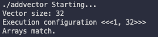

---

## 2.8 timing kernel

kernel이 얼마나 시간을 소모하는지, 어느 정도가 적정한 소모 시간인지를 알아야 한다. host side에서 CPU timer나 GPU timer를 사용하면 매우 쉽게 소모한 시간을 알 수 있다.

---

### 2.8.1 timing with CPU timer

sys/time.h 라이브러리의 gettimeofday()를 이용해서 CPU timer를 만들 수 있다.

```c
double cpuSecond() {
    struct timeval tp;
    gettimeofday(&tp, NULL);
    return ((double)tp.tv_sec + (double)tp.tv_usec*1.e-6);
}
```

이렇게 timer를 만들었다면 kernel을 시작하는 시간을 기록한 뒤, 끝난 시점에서 두 시간의 차이를 측정하면 kernel 수행 시간을 알 수 있다.

```c
double iStart = cpuSecond();
kernel_name<<<grid, block>>>(argument list);
cudaDeviceSynchronize();
double iElaps = cpuSecond() - iStart;
```

하지만 이렇게 시간을 측정할 경우, CPU가 모든 GPU thread가 작업을 완료할 때까지 기다리도록 cudaDeviceSynchronize()를 꼭 사용해야 한다.

<br/>

### <span style='background-color: #393E46; color: #F7F7F7'>&nbsp;&nbsp;&nbsp;📝 예제: vector addition 시간 측정하기&nbsp;&nbsp;&nbsp;</span>

- 비트 연산자를 이용해서 element를 약 1600만 개로 설정한다.(16,777,216개)

    ```c
    int nElem = 1<<24;
    ```

- kernel의 vector addition 때, array bound를 넘어가지 않도록 꼭 index를 점검해야 한다.(total thread 개수가 vector element 개수보다 많기 때문)

   ```c
   __global__ void sumArraysOnGPU(float *A, float *B, float *C, const int N) {
    int i = blockIdx.x * blockDim.x + threadIdx.x;
    if (i < N) {
        C[i] = A[i] + B[i];    // 
    }
   }
   ```

   아래 그림을 보면 이해가 쉽다.

   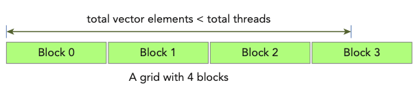

다음은 sumArraysOnGPU-timer.cu 코드이다. 앞서 본 몇 가지 function은 생략해서 기록했다.

```c
#include <cuda_runtime.h>
#include <stdio.h>
#include <sys/time.h>

// error handling을 위한 CHECK macro 생략

// CPU timer 역햘을 하는 cpuSecond() 생략

// random element를 생성하는 initialData() 생략

// host side에서 vector addition을 수행하는 sumArraysOnHost() 생략

// device side에서 vector addition을 수행하는 sumArraysOnGPU() 생략

// host/device의 vector addition 결과를 비교하는 checkResult() 생략

int main(int argc, char **argv) {
    printf("%s Starting...\n", argv[0]);

    // set up device
    int dev = 0;
    cudaDeviceProp deviceProp;
    CHECK(cudaGetDeviceProperties(&deviceProp, dev));
    printf("Using Device %d: %s\n", dev, deviceProp.name);
    CHECK(cudaSetDevice(dev));

    // set up data size of vectors
    int nElem = 1<<24;
    printf("Vector size %d\n", nElem);

    // malloc host memory
    size_t nBytes = nElem * sizeof(float);

    float *h_A, *h_B, *hostRef, *gpuRef;
    h_A     = (float *)malloc(nBytes);
    h_B     = (float *)malloc(nBytes);
    hostRef = (float *)malloc(nBytes);
    gpuRef  = (float *)malloc(nBytes);

    double iStart, iElaps;

    // initialize data at host side
    iStart = cpuSecond();
    initialData(h_A, nElem);
    initialData(h_B, nElem);
    iElaps = cpuSecond() - iStart;

    memset(hostRef, 0, nBytes);
    memset(gpuRef,  0, nBytes);

    // add vector at host side for result checks
    iStart = cpuSecond();
    sumArraysOnHost(h_A, h_B, hostRef, nElem);
    iElaps = cpuSecond() - iStart;

    // malloc device global memory
    float *d_A, *d_B, *d_C;
    cudaMalloc((float**)&d_A, nBytes);
    cudaMalloc((float**)&d_B, nBytes);
    cudaMalloc((float**)&d_C, nBytes);

    // transfer data from host to device
    cudaMemcpy(d_A, h_A, nBytes, cudaMemcpyHostToDevice);
    cudaMemcpy(d_B, h_B, nBytes, cudaMemcpyHostToDevice);

    // invoke kernel at host side
    int iLen = 1024;
    dim3 block(iLen);
    dim3 grid ((nElem + block.x - 1)/block.x);

    iStart = cpuSecond();
    sumArraysOnGPU<<<grid, block>>>(d_A, d_B, d_C, nElem);
    cudaDeviceSynchronize();
    iElaps = cpuSecond() - iStart;
    printf("sumArraysOnGPU<<<%d, %d>>> Time elapsed %f" \
        "sec\n", grid.x, block.x, iElaps);

    // copy kernel result back to host side
    cudaMemcpy(gpuRef, d_C, nBytes, cudaMemcpyDeviceToHost);

    // check device results
    checkResult(hostRef, gpuRef, nElem);

    // free device global memory
    cudaFree(d_A);
    cudaFree(d_B);
    cudaFree(d_C);

    // free host memory
    free(h_A);
    free(h_B);
    free(hostRef);
    free(gpuRef);

    return(0);  
}
```

다음과 같이 compile 후 실행한다.

```bash
$ nvcc sumArraysOnGPU-timer.cu -o sumArraysOnGPU-timer
$ ./sumArraysOnGPU-timer
```

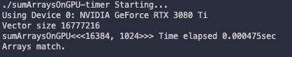

예제대로 구성하면 1D grid가 16,384개의 block을 갖는다. 그리고 각 block은 thread 1,024개를 가진다.)

여기서 1 block이 갖는 thread 수를 절반으로 줄이는 대신, block 수를 2배로 늘리면 소요되는 시간이 달라진다.(iLen = 512)

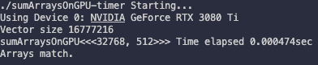

> Tesla device 기준으로는 0.002058 sec에서 0.000183 sec로 줄어들었다.

이보다 더 thread 수(block dimension)를 줄이고, block 수(grid dimension)를 늘리게 되면 device에 따라 오류가 발생할 수 있다. device에 따라 각 thread hierarchy level의 maximum size가 다르므로 유의해야 한다.

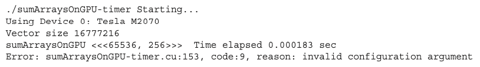

> 예를 들어 Tesla device는 block이 가질 수 있는 thread 수의 한계가 1,024개이며, grid dimension 수치는 각 x,y,z 차원에서 최대 65,535까지만 가능하다.

---

### 2.8.2 timing with nvprof

CUDA 5.0부터 nvprof를 이용해서 application의 CPU와 GPU activity timeline을 알 수 있게 되었다. 다음과 같이 사용할 수 있다.

```bash
$ nvprof [nvprof_args] <application> [application_args]
```

> \$ nvprof --help 명령으로 더 자세하게 알 수 있다.

앞선 예제를 nvprof로 살펴볼 수 있다.

```bash
$ nvprof ./sumArraysOnGPU-timer
```

위 명령을 입력해서 Tesla GPU에서 살펴본 결과는 다음과 같다. 절반은 program output을 담은 message이고, 나머지가 nvprof의 output에 해당한다.

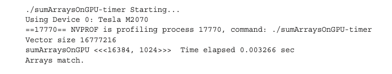

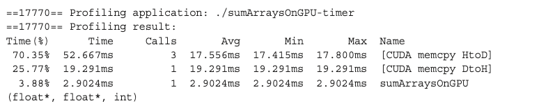

- 2.9024ms: nvprof가 측정한 kernel time

nvprof의 측정 값인 2.9024ms는 CPU timer로 측정한 kernel time인 3.26ms와 다르다. 이는 CPU timer output이 nvprof 처리를 위해 때문에 생기는 overhead를 포함하기 때문이다.(따라서 nvprof의 결과가 더 정확하다.)

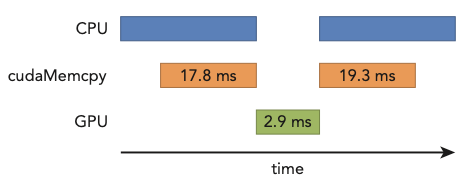

> kernel 수행보다도 host와 device 사이에서 일어나는 data transfer가 훨씬 시간을 잡아먹었다는 점을 기억하자.

<br/>

### <span style='background-color: #393E46; color: #F7F7F7'>&nbsp;&nbsp;&nbsp;📝 예제:nvprof를 이용하여 theoretical limit과 비교하기&nbsp;&nbsp;&nbsp;</span>

nvprof를 이용해서 application의 instruction과 memory throughput을 계산할 수 있다. 이 계산을 theoretical peak value(이론적인 한계값)와 비교하면, application이 어떤 제약을 받고 있는지 알 수 있다.

계산은 Tesla K10을 기준으로 살펴볼 것이다.

- Tesla K10 Peak Single Precision FLOPS

    = 745 MHz core clock * 2 GPUs/board * (8 multiprocessors * 192 fp32 cores/multiprocessor) * 2ops/cycle = 4.58TFLOPS

- Tesla K10 Peak Memory Bandwidth

    = 2 GPUs/board * 256 bit * 2500 MHz mem-clock * 2 DDR / 8bits/byte = 320 GB/s

- Ratio of instruction:bytes

    = 4.58 TFLOPS / 320 GB/s 

    $\rightarrow$ 13.6 instructions:1 byte

즉, Tesla K10은 byte access마다 instruction 13.6개 이상을 **issue**(투입) 가능하다.

---

## 2.9 organizing parallel threads

앞서 vector addition에서는 kernel에 알맞는 grid, block size를 지정해서 계산했다. 이때 grid size는 block size와 vector size에 의해 결정되었다.

그렇다면 matrix addition은 어떻게 계산할까? 일반적으로 2D grid나 2D block을 이용해서 해결할 수 있다.

- 2D grid with 2D blocks

- 1D grid with 1D blocks

- 2D grid with 1D blocks

일반적으로 2D array 형태의 data(image pixel 등)라면, 2D block으로 구성된 2D grid를 사용하는 편이 편리하다. 가령 76x62 pixel이 있다고 하자. 이를 16x16 thread로 구성된 block으로 나누면 어떻게 될까?

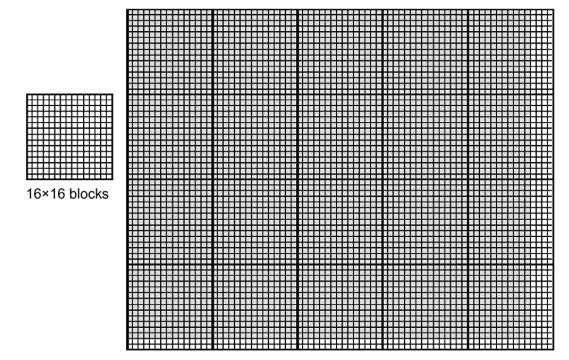

- 회색으로 칠해진 부분이 pixel data(76x62)를 의미한다.

- x축으로는 5개의 block이 필요하다.

- y축으로는 4개의 block이 필요하다.

- 즉, 이 pixel data를 처리하기 위해서는 5*4 = 20개의 block이 필요하다.

> 여전히 data 수보다 thread 수가 더 많다는 점에 유의하자.

pixel data를 Pin이라고 한다면, block(1,0)에 있는 thread(0,0)의 Pin element는 다음과 같이 index할 수 있다.

- blockIdx.y * blockDim.y + threadIdx.y = 1 * 16 + 0 = 16

- blockIdx.x * blockDim.x + threadIdx.x = 0 * 16 + 0 = 0

$$ P_{blockIdx.y * blockDim.y + threadIdx.y, \, blockIdx.x * blockDim.x + threadIdx.x} = P_{16,0} $$

---

### 2.9.1 indexing matrices with blocks and threads

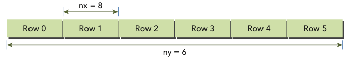

$8 \times 6$ matrix가 있다고 가정하자. matrix addition kernel에서도 thread는 주로 하나의 data element를 처리한다. matrix 계산을 위해서는 다음 세 가지를 정해야 한다.

- thread and block index

- coordinate of a given point in the matrix

- offset in linear global memory

다음 과정을 통해서 global memory에 matrix를 mapping할 수 있다.( $8 \times 6$ 이므로 nx = 8, ny = 6으로 사용한다. )

1. matrix coordinate에 맞춰서 thread와 block index를 지정한다.

    - ix = threadIdx.x + blockIdx.x * blockDim.x

    - iy = threadIdx.y + blockIdx.y * blockDim.y

2. global matrix에 이를 mapping한다.

    - idx = iy * nx + ix

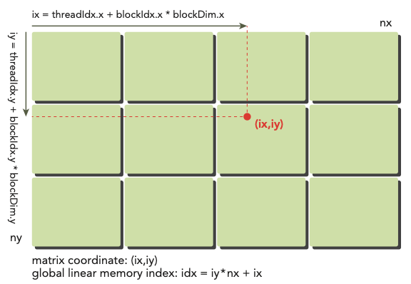

참고로 printThreadInfo() function을 사용하면 관련된 여러 정보를 알 수 있다.

- thread index

- block index

- matrix coordinate

- global linear memory offset

- value of corresponding elements

<br/>

### <span style='background-color: #393E46; color: #F7F7F7'>&nbsp;&nbsp;&nbsp;📝 예제: matrix element printing&nbsp;&nbsp;&nbsp;</span>

이제 다음과 같은 $8 \times 6$ matrix의 element를 출력해 보며 index를 확인할 것이다. 파일명은 'checkThreadIndex.cu'이다.

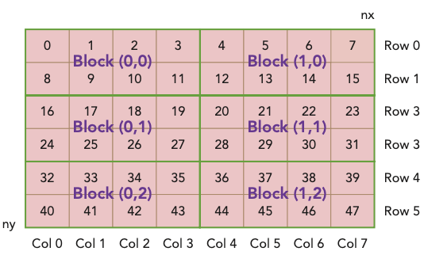

- 1 block은 $4 \times 2$ thread로 구성된다.

- grid는 $(8 + 4 - 1)/4 \times (6 + 2 - 1)/2$ block으로 구성된다.( 즉, $3 \times 2$ )

> 도중에 cudaDeviceProp()을 이용해 device 정보를 query할 것이다.

```c
#include <cuda_runtime.h>
#include <stdio.h>

#define CHECK(ans) { gpuAssert((ans), __FILE__, __LINE__); }
inline void gpuAssert(cudaError_t code, const char *file, int line, bool abort =true) {
    if (code != cudaSuccess) {
        fprintf(stderr, "GPUassert: %s %s %d\n", cudaGetErrorString(code), file, line);
        if (abort)
            exit(code);
    }
}

// host에서 matrix element를 채울 function
void initialInt(int *ip, int size) {
    for (int i = 0; i < size; i++) {
        ip[i] = i;
    }
}

// host에서 matrix element를 print할 function 
void printMatrix(int *C, const int nx, const int ny) {
    int *ic = C;
    printf("\nMatrix: (%d.%d)\n", nx, ny);
    for (int iy = 0; iy < ny; iy++) {
        for (int ix = 0; ix < nx; ix++) {
            printf("%3d", ic[ix]);
        }
        ic += nx;
        printf("\n");
    }
    printf("\n");
}

// device에서 matrix element를 print할 kernel
__global__ void printThreadIndex(int *A, const int nx, const int ny) {
    int ix = threadIdx.x + blockIdx.x * blockDim.x;
    int iy = threadIdx.y + blockIdx.y * blockDim.y;
    unsigned int idx = iy*nx + ix;

    // printf function 사용에 유의
    printf("thread_id (%d,%d) block_id (%d,%d) coordinate (%d,%d) "
        "global index %2d ival %2d\n", threadIdx.x, threadIdx.y, blockIdx.x,
        blockIdx.y, ix, iy, idx, A[idx]);
}

int main(int argc, char **argv) {
    printf("%s Starting...\n", argv[0]);

    // get device information
    int dev = 0;
    cudaDeviceProp deviceProp;
    CHECK(cudaGetDeviceProperties(&deviceProp, dev));
    printf("Using Device %d: %s\n", dev, deviceProp.name);
    CHECK(cudaSetDevice(dev));

    // set matrix dimension
    int nx = 8;
    int ny = 6;
    int nxy = nx*ny;
    int nBytes = nxy * sizeof(float);

    // malloc host memory
    int *h_A;
    h_A = (int *)malloc(nBytes);

    // initialize host matrix with integer
    initialInt(h_A, nxy);
    printMatrix(h_A, nx, ny);

    // malloc device memory
    int *d_MatA;
    cudaMalloc((void **)&d_MatA, nBytes);

    // transfer data from host to device
    cudaMemcpy(d_MatA, h_A, nBytes, cudaMemcpyHostToDevice);

    // set up execution configuration
    dim3 block(4, 2);
    dim3 grid((nx + block.x - 1)/block.x, (ny + block.y - 1)/block.y);

    // invoke the kernel
    printThreadIndex<<<grid, block>>>(d_MatA, nx, ny);
    cudaDeviceSynchronize();

    // free host and device memory
    cudaFree(d_MatA);
    free(h_A);

    // reset device
    cudaDeviceReset();

    return(0);
}
```

다음과 같이 compile한 뒤 실행한다.

```bash
$ nvcc -arch=sm_80 checkThreadIndex.cu -o checkIndex
$ ./checkIndex
```

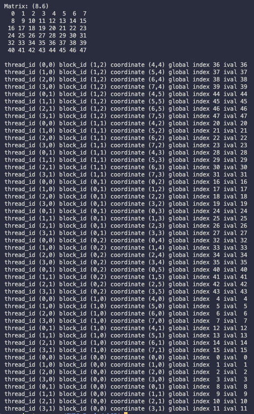

---

### 2.9.2 summing matrices with 2D grid and 2d blocks

<br/>

### <span style='background-color: #393E46; color: #F7F7F7'>&nbsp;&nbsp;&nbsp;📝 예제: matrix addition(2D grid, 2D blocks)&nbsp;&nbsp;&nbsp;</span>

2D grid와 2D block으로 구성한 kernel로 matrix addition을 수행한다. host side에서도 동일한 연산을 수행한 뒤, kernel 결과와 비교하여 제대로 수행이 됐는지 확인할 것이다.

- matrix size는 16,384 element를 갖는다.

    ```c
    int nx = 1<<14;
    int ny = 1<<14;
    ```

- 1 block은 (32, 32) thread를 갖는다.

- 1 grid는 block을 (nx + block.x - 1)/block.x, (ny + block.y - 1)/block.y 만큼 갖는다.(512, 512)

우선 host의 matrix addition function은 다음과 같다.

```c
// host side에서 matrix addition 수행
void sumMatrixOnHost(float *A, float *B, float *C, const int nx, const int ny) {
    float *ia = A;
    float *ib = B;
    float *ic = C;

    for (int iy = 0; iy < ny; iy++){
        for (int ix = 0; ix < nx; ix++){
            ic[ix] = ia[ix] + ib[ix];
        }
        ia += nx;
        ib += nx;
        ic += nx;
    }
}
```

device의 matrix addtion kernel은 다음과 같다.

```c
__global__ void sumMatrixOnGPU2D(float *MatA, float *MatB, float *MatC, int nx, int ny){
    unsigned int ix = threadIdx.x + blockIdx.x * blockDim.x;
    unsigned int iy = threadIdx.y + blockIdx.y * blockDim.y;
    unsigned int idx = iy*nx + ix;

    if (ix < nx && iy < ny){
        MatC[idx] = MatA[idx] + MatB[idx];
    }
}
```

아래는 matrix addition을 수행하는 sumMatrixOnGPU-2D-grid-2D-block.cu code이다.

```c
// include 생략
// error handling을 위한 CHECK macro 생략
// host와 device의 matrix addition function 생략(sumMatrixOnHost, sumMatrixOnGPU2D)
// CPU timer인 CPUsecond() function 생략
// matrix에 element를 생성하는 initialData() function 생략
// host와 device의 결과를 비교하는 checkResult() function 생략

int main(int argc, char** argv){
    printf("%s Starting...\n", argv[0]);

    // set up device
    int dev = 0;
    cudaDeviceProp deviceProp;
    CHECK(cudaGetDeviceProperties(&deviceProp, dev));
    printf("Using Device %d: %s\n", dev, deviceProp.name);
    CHECK(cudaSetDevice(dev));

    // set up data size of matrix
    int nx = 1<<14;
    int ny = 1<<14;

    int nxy = nx*ny;
    int nBytes = nxy * sizeof(float);
    printf("Matrix size: nx %d ny %d\n", nx, ny);

    // malloc host memory
    float *h_A, *h_B, *hostRef, *gpuRef;
    h_A = (float *)malloc(nBytes);
    h_B = (float *)malloc(nBytes);
    hostRef = (float *)malloc(nBytes);
    gpuRef = (float *)malloc(nBytes);

    // initialize data at host side
    double iStart = cpuSecond();
    initialData(h_A, nxy);
    initialData(h_B, nxy);
    double iElaps = cpuSecond() - iStart;

    memset(hostRef, 0, nBytes);
    memset(gpuRef, 0, nBytes);

    // add matrix at host side for result checks
    iStart = cpuSecond();
    sumMatrixOnHost(h_A, h_B, hostRef, nx, ny);
    iElaps = cpuSecond() - iStart;

    // malloc device global memory
    float *d_MatA, *d_MatB, *d_MatC;
    cudaMalloc((void **)&d_MatA, nBytes);
    cudaMalloc((void **)&d_MatB, nBytes);
    cudaMalloc((void **)&d_MatC, nBytes);

    // transfer data from host to device
    cudaMemcpy(d_MatA, h_A, nBytes, cudaMemcpyHostToDevice);
    cudaMemcpy(d_MatB, h_B, nBytes, cudaMemcpyHostToDevice);

    // invoke kernel at host side
    int dimx = 32;
    int dimy = 32;
    dim3 block(dimx, dimy);
    dim3 grid ((nx + block.x - 1)/block.x, (ny + block.y - 1)/block.y);

    iStart = cpuSecond();
    sumMatrixOnGPU2D<<<grid, block>>>(d_MatA, d_MatB, d_MatC, nx, ny);
    cudaDeviceSynchronize();
    iElaps = cpuSecond() - iStart;
    printf("sumMatrixOnGPU<<<(%d,%d), (%d,%d)>>> elapsed %f sec\n",
        grid.x, grid.y, block.x, block.y, iElaps);

    // copy kernel result back to host side
    cudaMemcpy(gpuRef, d_MatC, nBytes, cudaMemcpyDeviceToHost);

    // check device results
    checkResult(hostRef, gpuRef, nxy);

    // free device global memory
    cudaFree(d_MatA);
    cudaFree(d_MatB);
    cudaFree(d_MatC);

    // free host memory
    free(h_A);
    free(h_B);
    free(hostRef);
    free(gpuRef);

    // reset device
    cudaDeviceReset();

    return(0);
}
```

다음과 같이 compile한 뒤 실행한다.

```bash
$ nvcc -arch=sm_80 sumMatrixOnGPU-2D-grid-2D-block.cu -o matrix2D
$ ./matrix2D
```

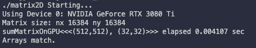

block dimension을 32x16으로 한 뒤(block은 512x1024가 된다.). recompile해서 실행하면 시간은 약 1/2배 정도로 줄어든다. 직관적으로 생각해도 parallelism이 두 배 늘었기 떄문에 시간이 줄었다는 사실을 알 수 있다. 

> 위 서술은 Tesla device 기준으로 줄어든 시간이다. 0.060323 sec에서 0.038041 sec로 줄어든다.

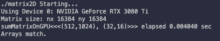

그러나 16x16으로 block dimension을 지정한 뒤(block은 1024x1024가 된다.), recompile하고 실행하면 오히려 시간이 더 늘어난다. 처음과 비교하면 block이 4배가 되며 parallelism이 늘었는데 어째서 이런 결과가 나오는 것일까? (ch03 참조)


> Fermi device에서 수행한 결과는 다음과 같다.

| kernel configuration | kernel elapsed time | block number |
| --- | --- | --- |
| (32,32) | 0.060323 sec | 512x512 |
| (32,16) | 0.038041 sec | 512x1024 |
| (16,16) | 0.045535 sec | 1024x1024 |

---

### 2.9.3 summing matrices with a 1D grid and 1D blocks

<br/>

### <span style='background-color: #393E46; color: #F7F7F7'>&nbsp;&nbsp;&nbsp;📝 예제: matrix addition(1D grid, 1D blocks)&nbsp;&nbsp;&nbsp;</span>

앞선 2D grid, 2D blocks 예제를 1D grid, 1D blocks로 변형해서 matrix addition을 수행한다.(파일명은 sumMatrixOnGPU-1D-grid-1D-block.cu)

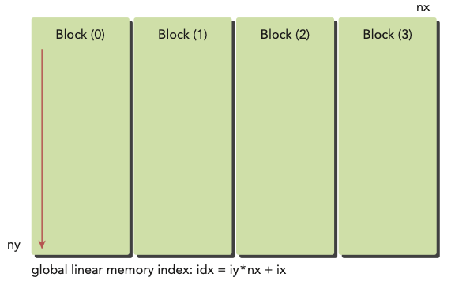

이와 같이 1D grid, 1D block으로 구성한다면, kernel의 index를 다르게 구성해야 한다.(1D block은 오직 threadIdx.x만 index 계산에 쓸 수 있게 된다.)

```c
__global__ void sumMatrixOnGPU1D(float *MatA, float *MatB, float *MatC,
    int nx, int ny) {
    unsigned int ix = threadIdx.x + blockIdx.x * blockDim.x;
        
    if (ix < nx) {
        for (int iy  = 0; iy < ny; iy++) {
            int idx = iy*nx + ix;
            MatC[idx] = MatA[idx] + MatB[idx];
        }
    }
}
```

다음과 같이 block configuration을 설정한다.

```c
dim3 block(32,1);
dim3 grid ((nx + block.x - 1)/block.x,1);
```

- 1 block은 32개 thread를 갖는다.

- 1 grid는 (nx + block.x - 1)/block.x개의 block을 갖는다.

kernel 명칭이 바뀐 것에 주의한다.

```c
sumMatrixOnGPU1D<<<grid, block>>>(d_MatA, d_MatB, d_MatC, nx, ny);
```

작성을 완료하면 compile해서 실행한다.

```bash
$ nvcc -arch=sm_80 sumMatrixOnGPU-1D-grid-1D-block.cu -o matrix1D
$ ./matrix1D
```

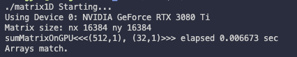

사실 결과를 보면 알 수 있지만, 이는 2D grid, 2D block (32x32)과 구조적으로 차이가 없다. 하지만 연산 시간에서 차이를 보인다.

block(128,1)로 변경해서 수행을 하면 조금 더 빨라지는 모습을 발견할 수 있다.

```
dim3 block(128,1);
dim3 grid ((nx + block.x - 1)/block.x,1);
```

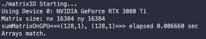

> Tesla device 기준으로 0.061352 sec에서 0.044701 sec로 빨라진다.

---

### 2.8.4 summing matrices with a 2D grid and 1D blocks

<br/>

### <span style='background-color: #393E46; color: #F7F7F7'>&nbsp;&nbsp;&nbsp;📝 예제: matrix addition(2D grid, 1D blocks)&nbsp;&nbsp;&nbsp;</span>

앞선 2D grid, 2D blocks 예제를 2D grid, 1D blocks로 변형해서 matrix addition을 수행한다.(파일명은 sumMatrixOnGPU-2D-grid-1D-block.cu)

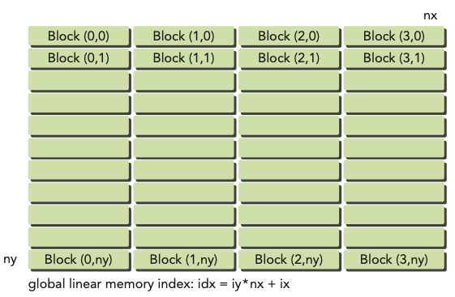

이 경우 matrix coordinate mapping(ix, iy)이 다음과 같이 바뀐다.

```c
ix = threadIdx.x + blockIdx.x * blockDim.x;
iy = blockIdx.y;
```

다음과 같이 block과 grid size를 지정한다.

```c
dim3 block(32);
dim3 grid((nx + block.x - 1)/block.x,ny);
```

global linear memory offset은 마찬가지다. 변경 사항을 반영한 kernel은 다음과 같다.

> 사실 아래와 같이 변경하지 않아도 sumMatrixOnGPU2D로 동작시킬 수 있다. 대신 바꾼 kernel이 thread마다 integer multiplication 연산 1개, integer addition 연산 1개를 덜 수행하는 이점을 갖는다.

```c
__global__ void sumMatrixOnGPUMix(float *MatA, float *MatB, float *MatC,
    int nx, int ny) {
    unsigned int ix = threadIdx.x + blockIdx.x * blockDim.x;
    unsigned int iy = blockIdx.y;
    unsigned int idx = iy*nx + ix;

    if (ix < nx && iy < ny){
        MatC[idx] = MatA[idx] + MatB[idx];
    }
}
```

kernel invoke는 다음과 같다.

```c
sumMatrixInGPUMix<<<grid, block>>>(d_MatA, d_MatB, d_MatC, nx, ny);
```

compile하고 실행한다.

```bash
$ nvcc -arch=sm_80 sumMatrixOnGPU-2D-grid-1D-block.cu -o mat2D1D
$ ./mat2D1D
```

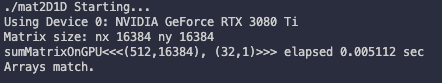

참고로 block size를 256으로 늘리면 시간이 더 감소한다. 

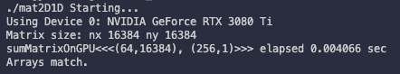

> Tesla 기준으로 0.073727 sec에서 0.030765 sec가 된다.

<br/>

아래는 Fermi device에서 grid, block dimension을 바꾸며 수행한 결과를 정리한 표다.

| kernel | execution comfigure | time elapsed |
| --- | --- | --- |
| sumMatrixOnGPU2D | (512, 1024), (32,16) | 0.038041 |
| sumMatrixOnGPU1D | (128, 1), (128,1) | 0.044701 |
| sumMatrixOnGPUMix | (64, 16384), (256,1) | 0.030765 |

이를 통해 알 수 있는 점은 다음과 같다.

1. execution configuration을 바꾸면 performance에 영향을 미친다.

2. 일반적으로 최적의 configuration을 찾지 않으면 best performance을 얻을 수 없다.

3. grid와 block dimension을 바꾸는 것으로도 performance를 향상시킬 수 있다.

---