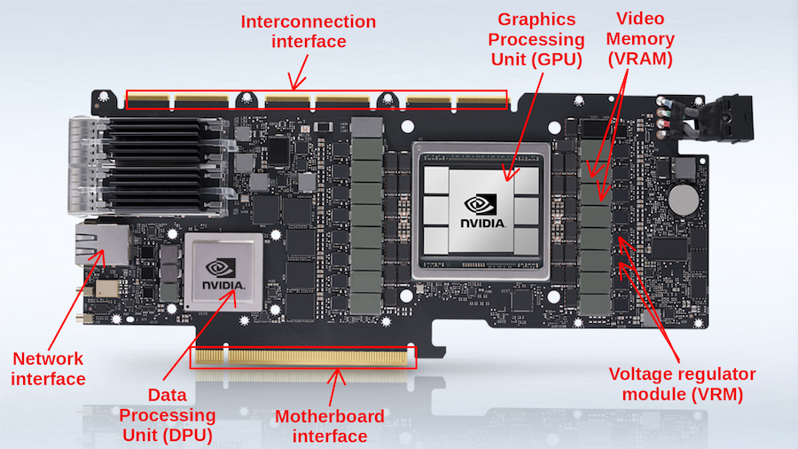
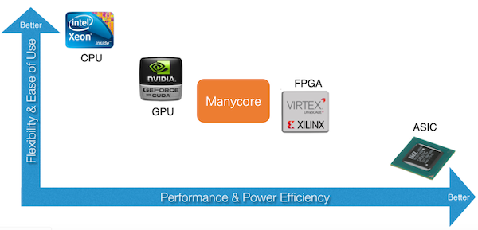
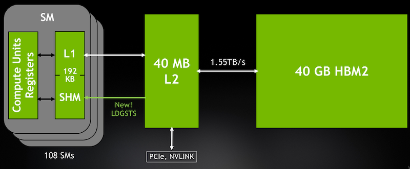
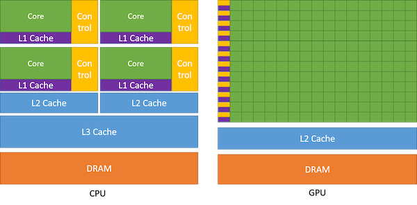
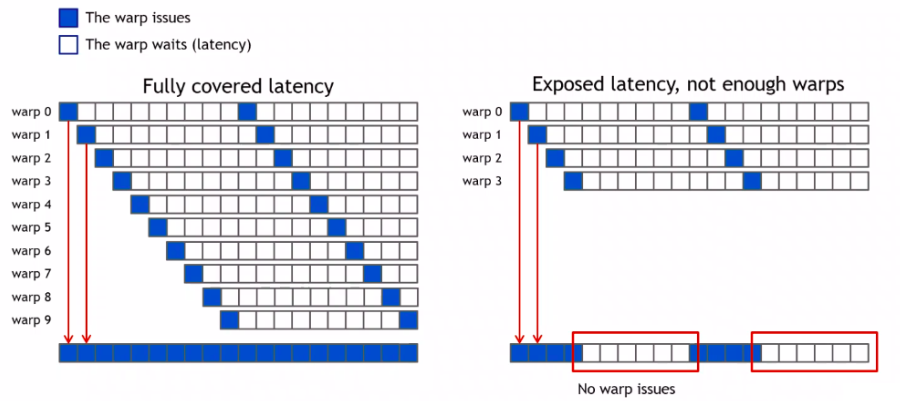
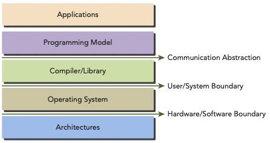
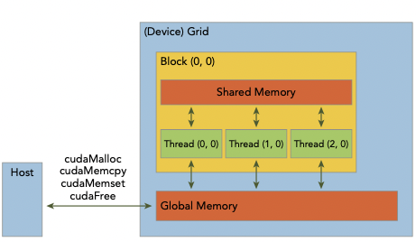
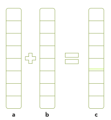

# 2 CUDA Programming Model (Part I)

> [Managing Devices](https://github.com/erectbranch/CUDA_Basic/blob/master/ch02/management.md)

이번 장은 vector addition, matrix addition 예제를 CUDA program으로 작성하며 살펴볼 것이다. 

---

## 2.1 Graphics card

> [A complete anatomy of a graphics card: Case study of the NVIDIA A100](https://blog.paperspace.com/a-complete-anatomy-of-a-graphics-card-case-study-of-the-nvidia-a100/)

들어가기 앞서 잠시 GPU의 PCB 기판, 즉 Graphics card가 어떻게 구성되어 있는지 살펴보자. 흔히 GPU를 Graphics card 자체로 착각하는 경우가 많지만, GPU는 Graphics card의 일부분이다.



- GPU chip 내부에, CUDA core와 SRAM 등이 존재한다.

- 외부는 GPU에서의 DRAM에 해당되는 Video RAM(VRAM)으로 GDDR SGRAM memory를 갖는다.

  > [DDR과 GDDR의 차이](https://news.skhynix.co.kr/post/ddr-gddr)

여기서 GDDR SGRAM은 **Graphics Double Data Rate** SGRAM(Synchronous Graphics DRAM)의 약자다. 3D graphic 처리를 보다 원활하게 할 수 있는 (pixel의 깊이 정보를 담는) Z buffer를 장착하는 등, GPU는 graphic 처리에 특화된 RAM(SGRAM)을 갖게 되었다.

- GDDR은 data를 읽고 쓸 수 있는 통로인 **strobe**(스트로브)를 일반 DRAM보다 훨씬 많이 갖고 있다.

  > DDR(Double Data Rate)란, 기존 SDR(Single Data Rate)가 clock rising edge에서만 data를 전송하는 방식에서, clock rising, falling edge를 이용해 2배의 data를 전송할 수 있게 된 방식을 의미한다. 세대가 지날수록 bus clock rate는 향상시키고, 소모 voltage는 낮추고 있다.

> 최신 기술로 더 낮은 latency와 높은 bandwidth를 얻기 위해, GDDR 대신 **HBM**(High Bandwidth Memory)를 장착하는 경우도 있다. 하지만 비용이나 구현 난이도, 용량의 확장 문제 등을 안고 있다.

---

### 2.1.1 spectrum of GPU

**GPU**(Graphics Processing Unit)는 기본적으로 graphic rendering에 필요한 복잡한 mathematical, geometric calculation을 처리하기 위해 설계된 processor이다.

- CPU와 비교했을 때 더 많은 transistor와 ALU를 가진다.

이러한 설계 목적 때문에 초기 GPU는 오로지 graphics pipeline의 특정 부분을 accelerate하기 위한 device로 사용되었다. 하지만 GPU가 발전하면서 일반적으로 CPU가 처리했던 계산을 처리하기 시작하고, general purpose computing에도 사용되기 시작했다.

> 초기에는 **GPGPU**(General Purpose GPU)라고 구분해서 부르기도 했다.

따라서 현재의 GPU는, '특정 목적에 **specialized**된' **accelerator**(가속기)가 아니라, general purpose computing에 사용되는 (data parallelism에 특화된) **processor**로 보는 편이 더 정확하다.



- processor: **flexibillity**가 높다.

  - CPU, GPU

- accerelator: **performance**와 **power efficiency**가 높다.

  - FPGA(Field Programmable Gate Array), ASIC(Application Specific Integrated Circuit)

> 현 시점에서는 one-size-fits-all(모든 일에 만능인) processor는 당장 존재하지 않을 것으로 보며, 대형 chip에 서로 다른 device를 결합하여 효율을 높이는 방식으로 발전하고 있다.

---

## 2.2 GPU architecture overview

GPU는 unit을 네 가지 분류로 나눈다.

- **Streaming Multiprocessors**(SMs)

- **Load/Store**(LD/ST) units

  data의 asynchronous copy가 가능하다. 추가 thread resource의 사용 없이, thread들이 global하게 share할 수 있도록 data를 load한다.

- **Special Function Units**(SFU)

  vectored data에서 sine, cosine, reciprocal, square root 등의 function을 계산한다.

- **Texture Mapping Units**(TMU)

  image rotation, resizing, adding distortion, noise, moving 3D plane objects 등의 task를 처리한다.

---

### 2.2.1 Streaming Multiprocessors

**SM**(Streaming Multiprocessor)은 다음 요소로 구성된 execution entity이다.

- register space를 공유하는 core 묶음.

  > NVIDIA에서는 CUDA cores와 Tensor cores, AMD에서는 Stream processors라고 부른다.

  > Tensor core는 ML application에 특화된 core로, ML에서는 훨씬 빠른 연산 속도를 보이지만 평범한 연산은 제대로 수행하지 못한다.(CUDA core가 clock cycle당 하나의 operation만 수행할 수 있는 것에 비해, Tensor core는 cycle당 여러 개의 operation을 수행한다.)

- shared memory와 L1 cache

아래는 A100의 cache hierarchy를 나타낸 그림이다. SM이 어떻게 구성되어 있고, VRAM과 어떻게 data transfer가 이루어지는지 살펴보자.



- 각 SM은 shared memory와 L1 cache를 갖는다.

- L2 cache는 모든 SM에 unified, shared되어 있다. HBM2(VRAM)의 가교 역할을 한다.

---

### 2.2.2 benifits of using GPUs, latency hiding

CPU의 한 core가 한 번에 여러 개의 thread를 처리할 수 있듯이, GPU 역시 SM 내부의 한 core가 한 번에 여러 개의 thread를 처리할 수 있다. 하지만 설계 철학에 따라 세부적인 차이는 크다.

- CPU: 소수의 core로 수십 개의 thread를 parallel하게 수행.

- GPU: 수백 개에서 수천 개에 달하는 CUDA core로, 수천 개의 thread를 parallel하게 수행.

CPU와 GPU의 차이를 cache hierarchy를 비교하며 살펴보자.



- CPU: chip 내부의 절반을 cache가 차지하고 있다. 

  - **latency stall**이 발생하지 않는 것을 중점으로 설계하였다.

  - 따라서 재사용성이 높은 data를 cache에 저장해두고, cache hit가 발생하면 빠르게 data를 가져올 수 있다. 

  - branch prediction, prefetching 등 pipeline hazard를 막기 위한 여러 기법을 사용한다.

- GPU: cache가 차지하는 비중이 적은 대신, 대부분을 core(ALU)가 차지하고 있다.

GPU는 cache가 적어서 VRAM에 접근할 때마다 penalty를 겪게 된다. 하지만 이러한 문제를 겪을 때 다른 warp가 대신 task를 이어서 수행하는 것으로 **latency hiding**을 할 수 있다.

GPU가 instruction을 실행해야 한다고 하자. 아래와 같은 방법으로 idle(혹은 wasted) time을 발생시키지 않는 것이다.

- 기존의 long-latency operation(memory access 등)으로 길게 기다려야 하는 warp는 선택하지 않는다.

- 실행 준비가 된 warp를 선택해서 실행한다.

  > (ready인 warp가 여러 개 있다면, priority mechanism에 따라 선택한다.) 

> [warp 정리](https://alpaka.readthedocs.io/en/0.5.0/usage/abstraction/warp.html): **warp**란 <U>동일한 instruction을 (parallel하게) 수행하는 thread 묶음</U>을 의미한다.(총 thread 32개로 구성된 single execution unit)

> 다시 말해 warp 내 어떤 한 thread가 어떤 instruction을 실행하면, 나머지 내부의 thread들도 동일한 instruction을 실행해야 한다. **SIMT**(Single Instruction Multiple Thread)라고 부르는 이유.

```
// 만약 128개의 가능한 thread가 있다면, 4개의 warp로 partition된다.
Warp 0: thread  0, thread  1, thread  2, ... thread 31
Warp 1: thread 32, thread 33, thread 34, ... thread 63
Warp 2: thread 64, thread 65, thread 66, ... thread 95
Warp 3: thread 96, thread 97, thread 98, ... thread 127
```

> process가 은행이라면, warp는 은행 창구의 은행원에 해당된다.



> 단, warp가 부족하면 오른쪽처럼 latency hiding에 실패할 수도 있다.

---

## 2.3 CUDA programming model

programming model이란, hardware상에서 동작하는 application을 만들 수 있도록 computer architecture을 abstraction한 것을 의미한다.

> programming language나 programming environment 형태로 나타난다.

아래 그림은 program과 programming model 구현에 있어서의 abstraction을 계층 형식으로 나타낸 것이다.

> CUDA programming model을 보면 GPU architecture가 갖는 memory hierarchy의 abstraction을 알 수 있다.



프로그래머 관점에서는 parallel computation을 다음 세 가지 level에서 향상시킬 수 있다. 

- domain level

    program과 algorithm. 어떻게 data와 function을 **decompose**(분해)해야 효율적으로 parallel하게 수행할 수 있는지 고민한다.

- logic level

    program과 algorithm 디자인이 끝나면 programming 단계로 넘어간다. 어떻게 programming해야 logic을 concurrent thread들로 구성할 수 있는지 고민한다. 

- hardware level

    hardware 자체적으로 thread를 효율 좋게 core로 mapping하는 방법 등을 고려한다.

---

## 2.4 CUDA Programming Structure

> [CUDA 기초 정리](https://velog.io/@lunarainproject/CUDA-%EA%B8%B0%EC%B4%88)

- 책(2014 발간)에서는 CUDA 6으로 실습을 진행한다.

- host(CPU) memory: variable 이름 앞에 `h_`를 붙여서 구분할 것이다.

- device(GPU) memory: variable 이름 앞에 `d_`를 붙여서 구분할 것이다.

여기서 CPU와 GPU 사이에서 공유&관리되는 memory pool인 **unified memory**를 먼저 살펴보자. 

- CPU, GPU memory 모두 단일 pointer로 data에 접근할 수 있다.

  > unified memory에 allocate된 data는 host와 device 사이에서 자동으로 **migrate**한다.

CUDA의 핵심은 kernel이다. CUDA를 이용하면 GPU thread를 통해 실행되는 kernel을 scheduling할 수 있다. 


- host는 대부분의 operation에서 device와 independent하게 동작할 수 있다.

- kernel이 **launch**(구동)되면, host는 additional task에서 벗어나 즉시 본래의 작업으로 돌아간다.

다시 말해 kernel은 **asynchronous**(비동기적)으로 launch된다. host는 kernel launch가 완료되는 것을 기다리지 않고 다음 작업을 수행한다.

> 이후 설명하겠지만, CUDA runtime에서 제공하는 `cudaDeviceSynchronize`를 이용해서 CPU가 device code의 완료를 기다리게 만들 수도 있다.

---

## 2.5 managing memory



CUDA runtime은 device memory를 allocate하는 function들을 제공한다.

| 표준 C function | CUDA C function |
| --- | --- |
| malloc | cudaMalloc |
| memcpy | cudaMemcpy |
| memset | cudaMemset |
| free | cudaFree |

---

### 2.5.1 cudaMalloc

우선 GPU memory allocation을 위한 function으로 `cudaMalloc`을 사용한다. 두 가지 parameter가 필요하다.

```c
cudaError_t cudaMalloc ( void** devPtr, size_t size )
```

- `cudaError_t`: error 발생 시 error 정보를 담는 enumerated type

- 할당 후 pointer 'devPtr'로 device memory address가 반환된다.

---

### 2.5.2 cudaMemcpy

host와 device 사이 data transfer을 위해 function으로 `cudaMemcpy`를 사용한다. 

> unified memory에 존재하는 data가 아니라면, `cudaMemcpy`를 이용해 data를 사전에 device memory로 전달해야 한다.

```c
cudaError_t cudaMemcpy ( void* dst, const void* src, size_t count, cudaMemcpyKind kind )
```

- dst: destination memory address pointer

- src: source memory address pointer

- count: copy할 byte size

- kind: data transfer type

  - `cudaMemcpyHostToHost`

  - `cudaMemcpyHostToDevice`

  - `cudaMemcpyDeviceToHost`

  - `cudaMemcpyDeviceToDevice`

<U>cudaMemcpy는 synchronous behavior</U>이다. 따라서 host application은 cudaMemcpy의 return/transfer가 완료될 때까지 멈추게 된다.

참고로 kernel launch를 제외한 모든 CUDA call은, enumerated type `cudaError_t`으로 error code를 return한다. 

- 만약 GPU memory에 성공적으로 allocate했다면, `cudaSuccess`를 return한다.

- 그렇지 않다면 `cudaErrorMemoryAllocation`을 return한다.

다음 function을 사용하면 이를 error message로 변환할 수 있다.(C의 strerror function과 비슷하다.)

```c
char* cudaGetErrorString(cudaError_t error)
```

---

### 2.5.3 array summation example

### <span style='background-color: #393E46; color: #F7F7F7'>&nbsp;&nbsp;&nbsp;📝 예제: array summation&nbsp;&nbsp;&nbsp;</span>



array summation 예제를 보며 host와 device간의 data movement가 어떻게 일어나는지 살펴보자. 

우선 위 그림과 같은 array 연산(host-based array summation)을 오직 C만 사용해서 구현할 것이다. 이를 GPU code로 바꾸는 것이 목표이다.

> 파일명은 sumArraysOnHost.c이다. 

> [int main(int argc, char **argv)란?](https://iamaman.tistory.com/364)

```c
#include <stdlib.h>
#include <string.h>
#include <time.h>

// Host에서 array sum 수행
void sumArraysOnHost(float *A, float *B, float *C, const int N) {
    for (int idx=0; idx<N; idx++) {
        C[idx] = A[idx] + B[idx];
    }
}

// array에 random number로 초기값을 설정
void initialData(float *ip, int size) {
    // random number 생성
    time_t t;
    srand((unsigned int) time(&t));

    for (int i=0; i<size; i++) {
        ip[i] = (float) ( rand() & 0xFF )/10.0f;
    }
}

int main(int argc, char **argv) {
    int nElem = 1024;
    size_t nBytes = nElem * sizeof(float);

    float *h_A, *h_B, *h_C;
    h_A = (float *)malloc(nBytes);
    h_B = (float *)malloc(nBytes);
    h_C = (float *)malloc(nBytes);

    initialData(h_A, nElem);
    initialData(h_B, nElem);

    sumArraysOnHost(h_A, h_B, h_C, nElem);

    free(h_A);
    free(h_B);
    free(h_C);

    return(0);
}
```

pure C program이므로 C compiler를 사용해도 괜찮고, nvcc compiler를 이용해 다음과 같이 compile해도 된다.

```bash
$ nvcc -Xcompiler -std=c99 sumArraysOnHost.c -o sum
$ ./sum
```

참고로 위 compile 명령의 **flag**(옵션)는 다음 의미를 가진다.

- -Xcompiler: 추가 인자를 compiler에게 전달하라는 의미.

- -std=c99: code style이 c99 standard임을 알린다.

### <span style='background-color: #C2B2B2; color: #F7F7F7'>&nbsp;&nbsp;&nbsp;🔍 풀이&nbsp;&nbsp;&nbsp;</span>

pure C code를 GPU 버전으로 바꿔보자.

1. GPU memory allocation(`cudaMalloc`)

    ```c
    /* CPU
    float *h_A, *h_B, *h_C;
    h_A = (float *)malloc(nBytes);
    h_B = (float *)malloc(nBytes);
    h_C = (float *)malloc(nBytes);
    */

    float *d_A, *d_B, *d_C;
    cudaMalloc((float**) &d_A, nBytes);
    cudaMalloc((float**) &d_B, nBytes);
    cudaMalloc((float**) &d_B, nBytes);
    ```

2. `cudaMemcpy`를 통해 GPU global memory로 data를 transfer한다.

    ```c
    cudaMemcpy(d_A, h_A, nBytes, cudaMemcpyHostToDevice);
    cudaMemcpy(d_B, h_B, nBytes, cudaMemcpyHostToDevice);
    ```

3. kernel launch

    host side에서 GPU가 array summation을 수행하도록 kernel function을 launch한다.
    
    kernel launch 시 control은 즉시 host로 return back되며, GPU가 kernel을 수행하는 사이에 다른 function을 수행한다.(asynchronous)

4. `cudaMemcpy`를 통해 GPU가 계산한 result를 host memory로 copy한다.

    kernel 작업이 모두 끝나면, 'result(array d_C)'는 GPU global memory에 저장될 것이다. 
    
    이 result를 host array(gpuRef)로 copy해야 한다.

    ```c
    cudaMemcpy(gpuRef, d_C, nBytes, cudaMemcpyDeviceToHost);
    ```

    > 만약 이렇게 copy를 진행하지 않고 'gpuRef = d_C'와 같은 잘못된 assignment문으로 작성한다면 runtime crash가 발생한다.

    > 이런 실수를 방지하기 위해 CUDA 6부터 unified memory가 제공됐다.

5. memory를 release한다.

    ```c
    cudaFree(d_A);
    cudaFree(d_B);
    cudaFree(d_C);
    ```

---

## 2.6 organizing threads

> [thread block architecture](https://tododiary.tistory.com/57)

'thread들을 어떻게 구성할 것인가'라는 문제가 CUDA programming에 있어서 핵심적인 부분이다. **thread**는 **grid**와 **block**의 2-level hierarcy로 구성된다. 

- grid: 여러 block으로 구성된다.

- block: 하나 이상의 thread로 구성된다.

  > block은 thread를 최대 512개까지 가질 수 있다. 
  
  > block이 가지는 thread 개수는 32(NVIDIA는 64를 권장) 배수로 지정하는 편이 좋다.(warp 특성상)

그림을 보며 자세히 살펴보자. host에서 kernel launch를 수행하면, device에 다음과 같은 thread hierarchy가 생성된다.


- **grid**: 한 번에 kernel launch에서 생성된 thread 전체.

  - 같은 global memory space를 공유한다.

  - 동일한 kernel code를 실행한다.

- grid는 여러 thread **block**들로 구성된다. block 단위는 다음과 같은 특성을 갖는다.

  - block-local synchronization

  - block-local shared memory

  > <U>다른 block의 thread끼리는 cooperate할 수 없다.</U>

---

### 2.6.1 blockIdx, threadIdx

CUDA runtime에 의해 각 thread별로 index(coordinate variable)가 할당된다.


- `blockIdx`: block index

- `threadIdx`: block 내부에서 갖는 thread index

> coordinate variable은 `uint3 type`이다. 3개의 unsigned integer로 구성되며, `.x`, `.y`, `.z`를 붙여서 component에 접근할 수 있다.

```c
blockIdx.x
blockIdx.y
blockIdx.z

// block 내 모든 thread는 동일한 blockIdx를 공유한다.
threadIdx.x
threadIdx.y
threadIdx.z
```

---

### 2.6.2 blockDim, gridDim

kernel launch 구문은 execution configutation parameters(`<<<...>>>`)로 grid와 block의 dimension을 지정할 수 있다. 

> grid는 주로 2D array block, block은 주로 3D array thread로 구성된다.

> 지정하지 않은 차원의 크기는 1로 지정된다.(default: 1)

 grid와 block dimension은 다음 built-in variable로 확인할 수 있다.

- `blockDim`

- `gridDim`

위 variable들은 `dim3` type이며, `uint3`에 기반해 dimension에 특화된 integer vector type이다. 마찬가지로 `.x`, `.y`, `.z`를 붙여서 component에 접근할 수 있다.

이를 통해 thread마다 유일한 global index `i`를 만들 수 있다.

- `i = blockIdx.x * blockDim.x + threadIdx.x`

만약 block이 1차원이며 thread를 256개 갖는다고 하자. 이 경우 global index는 다음과 같다.

- block 0: thread index `i`의 범위는 0~255

- block 1: thread index `i`의 범위는 256~511

- block 2: thread index `i`의 범위는 512~767

불편해 보일 수는 있지만, 이러한 방식 덕분에 kernel function은 loop가 없다. 예를 들어 아래와 같은 C code가 있다면, 각 thread가 iteration 하나씩을 담당(M*N개 thread)하여 parallel하게 수행할 수 있다.(실제로는 고려해야 하는 요소가 더 많다.)

```c
for(i = 0, i < N, i++)
    for (j = 0, j < M, j++)
        convolution(i, j);
```

이런 종류의 data parallelism을 **loop-level parallelism**이라고 지칭한다.

단, element(vector size)를 thread로 mapping할 때는 다음과 같은 사항을 고려해야 한다. 예를 들어 총 100개의 element를, (효율성을 고려한 가장 작은 thread 개수인) 32로 나눴다고 하자. 

그렇다면 block은 총 4개가 생기고, 총 128개의 thread를 가지게 된다. 그런데 이 경우 28개의 thread는 비활성화해야(연산을 수행하지 않아야) 한다. 

---

### 2.6.3 grid, block dimension example

### <span style='background-color: #393E46; color: #F7F7F7'>&nbsp;&nbsp;&nbsp;📝 예제: grid와 block dimension 구하기&nbsp;&nbsp;&nbsp;</span>

host, device 양쪽에서 grid와 block dimension을 체크해 보자.

- 'checkIndex'는 thread index, block index, grid dimension을 출력하는 kernel function이다. 

> 파일명은 checkDimension.cu이다.

```c
#include <cuda_runtime.h>
#include <stdio.h>

__global__ void checkIndex(void) {
    printf("threadIdx: (%d, %d, %d) blockIdx: (%d, %d, %d) blockDim: (%d, %d, %d) "
        "gridDim: (%d, %d, %d)\n", threadIdx.x, threadIdx.y, threadIdx.z,
        blockIdx.x, blockIdx.y, blockIdx.z, blockDim.x, blockDim.y, blockDim.z,
        gridDim.x, gridDim.y, gridDim.z);
}

int main(int argc, char **argv) {
    // number of elements
    int nElem = 6;

    // grid, block structure 정의
    // 지정하지 않은 차원은 사용하지 않는 것(1)으로 처리

    // 3개의 thread를 포함하는 1차원 block (3, 1, 1)
    dim3 block (3);
    // 필요한 grid 개수. (6 + 2)/3 = 2
    // -> 2개 block을 포함하는 1차원 grid (2, 1, 1)
    dim3 grid  ((nElem + block.x - 1)/block.x);

    // CPU에서 grid, block dimension 체크
    printf("grid.x %d grid.y %d grid.z %d\n", grid.x, grid.y, grid.z);
    printf("block.x %d block.y %d block.z %d\n", block.x, block.y, block.z);

    // GPU에서 grid, block dimension 체크
    checkIndex <<<grid, block>>> ();

    // reset device
    cudaDeviceReset();

    return(0);
}
```

참고로 CUDA로 `printf` function을 사용하기 위해서는, compile 때 GPU architecture를 명시해야 한다.

```bash
nvcc -arch=sm_80 checkDimension.cu -o check
./check
```

> 책은 Fermi GPU이므로 -arch=sm_20을 옵션으로 사용했다.([CUDA -arch 확인](https://arnon.dk/matching-sm-architectures-arch-and-gencode-for-various-nvidia-cards/))

> 현재 실습 중인 환경은 RTX 3080Ti로 Ampere architecture이다.(sm_86)($ nvidia-smi -q 명령으로 확인)([GPU 확인](https://kyumdoctor.tistory.com/72))

결과는 다음과 같다.


이 예제에서 명심할 점은 grid, block variable을, host와 device가 서로 다른 방식으로 접근한다는 점이다.

- host: 'block', 'grid'를 declaration한 뒤, 'block.x', 'block.y', 'block.z'을 사용.

- device: built-in variable인 `blockDim.x`, `blockDim.y`, `blockDim.z`를 사용.

정리하자면 data size가 주어졌을 때, grid와 block dimension은 다음 과정을 통해 정한다.

1. block size를 먼저 결정

2. grid dimension을 'data size'와 'block size'를 이용해 결정

> 단, block dimension을 정할 때는 GPU resource의 limitation을 숙지해야 한다.

---

## 2.7 launching a CUDA kernel

앞서 CUDA kernel call은 다음과 같은 문법을 사용했다.

```c
kernel_name <<<grid, block>>>(argument list);
```

다음 두 예시를 보자.

- `kernel_name<<<1, 32>>>(argument list)`: 한 block에 32개의 element를 담는다.

- `kernel_name<<<32, 1>>>(argument list)`: element 하나만을 갖는 32개의 block을 생성한다.

또한 kernel은 다음과 같이 type qualifier로 `__global__`을 붙여서 declaration해야 한다. 이때 <U>kernel function은 꼭 void return type</U>을 가져야 한다.

```c
__global__ void kernel_name(argument list);
```

아래는 CUDA C programming에서의 type qualifier를 정리한 표이다.

| qualifer | execution | callable | 설명 |
| :---: | :---: | :---: | :---: |
| \_\_global\_\_ | device | host에서 callable<br/>NVIDIA가 제시하는 compute capability가 3 이상인 device | void return type이어야 한다. |
| \_\_device\_\_ | device | device only | |
| \_\_host\_\_ | host | host only | 생략 가능. |

참고로 function이 host와 device 양쪽에서 compile된다면, \_\_device\_\_와 \_\_host\_\_ qualifier를 함께 써서 선언해도 된다. 예를 들면 다음과 같다.

```c
__host__ __device__ const char* cudaGetErrorString(cudaError_t error)
```

host function과 GPU kernel의 차이를 vector addition(A+B = C)으로 살펴보자.

- host code

    ```c
    void sumArraysOnHost(float *A, float *B, float *C, const int N) {
      for (int i = 0; i < N; i++) {
        C[i] = A[i] + B[i];
      }
    }
    ```

- CUDA

  loop가 사라지고 built-in thread coordinate variable이 array index를 대신했다. 또한 N개의 thread를 launch하면서, N을 reference할 필요가 없어졌다.

    ```c
    __global__ void sumArraysOnGPU(float *A, float *B, float *C) {
      int i = threadIdx.x;
      C[i] = A[i] + B[i];
    }
    ```

---

### 2.7.1 kernel limitation

CUDA kernel이 갖는 제약을 정리하면 다음과 같다.

- device memory만 접근 가능하다.

- void return type만 가능하다.

- 유동적인 숫자의 variable을 argument로 사용할 수 없다.

- static variable을 지원하지 않는다.

- function pointer를 지원하지 않는다.

- asynchronous한 특성 때문에 debugging이 힘들다.

---