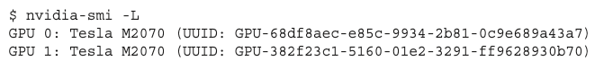
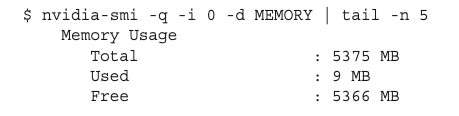
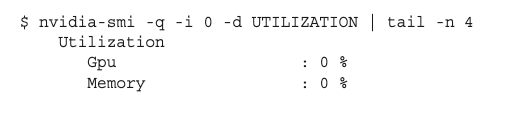

# 1 Managing Devices

NVIDIA는 GPU devices 정보를 query하거나 manage할 수 있는 몇 가지 도구를 제공한다. 따라서 이런 도구를 제대로 활용할 줄 알아야 한다.

- CUDA runtime API functions

- NVIDIA System Management Interface(**nvidia-smi**) 터미널 명령

---

## 1.1 Runtime API를 이용한 GPU 정보 query

다음과 같은 CUDA runtime API function을 이용하여 GPU device의 모든 정보를 query할 수 있다.

```c
cudaError_t cudaGetDeviceProperties(cudaDeviceProp* prop, int device);
```

GPU device 정보는 'cudaDeviceProp' structure로 return된다. 

> [NVIDIA developer zone: cudaDeviceProp](https://docs.nvidia.com/cuda/cuda-runtime-api/structcudaDeviceProp.html#structcudaDeviceProp)

CUDA runtime API를 이용해서 device 정보를 query하는 코드를 작성할 것이다. 파일명은 'checkDeviceInfor.cu'이다.

```c
#include <cuda_rumtime.h>
#include <stdio.h>

int main(int argc, char **argv) {
    printf("%s Starting...\n", argv[0]);

    int deviceCount = 0;
    cudaGetDeviceCount(&deviceCount);

    if (deviceCount == 0)
    {
        printf("There are no available device(s) that support CUDA\n");
    }
    else
    {
        printf("Detected %d CUDA Capable device(s)\n", deviceCount);
    }

    int dev = 0, driverVersion = 0, runtimeVersion = 0;
    CHECK(cudaSetDevice(dev));
    cudaDeviceProp deviceProp;
    CHECK(cudaGetDeviceProperties(&deviceProp, dev));
    printf("Device %d: \"%s\"\n", dev, deviceProp.name);

    cudaDriverGetVersion(&driverVersion);
    cudaRuntimeGetVersion(&runtimeVersion);
    printf("  CUDA Driver Version / Runtime Version          %d.%d / %d.%d\n",
           driverVersion / 1000, (driverVersion % 100) / 10,
           runtimeVersion / 1000, (runtimeVersion % 100) / 10);
    printf("  CUDA Capability Major/Minor version number:    %d.%d\n",
           deviceProp.major, deviceProp.minor);
    printf("  Total amount of global memory:                 %.2f GBytes (%llu "
           "bytes)\n", (float)deviceProp.totalGlobalMem / pow(1024.0, 3),
           (unsigned long long)deviceProp.totalGlobalMem);
    printf("  GPU Clock rate:                                %.0f MHz (%0.2f "
           "GHz)\n", deviceProp.clockRate * 1e-3f,
           deviceProp.clockRate * 1e-6f);
    printf("  Memory Clock rate:                             %.0f Mhz\n",
           deviceProp.memoryClockRate * 1e-3f);
    printf("  Memory Bus Width:                              %d-bit\n",
           deviceProp.memoryBusWidth);

    if (deviceProp.l2CacheSize)
    {
        printf("  L2 Cache Size:                                 %d bytes\n",
               deviceProp.l2CacheSize);
    }

    printf("  Max Texture Dimension Size (x,y,z)             1D=(%d), "
           "2D=(%d,%d), 3D=(%d,%d,%d)\n", deviceProp.maxTexture1D,
           deviceProp.maxTexture2D[0], deviceProp.maxTexture2D[1],
           deviceProp.maxTexture3D[0], deviceProp.maxTexture3D[1],
           deviceProp.maxTexture3D[2]);
    printf("  Max Layered Texture Size (dim) x layers        1D=(%d) x %d, "
           "2D=(%d,%d) x %d\n", deviceProp.maxTexture1DLayered[0],
           deviceProp.maxTexture1DLayered[1], deviceProp.maxTexture2DLayered[0],
           deviceProp.maxTexture2DLayered[1],
           deviceProp.maxTexture2DLayered[2]);
    printf("  Total amount of constant memory:               %lu bytes\n",
           deviceProp.totalConstMem);
    printf("  Total amount of shared memory per block:       %lu bytes\n",
           deviceProp.sharedMemPerBlock);
    printf("  Total number of registers available per block: %d\n",
           deviceProp.regsPerBlock);
    printf("  Warp size:                                     %d\n",
           deviceProp.warpSize);
    printf("  Maximum number of threads per multiprocessor:  %d\n",
           deviceProp.maxThreadsPerMultiProcessor);
    printf("  Maximum number of threads per block:           %d\n",
           deviceProp.maxThreadsPerBlock);
    printf("  Maximum sizes of each dimension of a block:    %d x %d x %d\n",
           deviceProp.maxThreadsDim[0],
           deviceProp.maxThreadsDim[1],
           deviceProp.maxThreadsDim[2]);
    printf("  Maximum sizes of each dimension of a grid:     %d x %d x %d\n",
           deviceProp.maxGridSize[0],
           deviceProp.maxGridSize[1],
           deviceProp.maxGridSize[2]);
    printf("  Maximum memory pitch:                          %lu bytes\n",
           deviceProp.memPitch);

    exit(EXIT_SUCCESS);
}
```

이를 다음과 같이 compile한 뒤 실행한다.

```bash
$ nvcc checkDeviceInfor.cu -o checkDeviceInfor
$ ./checkDeviceInfor
```

---

## 1.1.1 determining the best GPU

multiple GPUs를 지원하는 system에서 서로 다른 GPU를 이용하고 있다면, 어떤 GPU가 kernel 수행에서 제일 최적인지 고를 수 있어야 한다. 이를 정하는 대표적인 방법으로는, GPU가 가진 multiprocessor 수를 파악하는 것이 있다.

> 만약 N개의 GPU가 있다면 0 ~ N-1로 label된다.

> 환경 변수 CUDA_VISIBLE_DEVICES를 변경해서 runtime 때 사용할 GPU를 결정할 수 있다. 여러 개를 쓰려면 CUDA_VISIBLE_DEVICES=2,3 처럼 설정하는 것도 가능하다.(이들이 각각 0과 1을 대체하게 된다.)

```c
int numDevices = 0;
cudaGetDeviceCount(&numDevices);
if (numDevices > 1) {
    int maxMultiprocessors = 0, maxDevice = 0;
    for (int device = 0; device < numDevices; device++) {
        cudaDeviceProp props;
        cudaGetDeviceProperties(&props, device);
        if (maxMultiprocessors < props.multiProcessorCount) {
            maxMultiprocessors = props.multiProcessorCount;
            maxDevice = device;
        }
    }
    cudaSetDevice(maxDevice);
}
```

---

## 1.2 using nvidia-smi

command-line에서 nvidia-smi를 입력하면 GPU 정보를 가져올 수 있다.

- system에 GPU가 얼마나 install되었는지 파악

    ```bash
    $ nvidia-smi -L
    ```

    

- GPU 0에 해당하는 정보를 파악

    ```bash
    nvidia-smi -q -i 0
    ```

- 다음 옵션을 사용해서 표시되는 정보를 줄일 수 있다.

   - MEMORY
   
   - UTILIZATION

   - ECC

   - TEMPERATURE

   - POWER

   - CLOCK

   - COMPUTE

   - PIDS

   - PERFORMANCE

   - SUPPORTED_CLOCKS

   - PAGE_RETIREMENT

   - ACCOUNTING

    예를 들어 다음과 같이 사용하여 device memory만 표시할 수 있다.

    ```bash
    $ nvidia-smi -q -i 0 -d MEMORY | tail -n 5
    ```

    

    혹은 다음과 같이 device utilization 정보만 표시할 수도 있다.

    ```bash
    $ nvidia-smi -q -i 0 -d UTILIZATION | tail -n 4
    ```

    

---