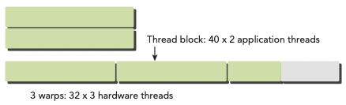
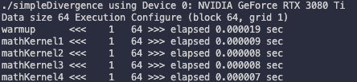
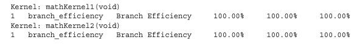
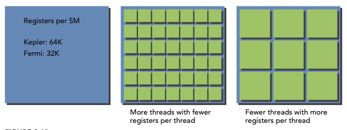
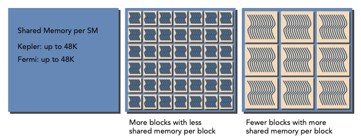
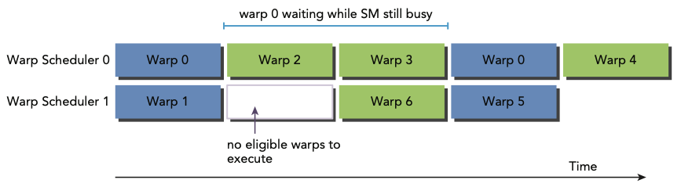
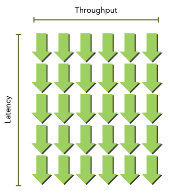
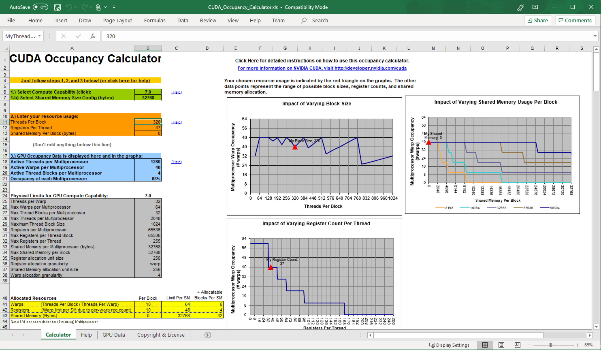
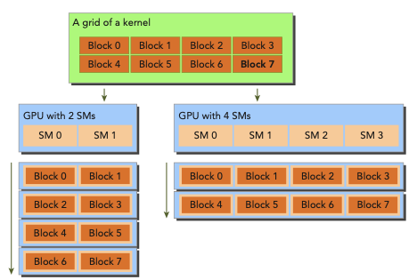

# 3 CUDA Execution Model

Fermi, Kepler architecture 설명 생략

---

## 3.1 understanding the nature of warp execution

**warp**란 thread 32개를 묶어서 지칭하는 single execution unit이다. warp은 SM에서 수행하는 execution의 basic unit이다. thread block이 SM에 schedule되면, thread block 안의 thread들은 warp로 partition된다. 

32 consecutive thread들로 구성된 warp 내부는 SIMT 방식으로 동작한다. 다시 말해 wrap 내부의 모든 thread가 동일한 instruction을 실행한다는 의미이다.

앞서 thread block을 3차원까지 구성할 수 있었지만, hardware 관점에서는 결국 모두 1차원으로 배정된다. blockDim과 blockIdx을 이용해서 block 당 warp 개수를 계산할 수 있다.

- 2D thread block에서는 다음과 같이 thread마다 unique identifier가 생성되었다.

    threadIdx.y * blockDim.x + threadIdx.x

- 3D thread block

    threadIdx.z * blockDim.y * blockDim.x + threadIdx.y * blockDim.x + threadIdx.x

- thread block당 warp 개수는 다음과 같다.

$$ WarpsPerBlock = ceil\left( {{ThreadsPerBlock} \over {warpSize}} \right) $$

wrap는 hardware마다 구체적인 숫자를 가지고, 모든 thread block에서 같은 size의 단위로 사용된다. 만약 thread block size가 warp size의 배수가 아니라면, 마지막 warp에 속하는 thread들은 inactive하게 남게 된다.

예를 들어 application에서 x dimension 40개의 thread를 갖고, y dimension이 2개의 thread를 갖는 2D thread block으로 구성했다고 하자.(40x2=80 threads laid out)

그렇다면 hardware 입장에서는 warp 3개를 allocate할 것이다. 다시 말해 80개 thread를 support하기 위해 96개의 thread가 allocate되는 것이다. 즉, 마지막 warp에서 inactive한 thread가 생기게 된다. 이런 thread들은 사용되지는 않지만, 여전히 SM resource(예를 들면 register)를 잡아먹게 된다.



---

## 3.2 warp divergence

program에서 실행되는 각 statement, instruction, function call을 제어하는 **control flow**(제어 흐름)은 high-level programming language에서의 기본적인 구성 요소이다. GPU도 마찬가지로 'if...then...else, for, while'과 같은 C 스타일의 flow-control construct를 제공한다.

CPU는 **branch prediction**(분기 예측)을 수행하기 위한 복잡한 hardware를 포함한다. predict가 올바르면 CPU는 오직 small performance penalty만 부담하면 된다. 하지만 predict가 틀렸다면, CPU는 여러 instruction pipeline으로 구성된 cycle이 stall된다.  

그러나 GPU는 branch prediction mechanism을 가지지 않은 simple한 device이다. warp의 모든 thread가 동일한 instruction을 execute하는 점을 생각해 보자. 만약 warp의 한 thread가 어느 instruction을 실행하게 되면, warp 내의 모든 thread는 같은 instruction만 execute해야 한다.

이런 특성이 application에서의 분기에서 문제를 일으킬 수 있다. 예를 들어 다음 statement가 있다고 하자.

```c
if (cond) {
    //...
} else {
    //...
}
```

이 instruction를 한 warp에서 16개는 cond(condition)이 true, 16개는 else block을 처리한다고 가정하자. 그렇다면 하나의 warp에서 다른 instruction들을 처리하게 되는 셈이다. 이를 **warp divergence**라고 한다. 

> 앞서 한 warp가 같은 instruction을 수행한다고 했으므로, warp divergence는 paradox로 보일 수 있다.

warp diverge 상황에서 warp는 serial하게 각 branch path를 '해당 path가 아닌 다른 path를 맡은 thread를 disable하게 만든 후' execute한다. 따라서 warp divergence는 performance를 굉장히 감소시키게 된다. 

앞서 한 가정에서는 warp의 parallelism은 절반(16개)로 나뉘었다. 이 예시라면 16개 thread가 execute하는 상황에서는, 다른 16개 thread가 disable된다.

> 따라서 conditional branch가 많을수록, parallelism으로 잃는 손실이 더욱 커지게 된다.

> 주의할 점은 branch divergence는 단일 warp에서 일어나는 현상이라는 점이다.

아래는 if...then statement를 처리하는 한 warp 내에서 일어나는 warp divergence를 나타낸 그림이다.(y축은 시간의 경과를 나타낸다.) 


- thread들은 condition이 true일 때의 execution, false일 때의 execution을 나눠서 수행해야 한다.

- 그러나 condition = true를 만족하는 block을 execute하고 있다면, 이를 맡지 않는 thread가 끝날 때까지 stall된다.

- 살구색: if clause(절)을 수행하는 동안, than clause를 수행하는 thread들은 stall된다.(보라색)

- 연두색: then clause를 수행하는 동안, if clause를 수행하는 thread들은 stall된다.(보라색)

따라서 best performance를 얻기 위해서는, 단일 warp에서 다른 execution path가 생기는 일을 피해야 한다. warp assignment는 **deterministic**(함수와 같이 input을 설정하면, 언제나 그에 맞는 output을 낼 수 있다.)하다는 점을 명심하자. 모든 warp가 각각 same control path을 맡게 data를 partition할 수 있다.


branch 두 개를 갖는 다음 simple arithmetic kernel 예시를 보자. 

```c
__global__ void mathKernel1(float *c) {
    int tid = blockIdx.x * blockDim.x + threadIdx.x;
    float a, b;
    a = b = 0.0f;

    if (tid % 2 == 0) {
        a = 100.0f;
    } else {
        b = 200.0f;
    }
    c[tid] = a + b;
}
```

- condition (tid % 2 == 0)로 설정하면 짝수 index thread들이 if clause, 홀수 index의 thread들이 else clause를 맡게 된다.

- 따라서 warp divergence가 발생한다.

이때 data를 **interleave**(인터리브. data가 서로 인접하지 않도록 배열하여 성능을 높이는 방법)하는 방법으로 warp divergence를 피할 수 있다. 다음 예시를 보자.

- CUDA의 built-in variable인 warpSize를 이용한다.

```c
__global__ void mathKernel2(void) {
    int tid = blockIdx.x * blockDim.x + threadIdx.x;
    float a, b;
    a = b = 0.0f;

    if ((tid / warpSize) % 2 == 0) {
        a = 100.0f;
    } else {
        b = 200.0f;
    }
    c[tid] = a + b;
}
```

- condition (tid/warpSize)%2==0)은 warp size에 맞춰서 **branch granularity**(세분성)를 갖도록 강제한다.

- even warp는 if clause를 담당하고, odd warp는 else clause를 담당한다.

다음은 이 두 예시의 performance를 비교하는 코드이다.(파일명은 simpleDivergence.cu)

```c
#include <cuda_runtime.h>
#include <stdio.h>
#include <sys/time.h>

double seconds() {
    struct timeval tp;
    gettimeofday(&tp, NULL);
    return ((double)tp.tv_sec + (double)tp.tv_usec*1.e-6);
}

// kernel causing wrap divergence
__global__ void mathKernel1(float *c) {
    int tid = blockIdx.x * blockDim.x + threadIdx.x;
    float a, b;
    a = b = 0.0f;

    if (tid % 2 == 0) {
        a = 100.0f;
    } else {
        b = 200.0f;
    }
    c[tid] = a + b;
}

// avoid wrap divergence
__global__ void mathKernel2(float *c) {
    int tid = blockIdx.x * blockDim.x + threadIdx.x;
    float a, b;
    a = b = 0.0f;

    if ((tid / warpSize) % 2 == 0) {
        a = 100.0f;
    } else {
        b = 200.0f;
    }
    c[tid] = a + b;
}

__global__ void mathKernel3(float *c) {
    int tid = blockIdx.x * blockDim.x + threadIdx.x;
    float ia, ib;
    ia = ib = 0.0f;

    bool ipred = (tid % 2 == 0);

    if (ipred) {
        ia = 100.0f;
    }

    if (!ipred) {
        ib = 200.0f;
    }
    c[tid] = ia + ib;
}

__global__ void mathKernel4(float *c) {
    int tid = blockIdx.x * blockDim.x + threadIdx.x;
    float ia, ib;
    ia = ib = 0.0f;

    int itid = tid >> 5;

    if (itid & 0x01 == 0) {
        ia = 100.0f;
    } else {
        ib = 200.0f;
    }
    c[tid] = ia + ib;
}

__global__ void warmingup(float *c) {
    int tid = blockIdx.x * blockDim.x + threadIdx.x;
    float ia, ib;
    ia = ib = 0.0f;

    if ((tid / warpSize) % 2 == 0){
        ia = 100.0f;
    } else {
        ib = 200.0f;
    }
    c[tid] = ia + ib;
}

int main(int argc, char **argv) {
    // set up device
    int dev = 0;
    cudaDeviceProp deviceProp;
    cudaGetDeviceProperties(&deviceProp, dev);
    printf("%s using Device %d: %s\n", argv[0], dev, deviceProp.name);

    // set up data size
    int size = 64;
    int blocksize = 64;
    if (argc > 1) blocksize = atoi(argv[1]);   // atoi: char to int
    if (argc > 2) size      = atoi(argv[2]);
    printf("Data size %d ", size);

    // set up execution configuration
    dim3 block (blocksize,1);
    dim3 grid  ((size + block.x -1)/block.x,1);
    printf("Execution Configure (block %d, grid %d)\n", block.x, grid.x);

    // allocate GPU memory
    float *d_C;
    size_t nBytes = size * sizeof(float);
    cudaMalloc((float**)&d_C, nBytes);

    // run a warmup kernel to remove overhead
    double iStart, iElaps;
    cudaDeviceSynchronize();
    iStart = seconds();
    warmingup<<<grid,block>>>(d_C);
    cudaDeviceSynchronize();
    iElaps = seconds() - iStart;
    printf("warmup      <<< %4d %4d >>> elapsed %f sec \n", grid.x, block.x, iElaps);

    // run kernel 1
    iStart = seconds();
    mathKernel1<<<grid,block>>>(d_C);
    cudaDeviceSynchronize();
    iElaps = seconds() - iStart;
    printf("mathKernel1 <<< %4d %4d >>> elapsed %f sec \n", grid.x, block.x, iElaps);

    // run kernel 2
    iStart = seconds();
    mathKernel2<<<grid,block>>>(d_C);
    cudaDeviceSynchronize();
    iElaps = seconds() - iStart;
    printf("mathKernel2 <<< %4d %4d >>> elapsed %f sec \n", grid.x, block.x, iElaps);

    // run kernel 3
    iStart = seconds();
    mathKernel3<<<grid,block>>>(d_C);
    cudaDeviceSynchronize();
    iElaps = seconds() - iStart;
    printf("mathKernel3 <<< %4d %4d >>> elapsed %f sec \n", grid.x, block.x, iElaps);

    // run kernel 4
    iStart = seconds();
    mathKernel4<<<grid,block>>>(d_C);
    cudaDeviceSynchronize();
    iElaps = seconds() - iStart;
    printf("mathKernel4 <<< %4d %4d >>> elapsed %f sec \n", grid.x, block.x, iElaps);

    // free GPU memory and reset device
    cudaFree(d_C);
    cudaDeviceReset();
    return(0);
}
```

다음과 같이 compile한 뒤 실행한다.

```bash
$ nvcc -O3 -arch=sm_80 simpleDivergence.cu -o simpleDivergence
$ ./simpleDivergence
```

> -O option은 optimization level을 뜻한다. 



또한 capability 7.5 미만인 device에서는 nvprof profiler를 사용해서 warp divergence를 파악할 수 있다.

> capability 7.5 이상의 device는 NVIDIA Nsight를 사용해서 profile하기를 권장하고 있다.

```bash
$ nvprof --metrics branch_efficiency ./simpleDivergence
```

branch efficiency는 전체 branch에서 non-divergent branch가 차지하는 비율을 의미한다.

$$ Branch \, Efficiency = 100 \times \left( {Branches - Divvergent \, Branches} \over {Branches} \right) $$

다음은 Tesla device에서 mathKernel1과 mathKernel2를 profiling을 진행한 결과이다.



그런데 결과를 보면 branch divergence가 없다고 나온다. 이런 결과가 나온 이유는 CUDA compiler가 warp divergence가 발생할 수 있는 branch instruction들을 optimization했기 때문이다.

여기서 주의해야 할 점이 있다. branch predication에서 condition은 1 혹은 0으로 설정된다. 그리고 두 가지 conditional flow path가 모두 execute된다. 결과적으로 predicate(논리 여부)가 1인 instruction들이 실행되지만, 그렇다고 해서 predicate가 0에 해당하는 instruction을 맡은 thread가 stall되지는 않는다.

> compiler는 조건문 수가 특정 threshold보다 적은 경우에만 optimization을 완벽하게 수행할 수 있다.

따라서 code path가 길다면 warp divergence를 일으킬 수 있다. 아래는 Tesla device에서 mathKernel3를 추가하고 profiling한 결과이다.


처음부터 warp divergence가 생기지 않도록 구성한 mathKernel2와 다르게, mathKernel1과 3는 limited optimization이 수행된 것을 알 수 있다. 

---

## 3.3 Resource Partitioning

warp를 resource 관점에서 볼 때, 다음 3가지 resource를 고려해야 한다.

- Program counters

- Registers

- Shared memory

SM 각각은 thread 사이로 register file이 든 32-bit register set을 가지고 있다. 또한 block 사이로 정해진 수량의 shared memory를 가지고 있다.

따라서 공간에 register나 shared memory를 덜 배치하면, 더 많은 thread나 block이 simultaneous하게 처리할 수 있다.





따라서 SM마다 있을 수 있는 thread의 수는 resource에 의해 제약을 받는다. 하지만 register나 shared memory는 compute capability에 필수적이므로, 이 resource가 부족하면 반대로 kernel launch에 실패할 수 있다.

allocate된 thread block을 **active** block이라고 지칭한다. 이 block 내부에 있는 warp를 active warps라 지칭한다. active warp는 다음 세 가지로 구분할 수 있다.

- selected warp: 실제로 executing 중인 warp

- stalled warp: ready(준비)가 안 된 warp

- eligible warp: ready 상태인 warp

ready는 다음 조건을 만족해야 가능하다.

- CUDA core 32개 모두 execute가 가능하다.

- 해당 instruction의 모든 argument가 준비되었다.

> SM의 warp scheduler들은 매 cycle마다 active warp를 선택하고 dispatch(준비에서 실행 상태로 변경)한다. 

예를 들어 Kepler SM에서 concurrent한 active warp의 수는 architecture limit인 64개를 넘을 수 없다. 또한 한 cycle당 selected warp는 4개 이하만 가능하다. 만약 어떤 warp가 stall되면, warp scheduler는 이를 대신하기 위해 eligible warp를 고른다.

이렇게 warp contexts를 switching하는 과정은 굉장히 빠르다.(warp 사이로 compute resource들이 배치되어 있다는 사실을 기억하자.) 덕분에 warp 수만 충분하다면 warp stall로 생기는 latency를 숨길 수 있다.

---

## 3.4 latency hiding

각 instruction 사이의 latency는 다른 resident warp에 다른 instruction을 issuing하는 것으로 감출 수 있다.

한 번에 하나에서 두 thread를 사용하며 latency를 minimize하게 디자인된 CPU core와 다르게, GPU는 throughput을 maximize하기 우ㅣ해 많은 수의 concurrent하고 lightweight한 thread들을 사용한다. 따라서 CUDA programming에서 latency hiding이 더 중요할 수밖에 없다.

instruction latency는 다음 두 가지 instruction 분류에서 살펴볼 수 있다.

- arithmetic instructions

    arithmetic instruction latency는 말 그대로 arithmetic operation이 시작해서 끝날 때까지 걸리는 시간을 의미한다.

    - 대체로 10~20 cycle

- memory instructions

    load 혹은 store operation이 issue된 시점부터 data가 destination에 도달하기까지의 시간이다.

    - (global memory access) 대체로 400~800 cycle

다음 예제를 보자. warp scheduler는 wrap 0가 stall되면, 다른 warp들을 골라 execute시킨 뒤 warp 0이 다시 eligible될 때 execute한다.



그렇다면 latency hiding을 위해서 얼마나 active warp가 필요할까? **Little's Law**(리틀의 법칙)을 GPU에 적용해서 다음과 같이 나타낼 수 있다.

$$ Number \, of \, Required \, Warps = Latency \, \times \, Throughput $$



> bandwidth와 throughput을 혼동하지 말자. 물론 둘은 종종 혼용하는 경우가 있고 양쪽 다 performance를 나타낼 수 있는 지표이다. bandwidth가 이론적인 peak value를 나타내는 값으로 주로 쓰인다면, throughput은 실제 achieved value를 말한다.

> 따라서 bandwidth가 단위 시간당 data transfer의 가장  highest한 양을 의미한다면, throughput은 단위 시간당 operation이 수행된 양(예를 들면 cycle당 완료된 instruction)을 의미한다.

우선 arithmetic operation에서는 latency hiding을 위해 필요한 operation의 개수가 required parallelism이라고 할 수 있다. 다음은 Fermi와 Kepler device에서의 필요한 operation 개수를 나타낸 표다.

| GPU model | instruction latency(cycles) | throughput | parallelism(operations) |
| --- | --- | --- | --- |
| Fermi | 20 | 32 | 640 |
| Kepler | 20 | 192 | 3840 |

- 예시는 32-bit floating-point multiply-add 연산 기준이다.

이를 다시 warp size로 나누면 SM당 필요한 warp의 개수도 알 수 있다. 가령 위 예시에서 Fermi GPU라면 640/32 = 20 warps가 된다.

정리하자면 required parallelism은 필요한 operation의 개수나, warp의 개수로 나타낼 수 있다. 

> 참고로 parallelism을 늘릴 수 있는 두 가지 방법으로, thread에 independent한 instruction을 늘리는 **ILP**(Instruction-level parallelism)과 concurrent한 eligible warp를 늘리는 **TLP**(Thread-level parallelism)이 있다. 

다음으로 memory operation에서는 latency hiding을 위해 cycle당 필요한 bytes 수를 required parallelism이라 할 수 있다. 다음은 Fermi와 Kepler device의 예시다.

| GPU model | (memory) instruction latency(cycles) | bandwidth(GB/sec) | bandwidth(B/cycle) | parallelism(KB) |
| --- | --- | --- | --- | --- |
| Fermi | 800 | 144 | 92 | 74 |
| Kepler | 800 | 250 | 96 | 77 |

> memory throughput이 주로 GB/sec로 표현되는데, nvidia-smi를 이용해서 이 단위로 변환해서 표시할 수도 있다.

```bash
$ nvidia-smi -a -q -d CLOCK | fgrep -A 3 "Max Clocks" | fgrep "Memory"
```

예를 들어 Fermi memory frequency는 1.566 GHz(Tesla C2070 측정)이다. 그리고 Kepler memory frequency는 1.6 GHz(Tesla K20 측정)이다. 이때 1Hz는 **cycle per second**로 정의되므로, bandwidth(GB/sec)에 이를 나누면 Bytes/Cycle bandwidth를 구할 수 있다.

$$ 144 GB/sec \div 1.566 GHz \cong 92 Bytes/Cycle $$

이렇게 구한 bandwidth(bytes/cycle)와 memory latency를 곱해서 required parallelism을 구할 수 있다. 예를 들어 Fermi device라면 결과가 약 74KB로 나오게 된다. 만약 thread가 하나의 float data(4 bytes)를 global memory에서 SM으로 옮겨 온다면 thread 개수는 다음과 같을 것이다.

$$ 74KB \div 4 bytes/thread \cong 18,500 threads $$

> 만약 각 thread가 independent 4-byte load보다 더 많이 수행할 수 있다면, latency hiding을 위해 요구되는 thread의 수는 줄어들 것이다.

또한 warp는 thread 32개로 구성되어 있으므로 필요한 warp의 개수를 도출해 낼 수 있다.

$$ 18,500 threads \div 32 threads/warp \cong 579 warps $$

Fermi architecture는 16SM을 가지고 있으므로, latency hiding을 위해서 SM당 579/16 = 36 warps가 필요한 셈이다. 이처럼 latency hiding은 SM당 active warp 수에 달려 있다. 또한 이러한 warp의 수는 execution configuration과 resource 제약(register와 kernel의 memory 사용량)의 영향을 받는다. 

따라서 latency hiding과 resource utilization 사이의 균형을 정하는 것이 중요한 문제다.

> 이러한 instruction latency와 마찬가지로 thread(warp)에서 더 많은 independent memory operation이 가능하게 만들면 parallelism을 향상시킬 수 있다. 

---

## 3.5 occupancy

instruction은 CUDA core에서 순차적으로 execute된다. 이때 한 warp가 stall되면, SM은 다른 eligible warp가 execute하도록 switch한다. 하지만 이를 위해서 여분의 warp를 너무 남긴다면 낭비가 생길 것이다.

**occupancy**는 (SM가 갖는) warp의 최대 수에서 active warp가 갖는 비율을 의미한다. occupancy를 최대한 늘릴 수 있어야 한다.

$$ occupancy = {active warps} \over {maximum warps} $$

여기서 SM당 maximum warp 수는 CUDA를 이용해서 알아낼 수 있다. (maxThreadsPerMultiProcessor이란 variable로 return된다.)

```c
cudaError_t cudaGetDeviceProperties(struct cudaDeviceProp *prop, int device);
```

다음 예제는 cudaGetDeviceProperties를 이용해서 GPU configuration information을 얻어내는 코드다.(파일명은 simpleDeviceQuery.cu)이다.

```c
#include <cuda_runtime.h>
#include <stdio.h>

int main(int argc, char *argv[]) {
    int iDev = 0;
    cudaDeviceProp iProp;
    cudaGetDeviceProperties(&iProp, iDev);

    printf("Device %d: %s\n", iDev, iProp.name);
    printf("Number of multiprocessor: %d\n", iProp.multiProcessorCount);
    printf("Total amount of constant memory: %4.2f KB\n",
        iProp.totalConstMem/1024.0);
    printf("Total amount of shared memory per block: %4.2f KB\n",
        iProp.sharedMemPerBlock/1024.0);
    printf("Total number of registers available per block: %d\n",
        iProp.regsPerBlock);
    printf("Warp size: %d\n, deviceProp.warpSize");
    printf("Maximum number of threads per block: %d\n",
        iProp.maxThreadsPerBlock);
    printf("Maximum number of threads per multiprocessor: %d\n",
        iProp.maxThreadsPerMultiProcessor);
    printf("Maximum number of warps per multiprocessor: %d\n",
        iProp.maxThreadsPerMultiProcessor/32);
    return(0);
}
```

다음과 같이 compile하고 실행한다.

```bash
$ nvcc simpleDeviceQuery.cu -o simpleDeviceQuery
$ ./simpleDeviceQuery
```

Tesla device를 기준으로는 다음과 같이 report 결과를 얻을 수 있다.

```bash
Device 0: Tesla M2070
Number of multiprocessors: 14
Total amount of constant memory: 64.00 KB
Total amount of shared memory per block: 48.00 KB
  
Total number of registers available per block: 32768 Warp size: 32
Maximum number of threads per block: 1024
Maximum number of threads per multiprocessor: 1536 Maximum number of warps per multiprocessor: 48
```

> CUDA Toolkit에 포함된 spreadsheet인 CUDA Occupancy Calculator를 사용해서, kernel에서의 occupancy를 maximize할 grid와 block을 정할 수도 있다.



occupancy를 늘리기 위해서는 thread block을 resize하거나, active warp가 늘어나도록 resource usage를 조절해야 한다. 이때 다음과 같은 thread block 설정은 resource utilization을 제한할 수 있다.

- small thread blocks: block마다 너무 작은 thread를 갖는다면, SM당 warp 수의 hardware 제한에 걸릴 가능성이 크다. 

- large thread blocks: block마다 thread가 너무 많아도, SM의 각 thread가 사용 가능한 hardware resource가 부족할 수 있다.

각각 다른 hardware limit에 의해 성능이 제한되지만 양쪽 다 parallelism을 저하한다. 

따라서 다음 가이드라인을 따라서 설정하는 것이 좋다.

---

### <span style='background-color: #393E46; color: #F7F7F7'>&nbsp;&nbsp;&nbsp;📖 grid, block size 가이드라인&nbsp;&nbsp;&nbsp;</span>

- block당 thread 수를 warp size(32)의 배수로 정한다.

- block size를 작게 만들지 않는다. 최소한 block당 128 ~ 256 이상 thread를 갖도록 설정한다.

- kernel resouce requirement에 따라 block size를 조절한다.

- 충분한 parallelism을 위해 SM 수보다도 block의 수를 훨씬 크게 설정한다.

- 최선의 execution configuration과 resource usage를 찾기 위해 실험을 반복한다.

> 하지만 full occupancy만이 performance optimization의 목표는 아니다. 어느 정도의 occupancy를 얻을 수 있다면, 그 다음부터는 performance improvement를 더 기대하기 힘들다.

---

## 3.6 synchronization

여러 프로그래밍 언어에서 barrier synchronization은 primitive(가장 기본적인 요소)다. CUDA에서는 synchronization을 두 가지 level 측면에서 수행할 수 있다.

- system-level: host와 device 양쪽의 모든 일이 끝나는 것을 기다린다.

- block-level: (device에서) block 내 모든 thread가 execution에 있어서 same point까지 수행하는 것을 기다린다.

대부분의 CUDA API call과 모든 kernel launch가 host와 asynchronous하기 때문에, cudaDeviceSynchronize가 CUDA operations(copies, kernels 등)를 끝낼 때까지 host를 block할 수 있다.

아래 function을 이용해서 앞선 asynchronous CUDA operation들의 error를 return할 수 있었다.

```c
cudaError_t cudaDeviceSynchronize(void);
```

또한 thread block의 warp들이 undefined order로 execute되기 때문에, CUDA는 block-local barrier로 이 execution을 synchronize하게 만들 수 있다. 

```c
__device__ void __syncthreads(void);
```

\_\_syncthreads가 call되면 thread block에 있는 각 thread는, 내부의 다른 모든 thread가 어느 synchronization point에 도달할 때까지 기다리게 된다. 이 barrier 이전 thread가 수행한 모든 global 및 shared memory access는, barrier 이후에 thread block의 모든 다른 thread에게 visible하게 된다.

> 이 function은 주로 같은 block 내 thread끼리의 communication을 조정하기 위해 사용하지만, warp를 강제로 idle하게 만들어서 perfomance에 악영향을 미칠 수 있다.

한 thread block 내의 thread들은 shared memory나 register를 통해서 data를 공유한다. 그런데 data를 sharing하게 만들려면 **race condition**(경쟁 상태)을 피해야 한다. race condition(또는 **hazard**)란 같은 memory location에 여러 thread가 unordered access를 시도하는 것을 의미한다.

예를 들어 RAW(Read-After-Write) hazard는 해당 location에서 write가 일어난 뒤, 바로 unordered read가 발생한 상황을 의미한다. read와 write 사이에 순서(write 이전에 read를 할지, 이후에 read를 할지)가 정해지지 않았기 때문에 문제가 발생하게 된다. 비슷한 예시로 WAR(Write-After-Read), WAW(Write-After-Write) hazard가 있다.

thread block 내 thread들이 logic하게는 parallel하더라도, 물리적으로 모두 동일한 시간에 thread들이 execute되지는 않는다. 만약 thread A가 '다른 warp에 있는 thread B가 write한 data'를 read하려고 한다면, thread B가 write 작업이 끝났는지를 알아야 한다.(synchronization이 필요하게 된다.) 만약 염두하지 않고 수행하면 race condition이 발생한다.

그런데 다른 block 사이의 thread synchronization는 존재하지 않는다. 다른 block 사이에서 synchronize를 수행할 단 하나의 안전한 방법은 매 kernel execution마다 'global synchronization point'를 사용하는 것뿐이다. 

> 다른 block끼리의 thread synchronize를 막아서, GPU는 어느 order에도 block을 execute할 수 있는 것이다.

---

## 3.7 scalability

**scalability**(확장성)는 모든 parallel application에 있어서 바람직한 특성이다. scalability란 hardware resource를 추가로 제공하면, 그 추가된 양에 비례해서 speedup을 이끌어낼 수 있는 능력을 의미한다. 

> 예를 들어 CUDA application이 SM 1개에서 수행됐을 때보다 SM 2개에서 수행됐을 때 실행 시간이 절반으로 줄어들었다면, d이 CUDA application은 scalable한 것이다.

따라서 scalable parallel program은 모든 resource를 효과적으로 사용하며, compute core를 추가하는 것으로 performance를 향상시킬 수 있다. 

> single threaded application에서 동작하는 serial code는 본질적으로 scalable하지 않고, parallel code만 scalable할 수 있다. 하지만 real scalability는 algorithm design과 hardware feature에 달렸다.

computer core의 수에 따라 달라지는 scalability를 **transparent scalability**라고 한다. 이 경우 다른 hardware를 사용하는 것만으로도 성능을 높일 수 있다. 따라서 관점에 따라 efficiency보다도 scalability를 더 중요하게 볼 수도 있다.

> scalable하지만 inefficient한 system도 hardware core를 추가하기만 하면 다룰 수 있기 때문이다. 반면 efficient하지만 unscalable한 system은 달성할 수 있는 performance의 한계에 금방 다다르게 된다.

다음은 matrix summation kernel에서의 CUDA architecture의 scalability를 나타낸 그림이다.

```c
__global void sumMatrixOnGPU2D(float *A, float *B, float *C, int nx, int ny) {
    //..
    unsigned int ix = blockIdx.x * blockDim.x + threadIdx.x;
    unsigned int iy = blockIdx.y * blockDim.y + threadIdx.y;
    unsigned int idx = iy * nx + ix;

    if (ix < nx && iy < ny) {
        C[idx] = A[idx] + B[idx];
    }
}
```



- 왼쪽은 한 번에 2개의 block을 execute하는 SM을 두 개 갖는 GPU이다.

- 오른쪽은 한 번에 4개의 block을 execute하는 SM을 네 개 갖는 GPU이다.

- matrix는 각 dimension마다 16,384개 element를 갖도록 설정했다.

    ```c
    int nx = 1<<14;
    int ny = 1<<14;
    ```

block size는 (32,32), (32,16), (16,32), (16,16)으로 다르게 test하고 profile했다. profiling 결과는 Tesla M2070 기준이다.

```
$ ./sumMatrix 32 32
sumMatrixOnGPU2D <<< (512,512), (32,32) >>> elapsed 60 ms $ ./sumMatrix 32 16
sumMatrixOnGPU2D <<< (512,1024), (32,16) >>> elapsed 38 ms $ ./sumMatrix 16 32
sumMatrixOnGPU2D <<< (1024,512), (16,32) >>> elapsed 51 ms $ ./sumMatrix 16 16
sumMatrixOnGPU2D <<< (1024,1024),(16,16) >>> elapsed 46 ms
```

결과를 보면 (32,32) block configuration에서 performance가 제일 낮은 것을 확인할 수 있다. 반면 제일 빠른 block configuration은 (32, 16)이다. 이런 차이는 더 많은 thread block을 사용해서 parallelism이 증가했기 때문일까? 이를 nvprof와 achieved occupancy를 사용해서 확인할 수 있다.

> kernel의 achieved occupancy는 'SM이 최대로 지원하는 warp의 수' 대비 'cycle당 평균 active wrap 수'를 의미한다.

```
$ nvprof --metrics achieved_occupancy ./sumMatrix 32 32 
sumMatrixOnGPU2D <<<(512,512), (32,32)>>> Achieved Occupancy        0.501071
$ nvprof --metrics achieved_occupancy ./sumMatrix 32 16 
sumMatrixOnGPU2D <<<(512,1024), (32,16)>>> Achieved Occupancy        0.736900
$ nvprof --metrics achieved_occupancy ./sumMatrix 16 32 
sumMatrixOnGPU2D <<<(1024,512), (16,32)>>> Achieved Occupancy        0.766037
$ nvprof --metrics achieved_occupancy ./sumMatrix 16 16 
sumMatrixOnGPU2D <<<(1024,1024),(16,16)>>> Achieved Occupancy        0.810691
```

결과를 보면 (32,16) configuration이 (32,32)보다 더 block을 가진다는 사실을 확인할 수 있다. 그런데 (16,32), (16,16)은 이보다도 더 많은 occupancy를 갖는데도 performance는 더 낮게 나온다. 즉, 어떠한 요인이 performance 향상을 가로막고 있는 것이다.

---

## 3.8 checking memory operations

sumMatrix kernel 예시에서 memory operation은 세 번(load 두 번, store 한 번) 있었다.(C[idx] = A[idx] + B[idx]) 이 memory operation의 efficiency를 nvprof를 사용해 확인할 수 있다.

우선 다음은 gld_throughput 사용하여 global load throughput을 확인한 결과이다.

```
$ nvprof --metrics gld_throughput./sumMatrix 32 32
sumMatrixOnGPU2D <<<(512,512), (32,32)>>> Global Load Throughput 35.908GB/s 
$ nvprof --metrics gld_throughput./sumMatrix 32 16
sumMatrixOnGPU2D <<<(512,1024), (32,16)>>> Global Load Throughput 56.478GB/s 
$ nvprof --metrics gld_throughput./sumMatrix 16 32
sumMatrixOnGPU2D <<<(1024,512), (16,32)>>> Global Load Throughput 85.195GB/s 
$ nvprof --metrics gld_throughput./sumMatrix 16 16
sumMatrixOnGPU2D <<<(1024,1024),(16,16)>>> Global Load Throughput 94.708GB/s
```

결과를 보면 (16,16) configuration에서 제일 load throughput이 높다. 이는 (32,16) configuration에 비해서 2배나 되는 수치로, 이것이 (16,16) configuration을 더 느리게 만드는 요인이다. 

> 다시 말해 load throughput이 높다고 해서 높은 performance를 보장하지는 않는다.

이번에는 gid_efficiency를 사용해서 global load efficiency 확인해 보자. '요구되는 global load throughput'과 '실제 request된 global load throughput'의 비를 표시해 준다.

```
$ nvprof --metrics gld_efficiency ./sumMatrix 32 32
sumMatrixOnGPU2D <<<(512,512), (32,32)>>> Global Memory Load Efficiency 100.00% 
$ nvprof --metrics gld_efficiency ./sumMatrix 32 16
sumMatrixOnGPU2D <<<(512,1024), (32,16)>>> Global Memory Load Efficiency 100.00% 
$ nvprof --metrics gld_efficiency ./sumMatrix 16 32
sumMatrixOnGPU2D <<<(1024,512), (16,32)>>> Global Memory Load Efficiency 49.96% 
$ nvprof --metrics gld_efficiency ./sumMatrix 16 16
sumMatrixOnGPU2D <<<(1024,1024),(16,16)>>> Global Memory Load Efficiency 49.80%
```

결과를 보면 (16,32), (16,16) configuration에서 load efficiency가, (32, 32), (32, 16)의 절반에 못 미치는 것을 확인할 수 있다.

> (16,32), (16,16) configuration에서 block size의 dimension이 warp의 절반인 점에 주목하자. heuristic하게 grid와 block innermost dimension(예: block.x)은 warp size의 배수로 하는 것이 좋다.

---

## 3.9 exposing more parallelism

그렇다면 block.x를 조절하는 것으로 load throughput을 늘릴 수 있을까? 우선 다양한 thread configuration에서의 latency를 살펴보자.

```

$ ./sumMatrix 64 2
sumMatrixOnGPU2D <<<(256,8192), (64,2) >>> elapsed 0.033567 sec
$ ./sumMatrix 64 4
sumMatrixOnGPU2D <<<(256,4096), (64,4) >>> elapsed 0.034908 sec
$ ./sumMatrix 64 8
sumMatrixOnGPU2D <<<(256,2048), (64,8) >>> elapsed 0.036651 sec
$ ./sumMatrix 128 2
sumMatrixOnGPU2D <<<(128,8192), (128,2)>>> elapsed 0.032688 sec
$ ./sumMatrix 128 4
sumMatrixOnGPU2D <<<(128,4096), (128,4)>>> elapsed 0.034786 sec
$ ./sumMatrix 128 8
sumMatrixOnGPU2D <<<(128,2048), (128,8)>>> elapsed 0.046157 sec
$ ./sumMatrix 256 2
sumMatrixOnGPU2D <<<(64,8192), (256,2)>>> elapsed 0.032793 sec
$ ./sumMatrix 256 4
sumMatrixOnGPU2D <<<(64,4096), (256,4)>>> elapsed 0.038092 sec
$ ./sumMatrix 256 8
sumMatrixOnGPU2D <<<(64,2048), (256,8)>>> elapsed 0.000173 sec
Error: sumMatrix.cu:163, code:9, reason: invalid configuration argument
```

- 마지막 Error 메시지는 block size를 (256, 8)로 설정했기 때문이다. 이는 hardware limit인 1,024 thread를 넘어가게 된다.

- 최적의 결과는 block dimension이 (128,2)인 네 번째 case이다.

- 첫 번째 case인 (64, 2)가 제일 많은 thread block을 갖지만, 제일 빠른 configuration은 아니다.

- 두 번째 case인 (64, 4)는 best case인 (128, 2)와 동일한 thread block 개수를 갖는다. 따라서 동일한 parallelism을 가져야 할 것으로 보인다. 하지만 thread block 내부의 innermost dimenstion 차이 때문에 더 낮은 성능을 지니게 된다.(이유는 3.8절 논의와 같다.)

- 이를 제외한 나머지는 모두 best case보다 thread block 개수가 더 적다. 따라서 parallelism은 performance 향상에 중요한 요소임을 알 수 있다.

achieved occupancy를 확인해 보자.

```
$ nvprof --metrics achieved_occupancy ./sumMatrix 64 2 
sumMatrixOnGPU2D <<<(256,8192), (64,2) >>> Achieved Occupancy       0.554556
$ nvprof --metrics achieved_occupancy ./sumMatrix 64 4 
sumMatrixOnGPU2D <<<(256,4096), (64,4) >>> Achieved Occupancy       0.798622
$ nvprof --metrics achieved_occupancy ./sumMatrix 64 8 
sumMatrixOnGPU2D <<<(256,2048), (64,8) >>> Achieved Occupancy       0.753532
$ nvprof --metrics achieved_occupancy ./sumMatrix 128 2 
sumMatrixOnGPU2D <<<(128,8192), (128,2)>>> Achieved Occupancy       0.802598
$ nvprof --metrics achieved_occupancy ./sumMatrix 128 4 
sumMatrixOnGPU2D <<<(128,4096), (128,4)>>> Achieved Occupancy       0.746367
$ nvprof --metrics achieved_occupancy ./sumMatrix 128 8 
sumMatrixOnGPU2D <<<(128,2048), (128,8)>>> Achieved Occupancy       0.573449
$ nvprof --metrics achieved_occupancy ./sumMatrix 256 2 
sumMatrixOnGPU2D <<<(64,8192), (256,2) >>> Achieved Occupancy       0.760901
$ nvprof --metrics achieved_occupancy ./sumMatrix 256 4 
sumMatrixOnGPU2D <<<(64,4096), (256,4) >>> Achieved Occupancy       0.595197
```

- 제일 많이 thread block을 갖는 첫 번째 case가 오히려 achieved occupancy가 제일 적다. hardware limit 때문이다.

- 네 번째 case인 (128,2)와 일곱 번째 case인 (256,2)가 제일 achieved occupancy가 높다.

그렇다면 네 번째와 일곱 번째 configuration에서 block.y를 1로 두어서 inner-block parallelism을 높이면 어떻게 될까?

```
$ ./sumMatrix 128 1
sumMatrixOnGPU2D <<<(128,16384),(128,1)>>> elapsed 0.032602 sec 
$ ./sumMatrix 256 1
sumMatrixOnGPU2D <<<(64,16384), (256,1)>>> elapsed 0.030959 sec
```

결과를 보면 block.y가 2일 때보다도 더 좋은 performance를 나타낸다. 게다가 (256,1) configuration이 (128,1) configuration보다 앞서게 됐다. (256,1)의 occupancy, load throughput, load efficiency를 살펴보자.

```bash
$ nvprof --metrics achieved_occupancy ./sumMatrix 256 1
$ nvprof --metrics gld_throughput ./sumMatrix 256 1
$ nvprof --metrics gld_efficiency ./sumMatrix 256 1
```

결과는 다음과 같다.

```
Achieved Occupancy                  0.808622
Global Load Throughput              69.762GB/s
Global Memory Load Efficiency       100.00%
```

bext execution configuration에서 주의 깊게 볼 사항은 다음과 같다.

- highest achieved occupancy도 highest load throughput도 이전의 configuration보다 높지 않다.

- 다시 말해 여러 지표에서 balance를 찾아야 best execution configuration을 찾아낼 수 있다.

> 이러한 특징 때문에 보통 한 가지 지표만으로는 최적의 performance를 나타내는 것인지 알 수 없다.

> 어느 지표가 중요한지는 kernel code가 갖는 특징에 따라 다르게 나타난다.

> heuristic을 이용한 starting point를 찾아서 계속해서 실험해 나가는 것이 좋다.

---

