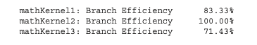

# 3 CUDA Execution Model

Fermi, Kepler architecture 생략

- dynamic parallelism

---

## 3.1 understanding the nature of warp execution

**warp**란 thread 32개를 묶어서 지칭하는 single execution unit이다. warp은 SM에서 수행하는 execution의 basic unit이다. thread block이 SM에 schedule되면, thread block 안의 thread들은 warp로 partition된다. 

32 consecutive thread들로 구성된 warp 내부는 SIMT 방식으로 동작한다. 다시 말해 wrap 내부의 모든 thread가 동일한 instruction을 실행한다는 의미이다.

앞서 thread block을 3차원까지 구성할 수 있었지만, hardware 관점에서는 결국 모두 1차원으로 배정된다. blockDim과 blockIdx을 이용해서 block 당 warp 개수를 계산할 수 있다.

- 2D thread block에서는 다음과 같이 thread마다 unique identifier가 생성되었다.

    threadIdx.y * blockDim.x + threadIdx.x

- 3D thread block

    threadIdx.z * blockDim.y * blockDim.x + threadIdx.y * blockDim.x + threadIdx.x

- thread block당 warp 개수는 다음과 같다.

$$ WarpsPerBlock = ceil\left( {{ThreadsPerBlock} \over {warpSize}} \right) $$

wrap는 hardware마다 구체적인 숫자를 가지고, 모든 thread block에서 같은 size의 단위로 사용된다. 만약 thread block size가 warp size의 배수가 아니라면, 마지막 warp에 속하는 thread들은 inactive하게 남게 된다.

예를 들어 application에서 x dimension 40개의 thread를 갖고, y dimension이 2개의 thread를 갖는 2D thread block으로 구성했다고 하자.(40x2=80 threads laid out)

그렇다면 hardware 입장에서는 warp 3개를 allocate할 것이다. 다시 말해 80개 thread를 support하기 위해 96개의 thread가 allocate되는 것이다. 즉, 마지막 warp에서 inactive한 thread가 생기게 된다. 이런 thread들은 사용되지는 않지만, 여전히 SM resource(예를 들면 register)를 잡아먹게 된다.


---

## 3.2 warp divergence

program에서 실행되는 각 statement, instruction, function call을 제어하는 **control flow**(제어 흐름)은 high-level programming language에서의 기본적인 구성 요소이다. GPU도 마찬가지로 'if...then...else, for, while'과 같은 C 스타일의 flow-control construct를 제공한다.

CPU는 **branch prediction**(분기 예측)을 수행하기 위한 복잡한 hardware를 포함한다. predict가 올바르면 CPU는 오직 small performance penalty만 부담하면 된다. 하지만 predict가 틀렸다면, CPU는 여러 instruction pipeline으로 구성된 cycle이 stall된다.  

그러나 GPU는 branch prediction mechanism을 가지지 않은 simple한 device이다. warp의 모든 thread가 동일한 instruction을 execute하는 점을 생각해 보자. 만약 warp의 한 thread가 어느 instruction을 실행하게 되면, warp 내의 모든 thread는 같은 instruction만 execute해야 한다.

이런 특성이 application에서의 분기에서 문제를 일으킬 수 있다. 예를 들어 다음 statement가 있다고 하자.

```c
if (cond) {
    //...
} else {
    //...
}
```

이 instruction를 한 warp에서 16개는 cond(condition)이 true, 16개는 else block을 처리한다고 가정하자. 그렇다면 하나의 warp에서 다른 instruction들을 처리하게 되는 셈이다. 이를 **warp divergence**라고 한다. 

> 앞서 한 warp가 같은 instruction을 수행한다고 했으므로, warp divergence는 paradox로 보일 수 있다.

warp diverge 상황에서 warp는 serial하게 각 branch path를 '해당 path가 아닌 다른 path를 맡은 thread를 disable하게 만든 후' execute한다. 따라서 warp divergence는 performance를 굉장히 감소시키게 된다. 

앞서 한 가정에서는 warp의 parallelism은 절반(16개)로 나뉘었다. 이 예시라면 16개 thread가 execute하는 상황에서는, 다른 16개 thread가 disable된다.

> 따라서 conditional branch가 많을수록, parallelism으로 잃는 손실이 더욱 커지게 된다.

> 주의할 점은 branch divergence는 단일 warp에서 일어나는 현상이라는 점이다.

아래는 if...then statement를 처리하는 한 warp 내에서 일어나는 warp divergence를 나타낸 그림이다.(y축은 시간의 경과를 나타낸다.) 


- thread들은 condition이 true일 때의 execution, false일 때의 execution을 나눠서 수행해야 한다.

- 그러나 condition = true를 만족하는 block을 execute하고 있다면, 이를 맡지 않는 thread가 끝날 때까지 stall된다.

- 살구색: if clause(절)을 수행하는 동안, than clause를 수행하는 thread들은 stall된다.(보라색)

- 연두색: then clause를 수행하는 동안, if clause를 수행하는 thread들은 stall된다.(보라색)

따라서 best performance를 얻기 위해서는, 단일 warp에서 다른 execution path가 생기는 일을 피해야 한다. warp assignment는 **deterministic**(함수와 같이 input을 설정하면, 언제나 그에 맞는 output을 낼 수 있다.)하다는 점을 명심하자. 모든 warp가 각각 same control path을 맡게 data를 partition할 수 있다.


branch 두 개를 갖는 다음 simple arithmetic kernel 예시를 보자. 

```c
__global__ void mathKernel1(float *c) {
    int tid = blockIdx.x * blockDim.x + threadIdx.x;
    float a, b;
    a = b = 0.0f;

    if (tid % 2 == 0) {
        a = 100.0f;
    } else {
        b = 200.0f;
    }
    c[tid] = a + b;
}
```

- condition (tid % 2 == 0)로 설정하면 짝수 index thread들이 if clause, 홀수 index의 thread들이 else clause를 맡게 된다.

- 따라서 warp divergence가 발생한다.

이때 data를 **interleave**(인터리브. data가 서로 인접하지 않도록 배열하여 성능을 높이는 방법)하는 방법으로 warp divergence를 피할 수 있다. 다음 예시를 보자.

- CUDA의 built-in variable인 warpSize를 이용한다.

```c
__global__ void mathKernel2(void) {
    int tid = blockIdx.x * blockDim.x + threadIdx.x;
    float a, b;
    a = b = 0.0f;

    if ((tid / warpSize) % 2 == 0) {
        a = 100.0f;
    } else {
        b = 200.0f;
    }
    c[tid] = a + b;
}
```

- condition (tid/warpSize)%2==0)은 warp size에 맞춰서 **branch granularity**(세분성)를 갖도록 강제한다.

- even warp는 if clause를 담당하고, odd warp는 else clause를 담당한다.

다음은 이 두 예시의 performance를 비교하는 코드이다.(파일명은 simpleDivergence.cu)

```c
#include <cuda_runtime.h>
#include <stdio.h>
#include <sys/time.h>

double seconds() {
    struct timeval tp;
    gettimeofday(&tp, NULL);
    return ((double)tp.tv_sec + (double)tp.tv_usec*1.e-6);
}

// kernel causing wrap divergence
__global__ void mathKernel1(float *c) {
    int tid = blockIdx.x * blockDim.x + threadIdx.x;
    float a, b;
    a = b = 0.0f;

    if (tid % 2 == 0) {
        a = 100.0f;
    } else {
        b = 200.0f;
    }
    c[tid] = a + b;
}

// avoid wrap divergence
__global__ void mathKernel2(float *c) {
    int tid = blockIdx.x * blockDim.x + threadIdx.x;
    float a, b;
    a = b = 0.0f;

    if ((tid / warpSize) % 2 == 0) {
        a = 100.0f;
    } else {
        b = 200.0f;
    }
    c[tid] = a + b;
}

__global__ void mathKernel3(float *c) {
    int tid = blockIdx.x * blockDim.x + threadIdx.x;
    float ia, ib;
    ia = ib = 0.0f;

    bool ipred = (tid % 2 == 0);

    if (ipred) {
        ia = 100.0f;
    }

    if (!ipred) {
        ib = 200.0f;
    }
    c[tid] = ia + ib;
}

__global__ void mathKernel4(float *c) {
    int tid = blockIdx.x * blockDim.x + threadIdx.x;
    float ia, ib;
    ia = ib = 0.0f;

    int itid = tid >> 5;

    if (itid & 0x01 == 0) {
        ia = 100.0f;
    } else {
        ib = 200.0f;
    }
    c[tid] = ia + ib;
}

__global__ void warmingup(float *c) {
    int tid = blockIdx.x * blockDim.x + threadIdx.x;
    float ia, ib;
    ia = ib = 0.0f;

    if ((tid / warpSize) % 2 == 0){
        ia = 100.0f;
    } else {
        ib = 200.0f;
    }
    c[tid] = ia + ib;
}

int main(int argc, char **argv) {
    // set up device
    int dev = 0;
    cudaDeviceProp deviceProp;
    cudaGetDeviceProperties(&deviceProp, dev);
    printf("%s using Device %d: %s\n", argv[0], dev, deviceProp.name);

    // set up data size
    int size = 64;
    int blocksize = 64;
    if (argc > 1) blocksize = atoi(argv[1]);   // atoi: char to int
    if (argc > 2) size      = atoi(argv[2]);
    printf("Data size %d ", size);

    // set up execution configuration
    dim3 block (blocksize,1);
    dim3 grid  ((size + block.x -1)/block.x,1);
    printf("Execution Configure (block %d, grid %d)\n", block.x, grid.x);

    // allocate GPU memory
    float *d_C;
    size_t nBytes = size * sizeof(float);
    cudaMalloc((float**)&d_C, nBytes);

    // run a warmup kernel to remove overhead
    double iStart, iElaps;
    cudaDeviceSynchronize();
    iStart = seconds();
    warmingup<<<grid,block>>>(d_C);
    cudaDeviceSynchronize();
    iElaps = seconds() - iStart;
    printf("warmup      <<< %4d %4d >>> elapsed %f sec \n", grid.x, block.x, iElaps);

    // run kernel 1
    iStart = seconds();
    mathKernel1<<<grid,block>>>(d_C);
    cudaDeviceSynchronize();
    iElaps = seconds() - iStart;
    printf("mathKernel1 <<< %4d %4d >>> elapsed %f sec \n", grid.x, block.x, iElaps);

    // run kernel 2
    iStart = seconds();
    mathKernel2<<<grid,block>>>(d_C);
    cudaDeviceSynchronize();
    iElaps = seconds() - iStart;
    printf("mathKernel2 <<< %4d %4d >>> elapsed %f sec \n", grid.x, block.x, iElaps);

    // run kernel 3
    iStart = seconds();
    mathKernel3<<<grid,block>>>(d_C);
    cudaDeviceSynchronize();
    iElaps = seconds() - iStart;
    printf("mathKernel3 <<< %4d %4d >>> elapsed %f sec \n", grid.x, block.x, iElaps);

    // run kernel 4
    iStart = seconds();
    mathKernel4<<<grid,block>>>(d_C);
    cudaDeviceSynchronize();
    iElaps = seconds() - iStart;
    printf("mathKernel4 <<< %4d %4d >>> elapsed %f sec \n", grid.x, block.x, iElaps);

    // free GPU memory and reset device
    cudaFree(d_C);
    cudaDeviceReset();
    return(0);
}
```

다음과 같이 compile한 뒤 실행한다.

```bash
$ nvcc -O3 -arch=sm_80 simpleDivergence.cu -o simpleDivergence
$ ./simpleDivergence
```

> -O option은 optimization level을 뜻한다. 


또한 capability 7.5 미만인 device에서는 nvprof profiler를 사용해서 warp divergence를 파악할 수 있다.

> capability 7.5 이상의 device는 NVIDIA Nsight를 사용해서 profile하기를 권장하고 있다.

```bash
$ nvprof --metrics branch_efficiency ./simpleDivergence
```

branch efficiency는 전체 branch에서 non-divergent branch가 차지하는 비율을 의미한다.

$$ Branch \, Efficiency = 100 \times \left( {\#Branches - \#Divvergent \, Branches} \over {\#Branches} \right) $$

다음은 Tesla device에서 mathKernel1과 mathKernel2를 profiling을 진행한 결과이다.


그런데 결과를 보면 branch divergence가 없다고 나온다. 이런 결과가 나온 이유는 CUDA compiler가 warp divergence가 발생할 수 있는 branch instruction들을 optimization했기 때문이다.

여기서 주의해야 할 점이 있다. branch predication에서 condition은 1 혹은 0으로 설정된다. 그리고 두 가지 conditional flow path가 모두 execute된다. 결과적으로 predicate(논리 여부)가 1인 instruction들이 실행되지만, 그렇다고 해서 predicate가 0에 해당하는 instruction을 맡은 thread가 stall되지는 않는다.

> compiler는 조건문 수가 특정 threshold보다 적은 경우에만 optimization을 완벽하게 수행할 수 있다.

따라서 code path가 길다면 warp divergence를 일으킬 수 있다. 아래는 Tesla device에서 mathKernel3를 추가하고 profiling한 결과이다.



처음부터 warp divergence가 생기지 않도록 구성한 mathKernel2와 다르게, mathKernel1과 3는 limited optimization이 수행된 것을 알 수 있다. 

---
