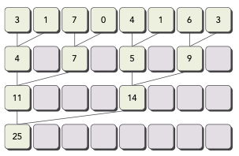
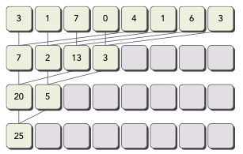
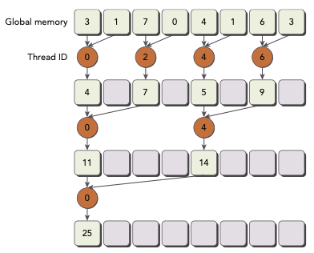
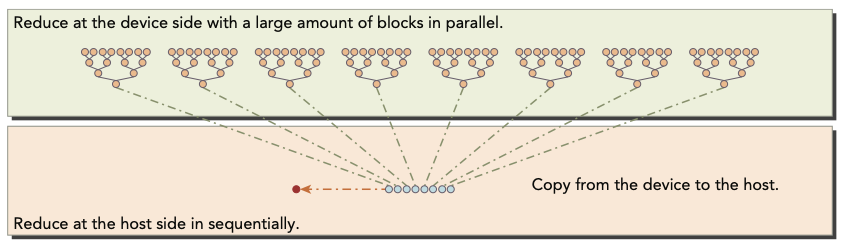
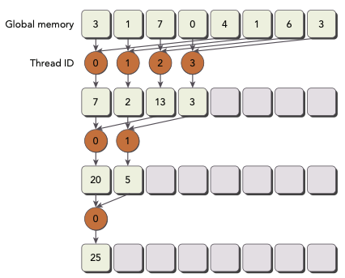
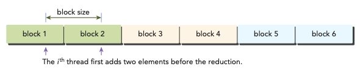
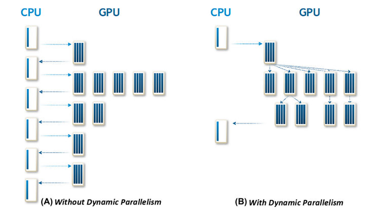

# 3 CUDA Execution Model

## 3.10 avoiding branch divergence

thread index에 따라 control flow가 결정되는 경우가 있다. 또한 control flow에 conditional execution가 존재하는 경우, warp divergence가 발생하여 kernel performance를 감소할 수 있었다.

이때 data access pattern을 rearrange하는 것으로 warp divergence를 피할 수 있었다. 이번 단계부터는 parallel reduction을 사용하여, branch divergence를 피하는 테크닉을 익힌다.

---

### 3.10.1 the parallel reduction problem

예를 들어 N개의 element를 합산하는 다음과 같은 code가 있다고 하자.

```c
int sum = 0;
for (int i = 0; i < N; i++) {
    sum += array[i];
}
```

data element가 굉장히 많다면 이 code는 어떤 문제를 일으킬까? 또한 parallelize해서 어떻게 accelerate할 수 있을까?

우선 parallel addition은 다음과 같은 절차로 구성하면 된다.

1. input vector를 작은 chunk 단위로 partition한다.

2. thread 하나가 각 chunk의 partial sum(부분합)을 계산하도록 만든다.

3. 각 chunk의 partial sum을 합쳐서 final sum을 도출한다.

예를 들어 iterative pairwise로 구현할 수 있다.
chunk는 element 두 개를 포함하고, thread에서 element를 합산해 partial sum을 생성해 낸다. 이 partial sum은 **in-place**, 원래의 input vector 자리에 저장된다. 이 partial sum은 다음 input으로 쓰이게 되며 과정이 반복된다. 

따라서 input vector size가 매 계산마다 1/2로 감소하게 된다. output vector size가 1이 되었을 때 해당되는 값이 final sum을 나타낸다.

이런 pairwise parallel sum implementation도 두 가지 type으로 구분할 수 있다.

- neighbored pair: 바로 이웃한 element끼리 pair로 묶인다.

    

    - step마다 두 adjacent(인접한) element가 하나의 partial sum을 만든다.

    - N개의 element가 있다면, 총 N-1번의 sum 연산이 필요하다.

    - step은 총 $\log_{2}{N}$ 번 수행된다.

- interleaved pair: 주어진 stride만큼 떨어진 element끼리 pair로 묶인다.

    

    - input length의 절반만큼 stride가 지정된다.

C언어로 interleaved pair implementation을 구현하면 다음과 같다.

```c
int recursiceReduce(int *data, int const size) {
    // terminate check
    if (size == 1) return data[0];

    // renew the stride
    int const stride = size / 2;

    // in-place reduction
    for (int i = 0; i < stride; i++) {
        data[i] += data[i + stride];
    }

    // call recursively
    return recursiveReduce(data, stride);
}
```

이때 input vector 내부의 값이 계속 바뀌기 때문에, max, min, average 등 commutative 혹은 associate operation 적용에 주의해야 한다.

> 이처럼 parallel reduction에 commutative and associate operation을 적용할 때 생기는 문제를 reduction problem이라고 지칭하기도 한다. 

---

### 3.10.2 divergence in parallel reduction

다음 예시는 neighbored pair을 이용한 pairwise parallel sum implementation이다.



이 kernel은 다음과 같이 두 개의 global memory array를 사용한다.

- 전체 array를 저장하기 위한 하나의 큰 array

- 각 thread block의 partial sum을 저장하기 위한 하나의 작은 array

한 iteration이 한 reduction step에 대응된다. 각 step마다 global memory의 value들이 partial sum으로 대체된다.(in-place로 reduction이 수행된다.) 

\_\_syncthreads()로 한 iteration에서 모든 partial sum이 계산되어 global memory value를 대체할 때까지, 동일한 thread block 내의 thread가 다음 iteration으로 넘어가는 것을 방지할 수 있다.

<br/>

### <span style='background-color: #393E46; color: #F7F7F7'>&nbsp;&nbsp;&nbsp;📝 예제: in-place reduction&nbsp;&nbsp;&nbsp;</span>

다음은 in-place reduction을 수행하는 kernel code이다.

```c
__global__ void reduceNeighbored(int *g_idate, int *g_odata, unsigned int n) {
    // set thread ID
    unsigned int tid = threadIdx.x;
    unsigned int idx = blockIdx.x * blockDim.x + threadIdx.x;

    // convert global data pointer to the local pointer of this block
    int *idata = g_idata + blockIdx.x * blockDim.x;

    // boundary check
    if (idx >= n) return;

    // in-place reduction in global memory
    for (int stride = 1; stride < blockDim.x; stride *= 2) {
        if ((tid % (2 * stride)) == 0) {
            idata[tid] += idata[tid + stride];
        }
        
        // synchronize within block
        __syncthreads();
    }

    // write result for this block to global mem
    if (tid == 0) g_odata[blockIdx.x] = idata[0];
}
```

- stride는 처음 1로 initialize된다. 이후 각 reduction round마다 이 distance는 2가 곱해진다.

  - 첫 번째 round 이후 idata의 짝수 element들은 partial sum으로 대체된다.

    > 0,1의 합 => 0에 저장, 2,3의 합 => 2에 저장, 4,5의 합 => 4에 저장...

  - 두 번째 round 이후 idata의 네 번째 element들이 partial sum으로 대체된다.

    > 0,2의 합 => 0에 저장, 4,6의 합 => 4에 저장, 8, 10의 합 => 8에 저장...

    

다음은 이를 수행하는 main function 부분이다. 파일명은 reduceInteger.cu이다.

```c
int main(int argc, char **argv) {
    // set up device
    int dev = 0;
    cudaDevicePorp deviceProp;
    cudaGetDeviceProperties(&deviceProp, dev);
    printf("%s starting reduction at ", argv[0]);
    printf("device %d: %s ", dev, deviceProp.name);
    cudaSetDevice(dev);

    bool bResult = false;

    // initialization
    int size = 1<<24;    // total number of elements to reduce
    printf("    with array size %d  ", size);

    // execution configuration
    int blocksize = 512;
    if(argc > 1) {
        blocksize = atoi(argv[1]);    // block size from command line argument
    }
    dim3 block (blocksize,1);
    dim3 grid  ((size + block.x - 1)/block.x,1);
    printf("grid %d block %d\n", grid.x, block.x);

    // allocate host memory
    size_t bytes = size * sizeof(int);
    int *h_idata = (int *) malloc(bytes);
    int *h_odata = (int *) malloc(grid.x * sizeof(int));
    int *tmp     = (int *) malloc(bytes);

    // initialize the array
    for (int i = 0; i < size; i++) {
        // mask off high 2 bytes to force max number to 255
        h_idata[i] = (int)(rand() & 0xFF);
    }
    memcpy (tmp, h_idata, bytes);

    double iStart, iElaps;
    int gpu_sum = 0;    // cpu result와 비교하기 위한 variable

    // allocate device memory
    int *d_idata = NULL;
    int *d_odata = NULL;
    cudaMalloc((void **) &d_idata, bytes);
    cudaMalloc((void **) &d_odata, grid.x * sizeof(int));

    // CPU reduction
    iStart = seconds();
    int cpu_sum = recursiveReduce(tmp, size);
    iElaps = seconds() - iStart;
    printf("CPU reduce      elapsed %f ms, cpu_sum: %d\n", iElaps, cpu_sum);

    // kernel 1: warpup
    cudaMemcpy(d_idata, h_idata, bytes, cudaMemcpyHostToDevice);
    cudaDeviceSynchronize();
    iStart = seconds();
    warmup<<<grid, block>>>(d_idata, d_odata, size);
    iElaps = seconds() - iStart;
    printf("GPU warmup      elapsed %f ms\n", iElaps);

    // kernel 2: reduceNeighbored
    iStart = seconds();
    reduceNeighbored<<<grid, block>>>(d_idata, d_odata, size);
    cudaDeviceSynchronize();
    iElaps = seconds() - iStart;
    cudaMemcpy(h_odata, d_odata, grid.x * sizeof(int), cudaMemcpyDeviceToHost);
    gpu_sum = 0;

    for (int i = 0; i < grid.x; i++) {
        gpu_sum += h_odata[i];
    }
    printf("GPU Neighbored elapsed %f sec, gpu_sum: %d <<<grid %d block %d>>>\n",
        iElaps, gpu_sum, grid.x, block.x);

    // free host memory
    free(h_idata);
    free(h_odata);

    // free device memory
    cudaFree(d_idata);
    cudaFree(d_odata);

    // reset device
    cudaDeviceReset();

    // check the results
    bResult = (gpu_sum == cpu_sum);
    if(!bResult) printf("Test failed!\n");
    return(0);
}
```

다음과 같이 compile해서 실행한다.

```
$ nvcc -arch=sm_80 reduceInteger.cu -o reduceInteger
./reduceInteger
```

Tesla device상에서 결과는 다음과 같다.

```
$ ./reduceInteger starting reduction at device 0: Tesla M2070 
        with array size 16777216 grid 32768 block 512
cpu reduce      elapsed 29 ms cpu_sum: 2139353471
gpu Neighbored  elapsed 11 ms gpu_sum: 2139353471 <<<grid 32768 block 512>>>
```

---

### 3.10.3 improving divergence in parallel reduction

앞서 reduceNeighbored kernel에서 conditional statement를 다음과 같이 설정했다.

```c
if((tid % (2 * stride)) == 0) {}
```

이 statement는 오직 짝수 index thread만 true이기 때문에 divergent warp을 만들게 된다. 첫 iteration에서도 thread 전체가 schedule되지만, 오직 절반만 conditional statement의 body 부분을 execute한다. 두 번째 iteration에서는 1/4만 body 부분을 execute한다.

이런 warp divergence를 막기 위해 array index를 재배치하는 방법을 사용해 보자.


- 이전 예제의 first iteration에서는 partial sum이 index 0, 2, 4, 6에 저장되었다.

- 하지만 지금은 array index rearranging을 통해 thread ID가 0, 1, 2, 3에 저장된다.

<br/>

### <span style='background-color: #393E46; color: #F7F7F7'>&nbsp;&nbsp;&nbsp;📝 예제: in-place reduction + index rearranging&nbsp;&nbsp;&nbsp;</span>

이를 반영한 kernel code는 다음과 같다.

```c
__global void reduceNeighboredLess (int *g_idata, int *g_odata, unsigned int n) {
    // set thread ID
    unsigned int tid = threadIdx.x;
    unsigned int idx = blockIdx.x * blockDim.x + threadIdx.x;

    // convert global data pointer to the local pointer of this block
    int *idata = g_idata + blockIdx.x * blockDim.x;

    // boundary check
    if (idx >= n) return;

    // in-place reduction in global memory
    for (int stride = 1; stride < blockDim.x; stride *= 2) {
        // convert tid into local array index
        int index = 2 * stride * tid;
        
        if (index < blockDim.x) {
            idata[index] += idata[index + stride];
        }

        // synchronize within threadblock
        __syncthreads();
    }

    // write result for this block to global mem
    if (tid == 0) g_odata[blockIdx.x] = idata[0];
}
```

- first iteration

    tid = 0 => idata[0] = idata[0] + idata[1]

    tid = 1 => idata[2] = idata[2] + idata[3]

    tid = 2 => idata[4] = idata[4] + idata[5]

    ...

    > index rearranging 이전에는 tid = 0, tid = 2, tid = 4만 execute되었다.

- second iteration

    tid = 0 => idata[0] = idata[0] + idata[2]

    tid = 1 => idata[4] = idata[4] + idata[6]

    ...

    > index rearranging 이전에는 tid = 0, tid = 4, tid = 8만 execute되었다.

만약 한 block을 thread 512개로 구성하고 이 kernel을 수행하면, first iteration에서 warp 8개는 reduction을 수행하고 나머지 warp 8개는 아무것도 수행하지 않는다. second iteration에서는 4개만 reduction을 수행하고 12개는 아무것도 수행하지 않는다. 따라서 divergence가 생기지 않는다.

> 다만 각 round의 thread 수가 warp size보다 적은 후반에는 warp divergence가 발생한다.

기존 reduceNeighbored kernel과 index rearrange를 거친 reduceNeighboredLess를 수행한 report 결과는 다음과 같다.(Tesla device 기준) 약 1.26배 더 빠른 속도를 보인다.

```
$ ./reduceInteger Starting reduction at device 0: Tesla M2070
    vector size 16777216 grid 32768 block 512
cpu reduced      elapsed 0.029138 sec cpu_sum: 2139353471
gpu Neighbored   elapsed 0.011722 sec gpu_sum: 2139353471 <<<grid 32768 block 512>>> 
gpu NeighboredL  elapsed 0.009321 sec gpu_sum: 2139353471 <<<grid 32768 block 512>>>
```

nvprof의 inst_per_warp를 이용해서 각 warp마다 execute되는 instruction 평균 개수를 측정할 수 있다.

```bash
$ nvprof --metrics inst_per_warp ./reduceInteger
```

결과는 다음과 같다. 기존 reduceNeighbored kernel이 warp당 수행해야 할 instruction이 두 배 이상 많기 때문에 차이가 발생했음을 알 수 있다.

```
Neighbored Instructions per warp 295.562500
NeighboredLess Instructions per warp 115.312500
```

또한 gld_throughput으로 memory load throughput도 측정하면 다음과 같다.

```bash
$ nvprof --metrics gld_throughput ./reduceInteger
```

새 implementation(reduceNeighboredLess)에서는 같은 양의 I/O를 수행하는 데 걸리는 시간이 적은 것을 확인할 수 있다. 

```
Neighbored Global Load Throughput 67.663GB/s 
NeighboredL Global Load Throughput 80.144GB/s
```

---

## 3.10.4 reducing with lnterleaved pairs

앞서 본 neighbored pair approach와 지금 살필 interleaved pair approach가 다른 점은, stride가 thread block size의 절반 부분부터 시작된다는 것이다.(reduction이 진행되면서 마찬가지로 stride 시작 지점이 1/2 지점으로 줄어든다.)



<br/>

### <span style='background-color: #393E46; color: #F7F7F7'>&nbsp;&nbsp;&nbsp;📝 예제: interleaved pair implementation with less divergence&nbsp;&nbsp;&nbsp;</span>

```c
__global__ void reduceInterleaved (int *g_idata, int *g_odata, unsigned int n) {
    // set thread ID
    unsigned int tid = threadIdx.x;
    unsigned int idx = blockIdx.x * blockDim.x + threadIdx.x;

    // convert global data pointer to the local pointer of this block
    int *idata = g_idata + blockIdx.x * blockDim.x;

    // boundary check
    if (idx >= n) return;

    // in-place reduction in global memory
    for (int stride = blockDim.x / 2; stride > 0; stride >>= 1) {
        if (tid < stride) {
            idata[tid] += idata[tid + stride];
        }

        __syncthreads();
    }

    // write result for this block to global mem
    if (tid == 0) g_odata[blockIdx.x] = idata[0];
}
```

- stride >>= 1: stride가 절반으로 줄어들게 된다.

- tid < stride: thread block의 절반(그 다음 iteration에서는 절반의 절반...)만 addition을 execute하도록 만든다.

compile한 뒤 실행하면 다음과 같은 결과를 얻을 수 있다.(Tesla device)

```
$ ./reduce starting reduction at device 0: Tesla M2070
    with array size 16777216 grid 32768 block 512 

cpu reduce      elapsed 0.029138 sec cpu_sum: 2139353471 
gpu Warmup      elapsed 0.011745 sec gpu_sum: 2139353471 <<<grid 32768 block 512>>>
gpu Neighbored  elapsed 0.011722 sec gpu_sum: 2139353471 <<<grid 32768 block 512>>>
gpu NeighboredL elapsed 0.009321 sec gpu_sum: 2139353471 <<<grid 32768 block 512>>>
gpu Interleaved elapsed 0.006967 sec gpu_sum: 2139353471 <<<grid 32768 block 512>>>
```

앞서 수행한 다른 kernel보다도 interleaved implementation이 각각 1.69배, 1.34배 빠른 것을 확인할 수 있다. 이런 performance 향상이 생기는 이유는 reduceInterleaved의 global memory load와 store pattern 때문이다.(4장 참조)

---

## 3.11 unrolling loops

**loop unrolling**은 branch 빈도와 loop maintenance instruction을 줄여서, loop execution을 optimize하는 테크닉이다. loop body를 한 번 작성하고 iteration하는 대신, 코드로 여러 번 작성한다.

loop body로 만들어진 copy들을 **loop unrolling factor**라고 지칭한다. 이를 둘러싸는 loop의 iteration 횟수를 loop unrolling factor로 나눠서 계산할 수 있다.

다음 코드를 보자.

```c
for (int i = 0; i < 100; i++) {
    a[i] = b[i] + c[i];
}
```

이를 다음과 같이 간단한 loop unrolling을 적용하는 것만으로도 전체 iteration 횟수가 절반으로 줄어들게 된다.

```c
for (int i = 0; i < 100; i += 2) {
    a[i] = b[i] + c[i];
    a[i+1] = b[i+1] + c[i+1];
}
```

> loop unrolling으로 얻을 수 있는 performance 향상은 high-level code에서 직관적으로 알기는 어렵다.

> 또한 위 예시에서는 각 loop마다 statement가 independent하기 때문에, memory operation들이 simultaneous하게 수행될 수 있다.

CUDA에서는 다양한 unrolling이 있지만 모두 performance를 늘리고, instruction overhead를 줄이며, 더 많은 independent instruction들을 schedule한다는 목표를 갖는다. 이를 통해 더 concurrent하게 operation을 pipeline을 통해 효율적으로 수행할 수 있다.

---

### 3.11.1 reducing with unrolling

### <span style='background-color: #393E46; color: #F7F7F7'>&nbsp;&nbsp;&nbsp;📝 예제: interleaved pair implementation + unrolling&nbsp;&nbsp;&nbsp;</span>

다음은 reduceInterleaved에서 한 block이 처리한 data portion을, 두 portion을 미리 합산해서 계산을 하는 것으로 한 block에서 더 많은 data portion을 처리하도록 만든 code이다.

```c
__global__ void reduceUnrolling2 (int *g_idata, int *g_odata, unsigned int n) {
    // set thread ID
    unsigned int tid = threadIdx.x;
    // 바뀐 부분에 주의
    unsigned int idx = blockIdx.x * blockDim.x * 2 + threadIdx.x;

    // convert global data pointer to the local pointer of this block
    // 바뀐 부분에 주의
    int *idata = g_idata + blockIdx.x * blockDim.x * 2;

    // unrolling 2 data blocks
    // 각 thread에서 neighboring data block의 element를 더한다.
    if (idx + blockDim.x < n) {
        g_idata[idx] += g_idata[idx + blockDim.x];
    }
    __syncthreads();

    // in-place reduction in global memory
    for (int stride = blockDim.x / 2; stride > 0; stride >>= 1) {
        if (tid < stride) {
            idata[tid] += idata[tid + stride];
        }
        // synchronize within threadblock
        __syncthreads();
    }

    // write result for this block to global mem
    if (tid == 0) g_odata[blockIdx.x] = idata[0];
}
```

unrolling을 위해 2 data block을 합산한 부분을 보자. 이렇게 두 data portion을 합치는 것으로 같은 data set에서 오직 절반의 thread block만 사용해서 처리할 수 있게 되었다.

```c
if (idx + blockDim.x < n) {
    g_idata[idx] += g_idata[idx + blockDim.x];
}
```



따라서 main function에서 reduceUnrolling2 kernel을 작성할 때는 다음과 같이 block의 개수를 절반으로 수정한다.

```c
reduceUnrolling2<<<grid.x / 2, block>>>(d_idata, d_odata, size);
```

compile한 뒤 실행하면 다음과 같은 결과를 얻을 수 있다.

```
gpu Unrolling2 elapsed 0.003430 sec gpu_sum: 2139353471 <<<grid 16384 block 512>>>
```

여기서 threadblock이 data porsion을 4개씩, 8개씩 다루게 수정하면 performance는 어떻게 달라질까?

```
gpu Unrolling2 elapsed 0.003430 sec gpu_sum: 2139353471 <<<grid 16384 block 512>>> 
gpu Unrolling4 elapsed 0.001829 sec gpu_sum: 2139353471 <<<grid 8192 block 512>>> 
gpu Unrolling8 elapsed 0.001422 sec gpu_sum: 2139353471 <<<grid 4096 block 512>>>
```

결과로 알 수 있는 사실은 한 thread 내에서 independent memory load/store operation을 더 많이 수행하도록 바꾸면, memory latency를 감추고 더 나은 performance를 얻을 수 있다는 것이다.

nvprof를 이용하여 memory read throughput을 살펴보면 다음과 같다.

```
Unrolling2 Device Memory Read Throughput 26.295GB/s 
Unrolling4 Device Memory Read Throughput 49.546GB/s 
Unrolling8 Device Memory Read Throughput 62.764GB/s
```

---

### 3.11.2 reducing with unrolled warps

앞선 execution에서 thread가 32개 혹은 그 이하로 남은 상황을 생각해 보자.(즉, single warp) warp execution이 SIMT이기 때문에, 각 instruction 이후에는 intra-warp synchronization이 있을 것이다. 따라서 다음과 같이 loop를 unroll하면, 필요 없는 과정을 건너뛰고 성능을 더 향상시킬 수 있다.

> volatile qualifier는 compiler에게 vmem[tid]를 매 assignment마다 global memory에 store하도록 당부하는 역할을 한다. 이렇게 declaration된 variable은 compiler가 다른 thread에 의해 언제든지 쓰일 수 있다는 사실을 파악하게 된다.

> 만약 volatile qualifier가 없다면 compiler(또는 cache)의 optimization에 의해 제대로 작동하지 않는다.

```c
if (tid < 32) {
    volatile int *vmem = idata;
    vmem[tid] += vmem[tid + 32];
    vmem[tid] += vmem[tid + 16];
    vmem[tid] += vmem[tid + 8];
    vmem[tid] += vmem[tid + 4];
    vmem[tid] += vmem[tid + 2];
    vmem[tid] += vmem[tid + 1];
}
```

이렇게 loop control execute와 synchronization logic을 피할 수 있다. 이를 reduceUnrolling8 kernel에 추가한 코드는 다음과 같다.

### <span style='background-color: #393E46; color: #F7F7F7'>&nbsp;&nbsp;&nbsp;📝 예제: interleaved pair + unrolling + last warp unrolling&nbsp;&nbsp;&nbsp;</span>

```c
__global__ void reduceCompleteUnrollWarps8 (int *g_idata, int *g_odata, unsigned int n) {
    // set thread ID
    unsigned int tid = threadIdx.x;
    unsigned int idx = blockIdx.x * blockDim.x * 8 + threadIdx.x;

    // convert global data pointer to the local pointer of this block
    int *idata = g_idata + blockIdx.x * blockDim.x * 8;

    // unrolling 8
    if (idx + blockDim.x * 7 < n) {
        int a1 = g_idata[idx];
        int a2 = g_idata[idx + blockDim.x];
        int a3 = g_idata[idx + 2*blockDim.x];
        int a4 = g_idata[idx + 3*blockDim.x];
        int b1 = g_idata[idx + 4*blockDim.x];
        int b2 = g_idata[idx + 5*blockDim.x];
        int b3 = g_idata[idx + 6*blockDim.x];
        int b4 = g_idata[idx + 7*blockDim.x];
        g_idata[idx] = a1 + a2 + a3 + a4 + b1 + b2 + b3 + b4;
    }
    __syncthreads();

    // in-place reduction in global memory
    for (int stride = blockDim.x / 2; stride > 32; stride >>= 1) {
        if (tid < stride) {
            idata[tid] += idata[tid + stride];
        }
        // synchronize within threadblock
        __syncthreads();
    }

    // unrolling warp
    if (tid < 32) {
        volatile int *vmem = idata;
        vmem[tid] += vmem[tid + 32];
        vmem[tid] += vmem[tid + 16];
        vmem[tid] += vmem[tid + 8];
        vmem[tid] += vmem[tid + 4];
        vmem[tid] += vmem[tid + 2];
        vmem[tid] += vmem[tid + 1];
    }
    
    // write result for this block to global mem
    if (tid == 0) g_odata[blockIdx.x] = idata[0];
}
```

이를 compile한 뒤 실행하면 다음과 같은 결과를 얻을 수 있다.(Tesla device)

```
gpu UnrollWarp8 elapsed 0.001355 sec gpu_sum: 2139353471 <<<grid 4096 block 512>>>
```

nvprof의 stall_sync를 이용해서 __syncthreads에 의해 어느 정도의 warp가 stall됐는지 알 수 있다.

```bash
$ nvprof --metrics stall_sync ./reduce
```

결과는 다음과 같다. 마지막 warp를 unrolling하는 것으로 거의 절반에 가까운 수치가 줄었다.

```
Unrolling8 Issue Stall Reasons 58.37% 
UnrollWarps8 Issue Stall Reasons 30.60%
```

---

### 3.11.3 reducing with complete unrolling

만약 complie 시점에서 loop의 iteration 횟수를 알 수 있다면 unrolling을 완전히 적용할 수 있다.(이 reduction kernel에서 loop iteration 횟수는 thread block dimension으로 결정되기 때문이다.) 

### <span style='background-color: #393E46; color: #F7F7F7'>&nbsp;&nbsp;&nbsp;📝 예제: interleaved pair with complete unrolling&nbsp;&nbsp;&nbsp;</span>

```c
__global__ void reduceCompleteUnrollWarp8 (int *g_idata, int *g_odata, unsigned int n) {
    // set thread ID
    unsigned int tid = threadIdx.x;
    unsigned int idx = blockIdx.x * blockDim.x * 8 + threadIdx.x;

    // convert global data pointer to the local pointer of this block
    int *idata = g_idata + blockIdx.x * blockDim.x * 8;

    // unrolling 8
    if (idx + blockDim.x * 7 < n) {
        int a1 = g_idata[idx];
        int a2 = g_idata[idx + blockDim.x];
        int a3 = g_idata[idx + 2*blockDim.x];
        int a4 = g_idata[idx + 3*blockDim.x];
        int b1 = g_idata[idx + 4*blockDim.x];
        int b2 = g_idata[idx + 5*blockDim.x];
        int b3 = g_idata[idx + 6*blockDim.x];
        int b4 = g_idata[idx + 7*blockDim.x];
        g_idata[idx] = a1 + a2 + a3 + a4 + b1 + b2 + b3 + b4;
    }
    __syncthreads();

    // in-place reduction and complete unroll
    if (blockDim.x >= 1024 && tid < 512) {
        idata[tid] += idata[tid + 512];
    }
    __syncthreads();

    if (blockDim.x >= 512 && tid < 256) {
        idata[tid] += idata[tid + 256];
    }
    __syncthreads();

    if (blockDim.x >= 256 && tid < 128) {
        idata[tid] += idata[tid + 128];
    }
    __syncthreads();

    if (blockDim.x >= 128 && tid < 64) {
        idata[tid] += idata[tid + 64];
    }
    __syncthreads();

    // unrolling warp
    if (tid < 32) {
        volatile int *vsmem = idata;
        vsmem[tid] += vsmem[tid + 32];
        vsmem[tid] += vsmem[tid + 16];
        vsmem[tid] += vsmem[tid + 8];
        vsmem[tid] += vsmem[tid + 4];
        vsmem[tid] += vsmem[tid + 2];
        vsmem[tid] += vsmem[tid + 1];
    }

    // write result for this block to global mem
    if (tid == 0) g_odata[blockIdx.x] = idata[0];
}
```

결과는 다음과 같다. Tesla device 기준 reduceUnrollWarps8 1.06배 빨라진 결과이다.

```
gpu CmptUnroll8 elapsed 0.001280 sec gpu_sum: 2139353471 <<<grid 4096 block 512>>>
```

---

## 3.12 reducing with template functions

CUDA가 지원하는 template function의 parameter로 block size를 지정하는 것만으로도 branch overhead를 더 줄일 수 있다.

예를 들어 다음 kernel을 block당 thread 수 제한이 1024개인 Fermi 혹은 Kepler device에서 수행한다고 하자.

```c
template <unsigned int iBlockSize>
__global__ void reduceCompleteUnroll (int *g_idata, int *g_odata, unsigned int n) {
    // set thread ID
    unsigned int tid = threadIdx.x;
    unsigned int idx = blockIdx.x * blockDim.x * 8 + threadIdx.x;

    // convert global data pointer to the local pointer of this block
    int *idata = g_idata + blockIdx.x * blockDim.x * 8;

    // unrolling 8
    if (idx + blockDim.x * 7 < n) {
        int a1 = g_idata[idx];
        int a2 = g_idata[idx + blockDim.x];
        int a3 = g_idata[idx + 2*blockDim.x];
        int a4 = g_idata[idx + 3*blockDim.x];
        int b1 = g_idata[idx + 4*blockDim.x];
        int b2 = g_idata[idx + 5*blockDim.x];
        int b3 = g_idata[idx + 6*blockDim.x];
        int b4 = g_idata[idx + 7*blockDim.x];
        g_idata[idx] = a1 + a2 + a3 + a4 + b1 + b2 + b3 + b4;
    }
    __syncthreads();

    // in-place reduction and complete unroll
    if (iBlockSize >= 1024 && tid < 512) {
        idata[tid] += idata[tid + 512];
    }
    __syncthreads();

    if (iBlockSize >= 512 && tid < 256) {
        idata[tid] += idata[tid + 256];
    }
    __syncthreads();

    if (iBlockSize >= 256 && tid < 128) {
        idata[tid] += idata[tid + 128];
    }
    __syncthreads();

    if (iBlockSize >= 128 && tid < 64) {
        idata[tid] += idata[tid + 64];
    }
    __syncthreads();

    // unrolling warp
    if (tid < 32) {
        volatile int *vsmem = idata;
        vsmem[tid] += vsmem[tid + 32];
        vsmem[tid] += vsmem[tid + 16];
        vsmem[tid] += vsmem[tid + 8];
        vsmem[tid] += vsmem[tid + 4];
        vsmem[tid] += vsmem[tid + 2];
        vsmem[tid] += vsmem[tid + 1];
    }

    // write result for this block to global mem
    if (tid == 0) g_odata[blockIdx.x] = idata[0];
}
```

코드는 단순히 blockDim.x를 template parameter로 바꿨을 뿐인데 성능이 어째서 향상이 될까? if문은 compile 시점에서 평가되고, 만약 true가 아니라면 remove되는 과정을 거치며 매우 효율적인 inner loop로 바뀐다. 예를 들어 코드에서 다음 statement는 언제나 false이다.

```c
iBlockSize>=1024 && tid < 512
```

따라서 compiler는 kernel execution 때 이를 자동적으로 제거해 주며 performance가 향상되는 것이다. 다음은 지금까지의 reduction kernel의 performance를 정리한 표다.

| kernel | time(s) | step speedup | cumulative speedup |
| --- | --- | --- | --- |
| neighbored (divergence) | 0.011722 | | |
| neighbored (no divergence) | 0.009321 | 1.26 | 1.26 |
| Interleaved | 0.006967 | 1.34 | 1.68 | 
| Unroll 8 blocks | 0.001422 | 4.90 | 8.24 | 
| Unroll 8 blocks + last warp | 0.001355 | 1.05 | 8.65 | 
| Unroll 8 blocks + loop + last warp | 0.001280 | 1.06 | 9.16 | 
| Templatized kernel | 0.001253 | 1.02 | 9.35 | 

---

## 3.13 dynamic parallelism

지금까지는 모든 kernel이 host thread에서 호출되었다.(GPU workload는 CPU에 의해 완전히 제어되었다.) 또한 algorithm을 개별로, massive한 data parallel kernel로 수행했다.



그런데 CUDA Dynamic Parallelism을 이용하면 GPU에서도 kernel 내에서 새 kernel을 생성하고 synchronize할 수 있다. 따라서 hierarchical approach가 가능하게 만들며, recursive algorithm을 더 쉽게 작성 및 이해할 수 있다. host와 device 사이에 control과 data를 전송할 필요성도 줄어들 수 있다.

> compute capability 3.5 이상의 device에서만 지원한다.

게다가 dynamic parallelism을 이용하면 정확한 block과 grid 수 결정을 runtime까지 미룰 수 있다.(data size가 일정하지 않은 input에 고정된 configuration을 사용하면 낭비가 많이 생기거나 문제가 발생할 수 있다.) GPU hardware scheduler와 load balancer를 dynamic하게 이용하고, data-driven decision이나 workload에 유연하게 대응할 수 있다.

---


